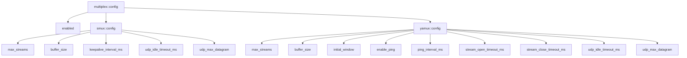

# multiplex::config - 多路复用通用配置

## 源码位置

`I:/code/Prism/include/prism/multiplex/config.hpp`

## 概述

`multiplex::config` 定义多路复用层的协议选择和全局开关。各协议的完整配置参数分别定义在对应子目录的 config.hpp 中。

## 配置结构

```cpp
struct config
{
    bool enabled = false;  // 是否启用多路复用服务端

    smux::config smux;    // smux 协议配置
    yamux::config yamux;  // yamux 协议配置
};
```

## 协议类型枚举

```cpp
enum class protocol_type : std::uint8_t
{
    smux = 0,  // xtaci/smux v1 + sing-mux 协商
    yamux = 1  // Hashicorp/yamux + sing-mux 协商
};
```

协议类型由 sing-mux 协商动态决定，无需在配置中预设。

## 配置层级



## 子配置引用

| 子配置 | 文档 |
|--------|------|
| smux::config | [[core/multiplex/smux/config|smux::config]] |
| yamux::config | [[core/multiplex/yamux/config|yamux::config]] |

## 配置加载

配置由 agent 配置统一加载，通过 [[core/multiplex/bootstrap|bootstrap]] 传递给具体的 mux 会话。

## 关联文档

- [[core/multiplex/bootstrap|bootstrap]] - 多路复用会话引导
- [[core/multiplex/core|core]] - 多路复用核心抽象基类
- [[core/multiplex/smux/config|smux::config]] - smux 协议配置
- [[core/multiplex/yamux/config|yamux::config]] - yamux 协议配置

---

## 配置详解

### multiplex::config 完整结构

```cpp
struct config {
    bool enabled = false;   // 全局开关

    smux::config smux;      // smux 专属配置
    yamux::config yamux;    // yamux 专属配置
};
```

### enabled — 全局开关

| 值 | 行为 |
|----|------|
| `true` | Agent Session 检测到 mux 协商头后启动多路复用会话 |
| `false` | 忽略 mux 协商头，按标准传输层处理 |

**性能影响**: 关闭时不会创建任何 mux 相关对象，零开销。

## 各参数的性能影响

### smux::config 参数

| 参数 | 默认值 | 范围 | 性能影响 |
|------|--------|------|----------|
| `max_streams` | 1000 | 1-65535 | 最大并发流数。增大可同时处理更多连接，但增加内存占用 |
| `buffer_size` | 32768 | 4096-262144 | 写通道缓冲区大小。增大减少反压触发频率，但增加内存 |
| `keepalive_interval_ms` | 30000 | 1000-60000 | 心跳间隔。减小更快检测断连，但增加网络开销 |
| `udp_idle_timeout_ms` | 30000 | 5000-300000 | UDP 管道空闲超时。减小更快释放 UDP socket |
| `udp_max_datagram` | 1500 | 512-65535 | 最大 UDP 数据报。匹配 MTU 可避免 IP 分片 |

**内存估算**:
```
每条 TCP 流内存 ≈ buffer_size × 2 (读写缓冲)
总内存 ≈ max_streams × buffer_size × 2 + 固定开销

示例: max_streams=1000, buffer_size=32KB
     峰值内存 ≈ 1000 × 64KB = 64MB
```

### yamux::config 参数

| 参数 | 默认值 | 范围 | 性能影响 |
|------|--------|------|----------|
| `max_streams` | 1000 | 1-65535 | 同 smux |
| `buffer_size` | 32768 | 4096-262144 | 同 smux |
| `initial_window` | 262144 | 65536-1048576 | 初始流窗口。增大提高大文件传输吞吐，增加内存 |
| `enable_ping` | true | true/false | 启用 Ping/Pong 心跳。关闭减少开销但无法检测死连接 |
| `ping_interval_ms` | 30000 | 1000-60000 | Ping 间隔。影响死连接检测速度 |
| `stream_open_timeout_ms` | 10000 | 1000-60000 | 流打开超时。减小更快拒绝僵尸流 |
| `stream_close_timeout_ms` | 5000 | 1000-60000 | 流关闭超时。影响 FIN 传播速度 |
| `udp_idle_timeout_ms` | 30000 | 5000-300000 | 同 smux |
| `udp_max_datagram` | 1500 | 512-65535 | 同 smux |

### 参数调优建议

#### 低延迟场景（实时通信）
```json
{
  "enabled": true,
  "smux": {
    "max_streams": 500,
    "buffer_size": 8192,
    "keepalive_interval_ms": 10000,
    "udp_idle_timeout_ms": 15000
  }
}
```
- 小 buffer → 减少排队延迟
- 短 keepalive → 快速检测断连
- 适中 max_streams → 控制资源

#### 高吞吐场景（大文件传输）
```json
{
  "enabled": true,
  "yamux": {
    "max_streams": 200,
    "buffer_size": 262144,
    "initial_window": 1048576,
    "enable_ping": true
  }
}
```
- 大 buffer + 大 window → 最大化管道填充
- 较少流数 → 集中资源
- yamux 优先 → 更好的流量控制

#### 移动端场景（网络不稳定）
```json
{
  "enabled": true,
  "smux": {
    "max_streams": 200,
    "buffer_size": 16384,
    "keepalive_interval_ms": 5000,
    "udp_idle_timeout_ms": 10000
  }
}
```
- 短 keepalive → 快速检测网络切换
- 短 udp_idle_timeout → 及时释放闲置 UDP
- 适中 buffer → 平衡内存和延迟

### 配置加载路径

```
Agent 配置 (JSON/YAML)
    ↓
解析 multiplex::config
    ↓
bootstrap(transport, router, cfg, mr)
    ↓
根据协商头中的 Protocol 选择:
    ├── Protocol=0 → 使用 cfg.smux
    └── Protocol=1 → 使用 cfg.yamux
    ↓
craft 构造函数接收对应子配置
```

**注意**: `smux` 和 `yamux` 子配置不会被交叉使用，仅在对应协议被选中时生效。

### 配置映射追踪链

```
JSON 配置文件 (configuration.json)
    ↓ glaze 反序列化
multiplex::config (enabled + smux + yamux + h2mux)
    ↓ bootstrap_context.cfg
bootstrap() → craft 构造函数
    ↓ core_options.cfg → core::config_ 引用
config_.smux / config_.yamux / config_.h2mux
    ↓ 各子配置字段
craft 行为参数（max_streams、buffer_size、keepalive_interval 等）
```

**关键路径**:
- `config` 以引用形式在 `core` 和 `craft` 间传递，不复制
- 引用生命周期必须长于 core/craft 实例（通常由 Agent 配置持有）
- `h2mux::config` 包含在 `multiplex::config` 中但不在 sing-mux 协商中使用

### 参数名映射（源码 → 配置 → 文档）

| 源码字段 | JSON 键 | 默认值 | 所属 |
|----------|---------|--------|------|
| `config::enabled` | `enabled` | `false` | multiplex |
| `smux::config::max_streams` | `smux.max_streams` | `32` | smux |
| `smux::config::keepalive_interval` | `smux.keepalive_interval` | `30000` | smux |
| `yamux::config::initial_window` | `yamux.initial_window` | `262144` | yamux |
| `yamux::config::open_timeout` | `yamux.open_timeout` | `30000` | yamux |
| `h2mux::config::max_frame_size` | `h2mux.max_frame_size` | `16384` | h2mux |

### 与 duct/parcel 的参数传递

```
config_.smux.buffer_size → duct_options.opts.buffer_size → duct::read_size_
    = min(buffer_size, max_frame_payload)

config_.smux.idle_timeout → parcel_config.idle_timeout → parcel::idle_timeout_

config_.smux.max_dgram → parcel_config.max_dgram → parcel::max_dgram_
```

## 设计决策

### 为什么 enabled 默认为 false？

**问题**: 多路复用是可选功能，大多数代理连接不需要 mux。

**选择**: `enabled = false` 意味着不创建任何 mux 对象，检测到协商头也不会处理。

**后果**: 零开销。需要 mux 的 Agent 必须显式配置 `enabled: true`。

## 跨模块契约

| multiplex::config | 使用方 | 契约 |
|-------------------|--------|------|
| `enabled` | Agent Session | false 时完全跳过 mux 逻辑 |
| `smux`/`yamux` 子配置 | 对应 craft 构造函数 | 以 const 引用传递，生命周期由配置持有者保证 |
| `h2mux` 子配置 | h2mux::craft | h2mux 不走 bootstrap 协商，由 TrustTunnel scheme 直接使用 |