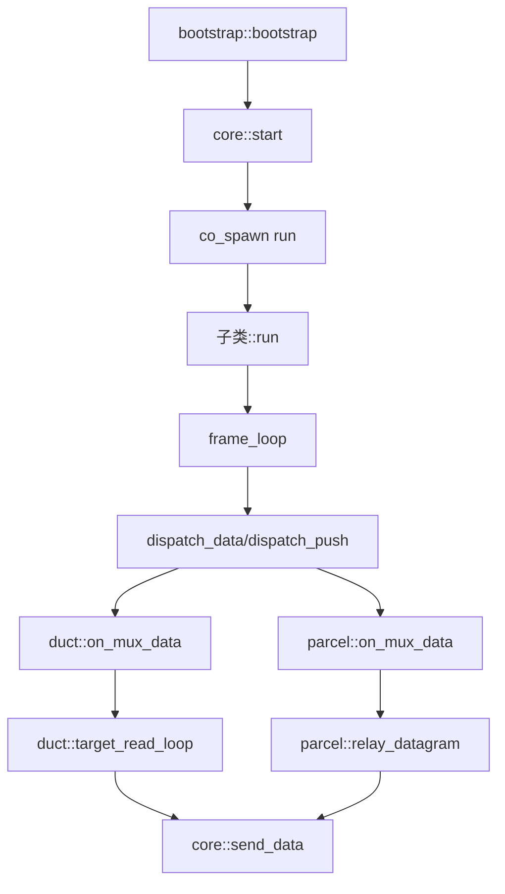

# multiplex::core - 多路复用核心抽象基类

## 源码位置

`I:/code/Prism/include/prism/multiplex/core.hpp`

## 概述

`multiplex::core` 是多路复用协议的抽象基类，提供所有多路复用协议共享的会话生命周期管理、流状态跟踪和发送串行化。协议特定的帧格式、解析和协商由子类实现（如 [[core/multiplex/smux/craft|smux::craft]]、[[core/multiplex/yamux/craft|yamux::craft]]）。

## 设计原则

- core 是协议无关的抽象层，所有帧编解码委托给子类
- 单个实例非线程安全，应在 transport executor 上串行使用
- 继承 `std::enable_shared_from_this`，支持协程上下文中安全的共享指针管理

## 流状态管理

core 管理三种流状态：

| 状态 | 类型 | 说明 |
|------|------|------|
| pending | pending_entry | SYN 后等待地址数据 |
| duct | TCP 流 | [[core/multiplex/duct|duct]] 双向转发 |
| parcel | UDP 流 | [[core/multiplex/parcel|parcel]] 数据报中继 |

## 流状态转换

```
SYN 帧 → 创建 pending_entry 累积地址数据
        ↓
地址完整 → activate_stream() 连接目标
        ↓
    ┌───┴───┐
    ↓       ↓
  duct    parcel
    ↓       ↓
FIN 帧 → 半关闭或完全关闭流
```

## 核心成员

### pending_entry 结构

```cpp
struct pending_entry
{
    memory::vector<std::byte> buffer; // 累积的地址+数据
    bool connecting = false;          // 是否已发起连接
};
```

### 流映射

```cpp
memory::unordered_map<std::uint32_t, pending_entry> pending_;           // 待连接流
memory::unordered_map<std::uint32_t, std::shared_ptr<duct>> ducts_;     // 已连接的活跃 TCP 管道
memory::unordered_map<std::uint32_t, std::shared_ptr<parcel>> parcels_; // 活跃的 UDP 管道
```

## 公开接口

### 构造与生命周期

```cpp
core(channel::transport::shared_transmission transport,
     resolve::router &router,
     const config &cfg,
     memory::resource_pointer mr = {});

virtual ~core();

void start();              // 启动 mux 会话
virtual void close();      // 关闭会话（幂等）
bool is_active() const;    // 检查会话是否活跃
```

### 纯虚函数（子类必须实现）

```cpp
virtual auto send_data(std::uint32_t stream_id,
                       memory::vector<std::byte> payload) const
    -> net::awaitable<void> = 0;

virtual void send_fin(std::uint32_t stream_id) = 0;

virtual net::any_io_executor executor() const = 0;

virtual auto run() -> net::awaitable<void> = 0;  // 协议主循环
```

## 调用链



## 关联文档

- [[core/multiplex/bootstrap|bootstrap]] - 多路复用会话引导
- [[core/multiplex/duct|duct]] - TCP 流管道
- [[core/multiplex/parcel|parcel]] - UDP 数据报管道
- [[core/multiplex/config|config]] - 多路复用配置
- [[core/multiplex/smux/craft|smux::craft]] - smux 协议实现
- [[core/multiplex/yamux/craft|yamux::craft]] - yamux 协议实现

---

## 核心架构设计

### 分层架构

```
┌──────────────────────────────────────────────────────────────┐
│                    Agent Session Layer                       │
│                      bootstrap()                              │
└──────────────────────────┬───────────────────────────────────┘
                           │
┌──────────────────────────▼───────────────────────────────────┐
│                  Multiplex Core Layer                        │
│                                                              │
│  ┌─────────────────────────────────────────────────────┐    │
│  │              core (抽象基类)                          │    │
│  │                                                     │    │
│  │  职责:                                              │    │
│  │  - 会话生命周期管理 (start/close)                   │    │
│  │  - 流状态跟踪 (pending_/ducts_/parcels_)            │    │
│  │  - 发送串行化 (确保帧按序发送)                       │    │
│  │  - 流激活/关闭协议 (SYN/FIN 处理)                   │    │
│  │  - 地址数据累积与目标连接                            │    │
│  └─────────────┬───────────────────┬───────────────────┘    │
│                │                   │                         │
│    ┌───────────▼──────┐  ┌────────▼──────────┐             │
│    │   smux::craft    │  │   yamux::craft    │             │
│    │                  │  │                   │             │
│    │ 帧格式:           │  │ 帧格式:            │             │
│    │  [Version][Type] │  │  [Version][Type]  │             │
│    │  [StreamID]      │  │  [StreamID]       │             │
│    │  [Length][Data]  │  │  [Length][Data]   │             │
│    └──────────────────┘  └───────────────────┘             │
└──────────────────────────────────────────────────────────────┘
                           │
┌──────────────────────────▼───────────────────────────────────┐
│                  Transport Layer                             │
│                                                              │
│  ┌────────────┐  ┌────────────┐  ┌────────────┐            │
│  │ TCP/TLS    │  │ WebSocket  │  │ gRPC       │  ...       │
│  └────────────┘  └────────────┘  └────────────┘            │
│                                                              │
│  shared_transmission (统一传输接口)                           │
└──────────────────────────────────────────────────────────────┘
```

### 组件交互

```
┌──────────────────────────────────────────────────────────────┐
│                     core 内部结构                             │
│                                                              │
│  transport (shared_transmission) ── 底层传输                  │
│       │                                                       │
│       ▼                                                       │
│  run() ─── 帧读取循环 ──▶ dispatch_frame()                    │
│       │                    │                                  │
│       │                    ├── DATA 帧 → dispatch_data()      │
│       │                    │       ├── duct → on_mux_data     │
│       │                    │       └── parcel → on_mux_data   │
│       │                    │                                  │
│       │                    ├── SYN 帧 → create_pending()      │
│       │                    │                                  │
│       │                    └── FIN 帧 → close_stream()        │
│       │                                                       │
│  pending_  ── 待连接流 ──▶ activate_stream()                  │
│       │                     │                                 │
│       │                     ├── router.async_forward()        │
│       │                     ├── make_duct() / make_parcel()   │
│       │                     └── 发送 SYN 应答                  │
│       │                                                       │
│  ducts_  ── 活跃 TCP 管道                                      │
│  parcels_ ── 活跃 UDP 管道                                     │
│                                                              │
│  send_data() ──▶ 子类::push_frame() ──▶ transport->write     │
│  send_fin()  ──▶ 子类::push_fin()  ──▶ transport->write      │
└──────────────────────────────────────────────────────────────┘
```

## 多路复用与底层传输的关系

### 传输层抽象

`core` 通过 `shared_transmission` 接口与底层传输解耦：

```cpp
// 传输层接口（简化）
class transmission {
    virtual auto async_read(buffer) -> awaitable<std::size_t> = 0;
    virtual auto async_write(span<const byte>) -> awaitable<void> = 0;
    virtual auto close() -> void = 0;
    virtual auto executor() -> any_io_executor = 0;
};

using shared_transmission = std::shared_ptr<transmission>;
```

**优势**:
- `core` 不关心底层是 TCP、TLS、WebSocket 还是 gRPC
- 同一套 mux 逻辑可在不同传输层上运行
- 传输层替换不影响 mux 实现

### 数据流向

```
客户端请求 ──▶ Transport (TCP/TLS/WSS/gRPC)
                   │
                   ▼
             shared_transmission
                   │
                   ▼
             core::run()
                   │
              dispatch_frame()
                   │
        ┌──────────┼──────────┐
        ▼          ▼          ▼
     SYN帧      DATA帧      FIN帧
        │          │          │
        ▼          ▼          ▼
   创建流     duct/parcel   关闭流
        │          │          │
        ▼          ▼          ▼
   router连接   目标服务      资源释放
```

### 发送串行化

`core` 保证帧的串行发送，避免数据竞争：

```cpp
// core 中的串行化发送
auto send_data(uint32_t stream_id, vector<byte> payload)
    -> awaitable<void>
{
    // 在 transport executor 上串行执行
    co_await net::post(executor(), net::use_awaitable);
    co_await push_frame(DATA, stream_id, payload);
}
```

**为什么需要串行化**:
- 多个 duct/parcel 可能同时调用 `send_data`
- 底层传输层可能不支持并发写入
- 帧边界必须保持完整（不能交错发送）

### 流状态转换全图

```
                    ┌──────────────┐
                    │   (无流)     │
                    └──────┬───────┘
                           │ SYN 帧到达
                    ┌──────▼───────┐
                    │  pending     │
                    │  (累积地址)   │
                    └──────┬───────┘
                           │ 地址完整
                    ┌──────▼───────┐
                    │  connecting  │
                    │  (等待连接)   │
                    └──────┬───────┘
                           │
              ┌────────────┼────────────┐
              │            │            │
              ▼            ▼            ▼
        ┌──────────┐ ┌──────────┐ ┌──────────┐
        │ TCP 连接  │ │ UDP 创建  │ │ 连接失败  │
        │ 成功     │ │ socket   │ │          │
        └────┬─────┘ └────┬─────┘ └────┬─────┘
             │            │            │
             ▼            ▼            ▼
        ┌──────────┐ ┌──────────┐ ┌──────────┐
        │  active  │ │  active  │ │  error   │
        │  duct    │ │  parcel  │ │ (删除)   │
        └────┬─────┘ └────┬─────┘ └──────────┘
             │            │
             │ FIN/EOF    │ 超时/close
             │            │
             ▼            ▼
        ┌──────────────────┐
        │    closed        │
        │  (从映射移除)     │
        └──────────────────┘
```

### 内存管理

所有 `core` 及其子对象使用 PMR 内存资源：

```cpp
// core 构造函数接收 memory::resource_pointer
core(transport, router, config, mr)
    : pending_(mr), ducts_(mr), parcels_(mr) {}

// duct/parcel 工厂函数同样接受 mr
make_duct(stream_id, owner, target, buffer_size, mr);
make_parcel(stream_id, owner, router, timeout, max_dg, mr);
```

**优势**:
- 内存资源可运行时切换（如 arena、pool）
- 支持自定义分配器用于性能调优
- 会话关闭时统一释放内存池

### 错误传播

```
底层传输错误:
  transport 读取/写入失败
    ↓
  core::run() 协程结束
    ↓
  close() → 关闭所有活跃流
    ↓
  通知上游 (Agent Session)

单个流错误:
  duct/parcel 内部错误
    ↓
  从 ducts_/parcels_ 移除
    ↓
  不影响其他流
    ↓
  发送 FIN 帧通知客户端
```