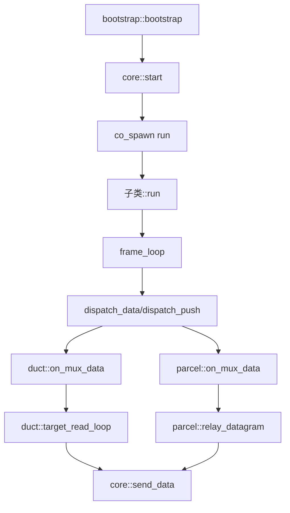

# multiplex::core - 多路复用核心抽象基类

## 源码位置

`I:/code/Prism/include/prism/multiplex/core.hpp`

## 概述

`multiplex::core` 是多路复用协议的抽象基类，提供所有多路复用协议共享的会话生命周期管理、流状态跟踪和发送串行化。协议特定的帧格式、解析和协商由子类实现（如 [[core/multiplex/smux/craft|smux::craft]]、[[core/multiplex/yamux/craft|yamux::craft]]）。

## 设计原则

- core 是协议无关的抽象层，所有帧编解码委托给子类
- 单个实例非线程安全，应在 transport executor 上串行使用
- 继承 `std::enable_shared_from_this`，支持协程上下文中安全的共享指针管理

## 流状态管理

core 管理三种流状态：

| 状态 | 类型 | 说明 |
|------|------|------|
| pending | pending_entry | SYN 后等待地址数据 |
| duct | TCP 流 | [[core/multiplex/duct|duct]] 双向转发 |
| parcel | UDP 流 | [[core/multiplex/parcel|parcel]] 数据报中继 |

## 流状态转换

```
SYN 帧 → 创建 pending_entry 累积地址数据
        ↓
地址完整 → activate_stream() 连接目标
        ↓
    ┌───┴───┐
    ↓       ↓
  duct    parcel
    ↓       ↓
FIN 帧 → 半关闭或完全关闭流
```

## 核心成员

### pending_entry 结构

```cpp
struct pending_entry
{
    memory::vector<std::byte> buffer; // 累积的地址+数据
    bool connecting = false;          // 是否已发起连接
};
```

### 流映射

```cpp
memory::unordered_map<std::uint32_t, pending_entry> pending_;           // 待连接流
memory::unordered_map<std::uint32_t, std::shared_ptr<duct>> ducts_;     // 已连接的活跃 TCP 管道
memory::unordered_map<std::uint32_t, std::shared_ptr<parcel>> parcels_; // 活跃的 UDP 管道
```

## 公开接口

### 构造与生命周期

```cpp
core(channel::transport::shared_transmission transport,
     resolve::router &router,
     const config &cfg,
     memory::resource_pointer mr = {});

virtual ~core();

void start();              // 启动 mux 会话
virtual void close();      // 关闭会话（幂等）
bool is_active() const;    // 检查会话是否活跃
```

### 纯虚函数（子类必须实现）

```cpp
virtual auto send_data(std::uint32_t stream_id,
                       memory::vector<std::byte> payload) const
    -> net::awaitable<void> = 0;

virtual void send_fin(std::uint32_t stream_id) = 0;

virtual net::any_io_executor executor() const = 0;

virtual auto run() -> net::awaitable<void> = 0;  // 协议主循环
```

## 调用链



## 关联文档

- [[core/multiplex/bootstrap|bootstrap]] - 多路复用会话引导
- [[core/multiplex/duct|duct]] - TCP 流管道
- [[core/multiplex/parcel|parcel]] - UDP 数据报管道
- [[core/multiplex/config|config]] - 多路复用配置
- [[core/multiplex/smux/craft|smux::craft]] - smux 协议实现
- [[core/multiplex/yamux/craft|yamux::craft]] - yamux 协议实现