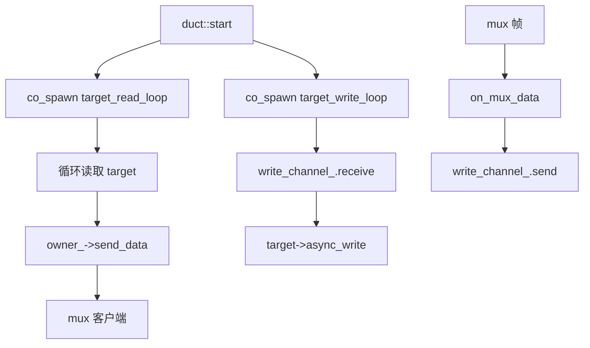
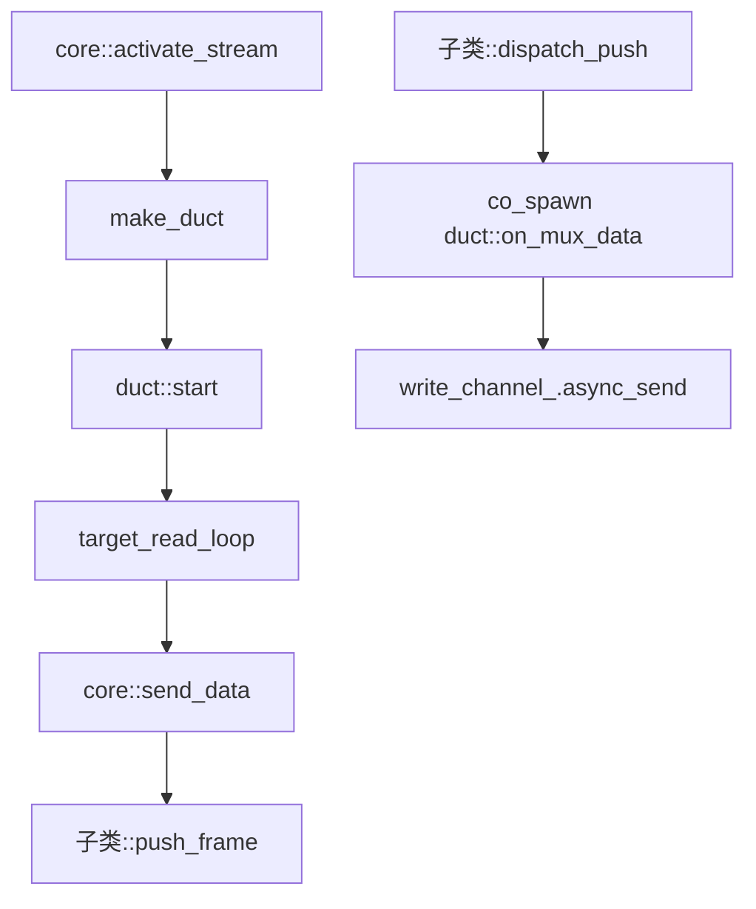

# multiplex::duct - 多路复用 TCP 流管道

## 源码位置

`I:/code/Prism/include/prism/multiplex/duct.hpp`

## 概述

`multiplex::duct` 是协议无关的双向 TCP 转发管道。每条 duct 绑定一个已连接的 target 传输层，提供 mux 帧到 target 的透明双向转发。构造时即持有 target，不存在空管道阶段。

## 设计原则

- duct 是协议无关的，通过 [[core/multiplex/core|core]] 虚函数接口发送帧，不依赖具体协议
- 单个实例非线程安全，应在 transport executor 上串行使用
- 通过 `shared_from_this` 保活，协程持有 self 防止提前析构
- `owner_` 持有 core 的 weak_ptr，不构成循环引用

## 双向数据转发

### 客户端下载方向

```
target → target_read_loop → core::send_data → mux 客户端
```

### 客户端上传方向

```
mux 客户端 → on_mux_data → write_channel_ → target_write_loop → target
```

## 半关闭语义

| 事件 | 动作 |
|------|------|
| mux 端收到 FIN | 调用 `on_mux_fin`，标记 `mux_closed_`，关闭 `write_channel_` |
| target 端读到 EOF | 标记 `target_closed_`，调用 `owner_->send_fin` |
| 两端均关闭 | duct 自行析构 |

## 成员变量

```cpp
std::uint32_t id_;                               // 流标识符
std::weak_ptr<core> owner_;                      // 所属 core 的弱引用
channel::transport::shared_transmission target_; // 已连接的目标传输层
bool closed_ = false;                            // 关闭标志
std::atomic<bool> mux_closed_{false};            // mux 端已半关闭
std::atomic<bool> target_closed_{false};         // target 端已半关闭
write_channel_type write_channel_;               // 写通道（有界容量提供反压）
```

## 公开接口

```cpp
duct(std::uint32_t stream_id,
     std::shared_ptr<core> owner,
     channel::transport::shared_transmission target,
     std::uint32_t buffer_size,
     memory::resource_pointer mr);

void start();                               // 启动双向转发协程
auto on_mux_data(memory::vector<std::byte> data) -> net::awaitable<void>;  // 接收 mux 数据
void on_mux_fin();                          // 处理 mux 端 FIN
void close();                               // 关闭管道（幂等）
std::uint32_t stream_id() const noexcept;   // 获取流标识符
```

## 工厂函数

```cpp
[[nodiscard]] inline auto make_duct(
    std::uint32_t stream_id,
    std::shared_ptr<core> owner,
    channel::transport::shared_transmission target,
    std::uint32_t buffer_size,
    memory::resource_pointer mr = {}
) -> std::shared_ptr<duct>;
```

## 协程模型



## 调用链



## 关联文档

- [[core/multiplex/core|core]] - 多路复用核心抽象基类
- [[core/multiplex/parcel|parcel]] - UDP 数据报管道
- [[core/multiplex/smux/craft|smux::craft]] - smux 协议实现
- [[core/multiplex/yamux/craft|yamux::craft]] - yamux 协议实现