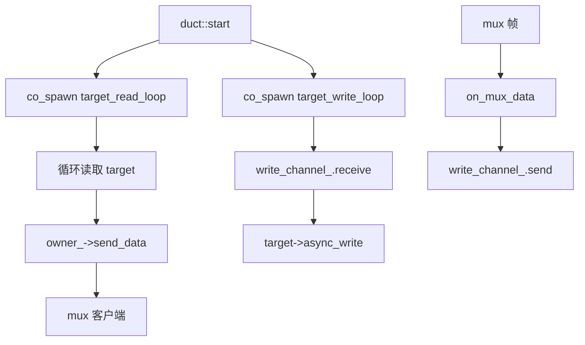
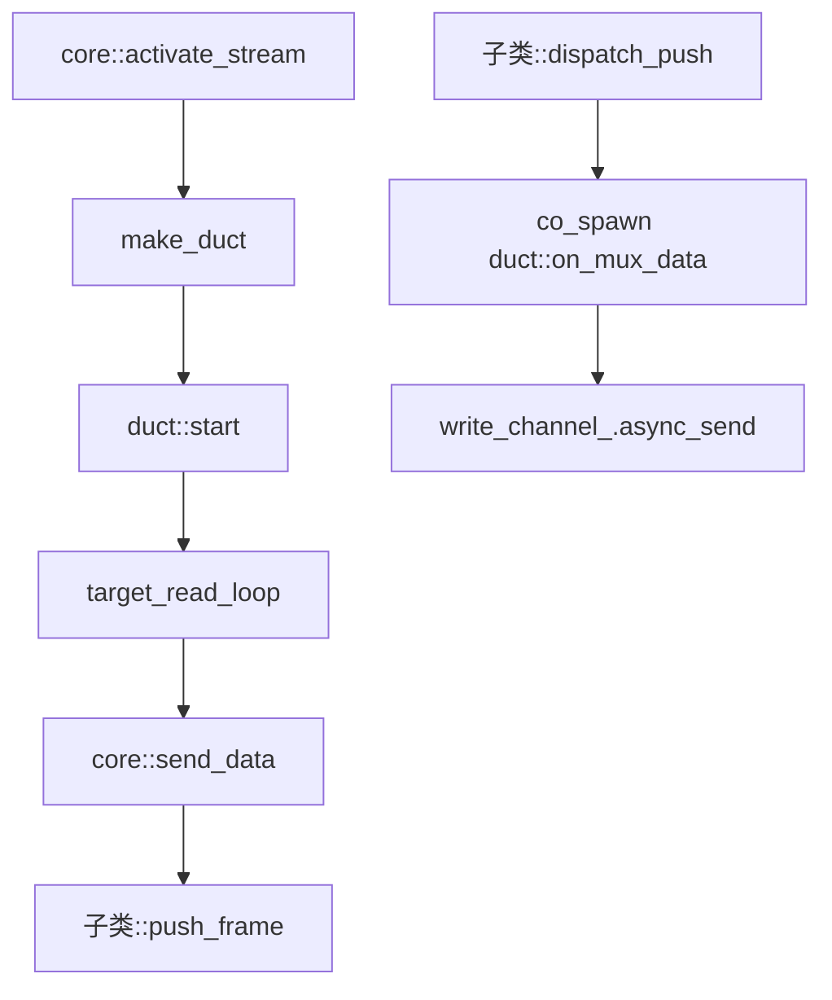

# multiplex::duct - 多路复用 TCP 流管道

## 源码位置

`I:/code/Prism/include/prism/multiplex/duct.hpp`

## 概述

`multiplex::duct` 是协议无关的双向 TCP 转发管道。每条 duct 绑定一个已连接的 target 传输层，提供 mux 帧到 target 的透明双向转发。构造时即持有 target，不存在空管道阶段。

## 设计原则

- duct 是协议无关的，通过 [[core/multiplex/core|core]] 虚函数接口发送帧，不依赖具体协议
- 单个实例非线程安全，应在 transport executor 上串行使用
- 通过 `shared_from_this` 保活，协程持有 self 防止提前析构
- `owner_` 持有 core 的 weak_ptr，不构成循环引用

## 双向数据转发

### 客户端下载方向

```
target → target_read_loop → core::send_data → mux 客户端
```

### 客户端上传方向

```
mux 客户端 → on_mux_data → write_channel_ → target_write_loop → target
```

## 半关闭语义

| 事件 | 动作 |
|------|------|
| mux 端收到 FIN | 调用 `on_mux_fin`，标记 `mux_closed_`，关闭 `write_channel_` |
| target 端读到 EOF | 标记 `target_closed_`，调用 `owner_->send_fin` |
| 两端均关闭 | duct 自行析构 |

## 成员变量

```cpp
std::uint32_t id_;                               // 流标识符
std::weak_ptr<core> owner_;                      // 所属 core 的弱引用
transport::shared_transmission target_; // 已连接的目标传输层
bool closed_ = false;                            // 关闭标志
std::atomic<bool> mux_closed_{false};            // mux 端已半关闭
std::atomic<bool> target_closed_{false};         // target 端已半关闭
write_channel_type write_channel_;               // 写通道（有界容量提供反压）
```

## 公开接口

```cpp
duct(std::uint32_t stream_id,
     std::shared_ptr<core> owner,
     transport::shared_transmission target,
     std::uint32_t buffer_size,
     memory::resource_pointer mr);

void start();                               // 启动双向转发协程
auto on_mux_data(memory::vector<std::byte> data) -> net::awaitable<void>;  // 接收 mux 数据
void on_mux_fin();                          // 处理 mux 端 FIN
void close();                               // 关闭管道（幂等）
std::uint32_t stream_id() const noexcept;   // 获取流标识符
```

## 工厂函数

```cpp
[[nodiscard]] inline auto make_duct(
    std::uint32_t stream_id,
    std::shared_ptr<core> owner,
    transport::shared_transmission target,
    std::uint32_t buffer_size,
    memory::resource_pointer mr = {}
) -> std::shared_ptr<duct>;
```

## 协程模型



## 调用链



## 关联文档

- [[core/multiplex/core|core]] - 多路复用核心抽象基类
- [[core/multiplex/parcel|parcel]] - UDP 数据报管道
- [[core/multiplex/smux/craft|smux::craft]] - smux 协议实现
- [[core/multiplex/yamux/craft|yamux::craft]] - yamux 协议实现

---

## TCP 流管道机制

### 核心架构

`duct` 是 TCP 流的透明双向转发管道。它在 mux 协议层和目标传输层之间建立桥梁：

```
┌──────────────────────────────────────────────────────────┐
│                        duct                               │
│                                                          │
│   mux 客户端 ◄────► write_channel_ ◄────► target         │
│       │                      │                │          │
│       │ on_mux_data          │ target_write   │          │
│       │ (入站数据)           │ _loop          │          │
│       │                      │                │          │
│       │                      │                │          │
│       │ target_read_loop     │                │          │
│       │ (出站数据)           │                │          │
│       ▼                      ▼                ▼          │
│   core::send_data      反压队列          async_write     │
│                                                          │
└──────────────────────────────────────────────────────────┘
```

### 写通道（反压队列）

`write_channel_` 是有界容量的异步队列，提供反压机制：

```cpp
// write_channel_ 伪代码
class write_channel {
    std::deque<memory::vector<std::byte>> queue_;
    std::size_t max_size_;      // 最大容量
    std::size_t current_size_;  // 当前大小

    auto send(data) -> awaitable<void>;    // 满时挂起（反压）
    auto receive() -> awaitable<vector<byte>>;  // 空时挂起
};
```

**反压语义**:
- 当 `write_channel_` 满时，`on_mux_data` 挂起
- mux 帧发送被暂停，防止内存无限增长
- target 消费数据后队列释放空间，反压解除

### 双向转发协程

```
target_read_loop (出站方向):
┌─────────────────────────────────┐
│ 循环:                           │
│   data = co_await target->read │
│   if data.empty() → break       │
│   co_await owner_->send_data    │
│     (id_, std::move(data))      │
│ 结束:                           │
│   target_closed_ = true         │
│   owner_->send_fin(id_)         │
│   close()                       │
└─────────────────────────────────┘

target_write_loop (入站方向):
┌─────────────────────────────────┐
│ 循环:                           │
│   data = co_await               │
│     write_channel_.receive()    │
│   co_await target->async_write  │
│     (data)                      │
│ 结束 (write_channel_ 关闭):     │
│   mux_closed_ = true            │
│   close()                       │
└─────────────────────────────────┘
```

## 流创建/关闭流程

### 流创建流程 (SYN → duct 激活)

```
1. core 接收到 SYN 帧
   │
2. 创建 pending_entry {stream_id}
   │  累积后续 DATA 帧中的地址数据
   │
3. 地址数据完整 → activate_stream(stream_id)
   │
4. 解析目标地址 (host:port)
   │
5. 通过 router.async_forward() 连接目标
   │  ├─→ IP 字面量: 直接连接
   │  └─→ 域名: DNS 解析 → Happy Eyeballs 连接
   │
6. 连接成功 → make_duct(stream_id, core, target, ...)
   │
7. 从 pending_ 移除 → 加入 ducts_ 映射
   │
8. 发送 SYN 应答帧 (stream_id, status=0x00)
   │  通知客户端流已就绪
   │
9. duct->start() → 启动双向转发协程
   │
10. 流进入活跃状态
   │
   此时: mux 客户端 ◄──► duct ◄──► 目标服务
```

### 半关闭时序图

```
mux 客户端                 duct                    target
    │                       │                        │
    │── DATA ──────────────▶│                        │
    │                       │── write_channel ──────▶│
    │                       │                        │
    │── FIN ───────────────▶│                        │
    │  (上传结束)           │ on_mux_fin             │
    │                       │ mux_closed_ = true     │
    │                       │ close write_channel    │
    │                       │                        │
    │                       │── (无更多数据)          │
    │                       │                        │── EOF
    │                       │                        │ (读结束)
    │                       │ target_read_loop 结束  │
    │                       │ target_closed_ = true  │
    │                       │ send_fin(id_) ────────▶│
    │                       │                        │
    │◀── FIN ◀──────────────│                        │
    │  (下载结束)           │                        │
    │                       │                        │
    │                  close() → duct 析构            │
    │                  从 ducts_ 移除                 │
```

### 完全关闭流程

```
duct::close() (幂等操作):
  │
  1. if closed_ already → return
  2. closed_ = true
  3. write_channel_.close()    // 唤醒等待的 writer
  4. target->shutdown()        // 优雅关闭 target 连接
  5. 从 core::ducts_ 移除      // 释放引用
  6. duct 对象析构 (shared_ptr 计数归零)
```

### 异常处理

| 异常场景 | 处理策略 | 影响范围 |
|----------|----------|----------|
| target 连接失败 | 发送错误状态帧，删除 pending_entry | 单流 |
| target 读取中断 | 发送 FIN，标记 target_closed_ | 单流 |
| mux 发送 FIN | 关闭 write_channel_，等待 target 读完 | 单流 |
| core 关闭 | 关闭所有 ducts_，释放所有流 | 全部流 |
| 内存资源耗尽 | write_channel_ 反压挂起，等待释放 | 单流 |

### 流生命周期状态机

```
                    ┌───────────┐
                    │  pending  │ ← SYN 帧后等待地址数据
                    └─────┬─────┘
                          │ 地址完整 + 连接成功
                    ┌─────▼─────┐
              ┌─────│  active   │─────┐
              │     │ (ducting) │     │
              │     └─────┬─────┘     │
              │           │           │
    mux FIN   │     target FIN       │ both closed
              │           │           │
         ┌────▼───┐ ┌────▼────┐      │
         │mux_    │ │target_  │      │
         │closed  │ │closed   │      │
         └────┬───┘ └────┬────┘      │
              │          │           │
              │     other closes      │
              │          │           │
              └────┬─────┘───────────┘
                   │
             ┌─────▼─────┐
             │  closed   │ → 从 ducts_ 移除
             │  (删除)   │ → duct 析构
             └───────────┘
```