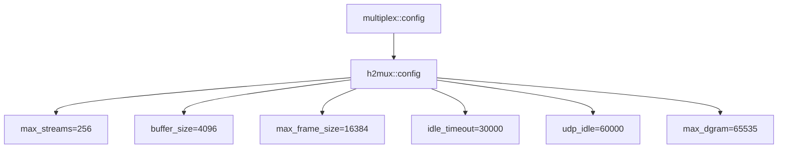

# h2mux::config - h2mux 协议配置

## 源码位置

`I:/code/Prism/include/prism/multiplex/h2mux/config.hpp`

## 概述

定义 h2mux（HTTP/2 CONNECT 多路复用）协议的全部配置参数。h2mux 利用 HTTP/2 原生 stream 实现应用层多路复用，流量控制由 HTTP/2 标准流控自动管理，无需应用层窗口机制。

## 配置结构

```cpp
struct config
{
    std::uint32_t max_streams = 256;           // 单个 mux 会话最大并发流数
    std::uint32_t buffer_size = 4096;          // 每流读取缓冲区大小
    std::uint32_t max_frame_size = 16384;      // HTTP/2 最大帧载荷大小
    std::uint32_t idle_timeout = 30000;        // 连接空闲超时（毫秒）
    std::uint32_t udp_idle = 60000;            // UDP 管道空闲超时（毫秒）
    std::uint32_t max_dgram = 65535;           // UDP 数据报最大长度（字节）
};
```

## 参数说明

| 参数 | 默认值 | 说明 |
|------|--------|------|
| max_streams | 256 | 单个 mux 会话最大并发流数（HTTP/2 默认允许更多） |
| buffer_size | 4096 | 每流读取缓冲区大小（字节） |
| max_frame_size | 16384 | HTTP/2 最大帧载荷大小（字节），默认 16384 |
| idle_timeout | 30000 | HTTP/2 连接空闲超时 |
| udp_idle | 60000 | UDP 管道空闲超时，超时自动关闭 |
| max_dgram | 65535 | UDP 数据报最大长度（字节） |

## 与 smux/yamux 对比

| 参数 | smux | yamux | h2mux |
|------|------|-------|-------|
| max_streams | 32 | 32 | 256 |
| buffer_size | 4096 | 4096 | 4096 |
| 流量控制 | 无 | 256KB | HTTP/2 标准流控 |
| 心跳 | NOP | Ping | HTTP/2 PING |
| 最大帧载荷 | 65535 | 65535 | 16384 (max_frame_size) |
| UDP 空闲超时 | 60000 | 60000 | 60000 |
| UDP 最大数据报 | 65535 | 65535 | 65535 |

## 配置层级



## 配置映射

### 源码字段到使用方的追踪

| 配置字段 | 使用位置 | 效果 |
|----------|----------|------|
| `max_streams` | `craft` 构造函数中 `send_channel_` 容量 | 发送通道最大缓冲项数 |
| `buffer_size` | `frame_loop` 中 `recv_buf` 大小 | 单次从 transport 读取上限 |
| `buffer_size` | `activate_stream` 中 `duct_options.opts.buffer_size` | duct 从 target 单次读取上限 |
| `max_frame_size` | 当前未直接使用（nghttp2 内部 SETTINGS） | 控制 HTTP/2 帧载荷上限 |
| `idle_timeout` | 预留字段，当前未使用 | 连接空闲超时（未来迭代） |
| `udp_idle` | `activate_stream` 中 `parcel_config.idle_timeout` | UDP 管道空闲超时 |
| `max_dgram` | `activate_stream` 中 `parcel_config.max_dgram` | UDP 数据报最大长度 |

### 加载路径

```
configuration.json
    -> loader::load()
        -> multiplex::config.h2mux
            -> TrustTunnel scheme 构造时创建 h2mux::craft
                -> craft 构造函数读取 cfg.h2mux.*
```

若通过 bootstrap 创建（Protocol=2），则 craft 构造函数通过 `craft_init.cfg` 访问。

### max_streams 调优说明

h2mux 的 max_streams 默认 256（而非 smux/yamux 的 32），原因是 HTTP/2 连接通常由 TrustTunnel 方案承载，nghttp2 库内部维护完整 HTTP/2 状态机，256 个并发 stream 是 HTTP/2 协议的常见上限。更大的 duct 数量不会显著增加内存，因为 channel 容量仅控制发送缓冲，不预分配。

### max_frame_size 调优说明

16384（16KB）是 HTTP/2 规范默认值（RFC 7540 Section 4.2），通过 SETTINGS_MAX_FRAME_SIZE 协商。nghttp2 内部按此值分片，无需应用层干预。

## 关联文档

- [[core/multiplex/config|multiplex::config]] - 多路复用通用配置
- [[core/multiplex/h2mux/craft|h2mux::craft]] - h2mux 协议实现
- [[core/multiplex/smux/config|smux::config]] - smux 协议配置
- [[core/multiplex/yamux/config|yamux::config]] - yamux 协议配置
