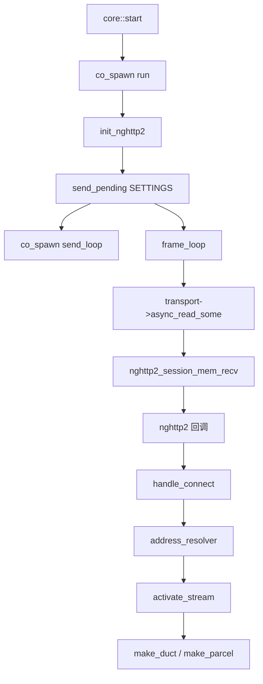
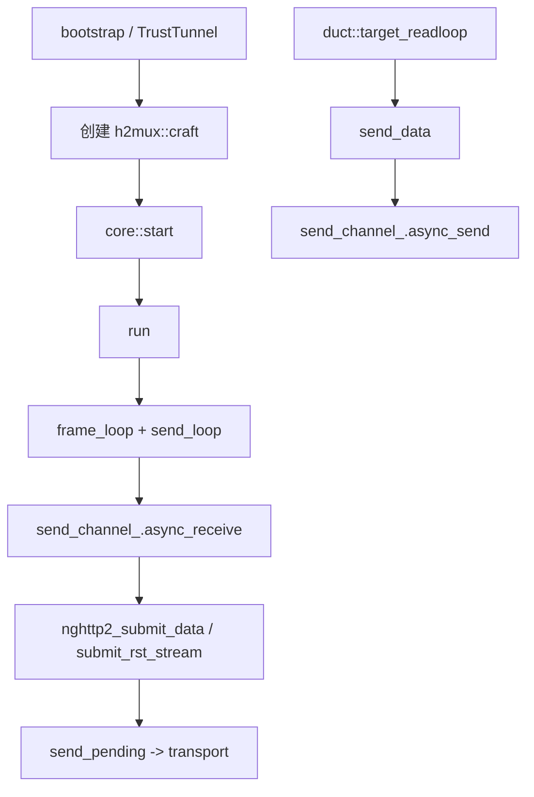

# h2mux::craft - h2mux 多路复用会话服务端

## 源码位置

头文件: include/prism/multiplex/h2mux/craft.hpp
源文件: src/prism/multiplex/h2mux/craft.cpp

## 概述

`h2mux::craft` 继承 [[core/multiplex/core|core]]，利用 nghttp2 库实现 HTTP/2 原生 stream 多路复用。每个 HTTP/2 CONNECT 请求创建一个独立 stream，对应 [[core/multiplex/duct|duct]]（TCP）或 [[core/multiplex/parcel|parcel]]（UDP）。流量控制由 HTTP/2 标准流控管理，无需应用层窗口机制。

## 关键特征

- 基于 nghttp2 库实现完整 HTTP/2 帧编解码
- 独立的 `h2_pending_` 映射，与 core 的 `pending_` 分离
- `address_resolver` 回调支持 sing-mux 和 TrustTunnel 两种地址解析模式
- 不走 sing-mux bootstrap 协商，由 scheme 或 bootstrap 直接创建
- **活跃 TODO**: `on_data` 中的 sing-mux StreamRequest 解析尚未实现

## stream_type 枚举

```cpp
enum class stream_type : std::uint8_t
{
    tcp,   // TCP 流，创建 duct 双向转发
    udp,   // UDP 数据报，创建 parcel 中继
    icmp,  // ICMP 代理（后续迭代）
    check  // 健康检查，回复 200 后关闭
};
```

> 源码位置: include/prism/multiplex/h2mux/craft.hpp:36

## stream_info 结构

```cpp
struct stream_info
{
    memory::string host;
    std::uint16_t port = 0;
    stream_type type = stream_type::tcp;
    bool valid = false;  // 地址信息是否完整可用
};
```

> 源码位置: include/prism/multiplex/h2mux/craft.hpp:54

`valid=false` 表示地址信息不完整（如 sing-mux 模式需要等待 DATA 帧），此时不立即连接目标。

## h2_headers 结构

```cpp
struct h2_headers
{
    std::int32_t stream_id{0};
    memory::string authority;       // :authority 头（CONNECT 目标）
    memory::string host;            // Host 头
    memory::string user_agent;      // User-Agent 头
    memory::string proxy_auth;      // Proxy-Authorization 头
};
```

> 源码位置: include/prism/multiplex/h2mux/craft.hpp:67

## address_resolver 回调

```cpp
using address_resolver = std::function<stream_info(
    std::int32_t stream_id, const h2_headers &headers)>;
```

> 源码位置: include/prism/multiplex/h2mux/craft.hpp:85

双模式解析:

- **sing-mux resolver**: authority 为 localhost/空值时忽略 HEADERS，等待 StreamRequest DATA 帧后解析
- **TrustTunnel resolver**: 从 authority 解析 host:port，从 Host 判断流类型

## h2_pending_entry 结构

```cpp
struct h2_pending_entry
{
    h2_headers headers;
    stream_info info;
    bool connecting = false;
};
```

> 源码位置: include/prism/multiplex/h2mux/craft.hpp:95

命名冲突避免: 命名为 `h2_pending_entry` 而非 `pending_entry`，避免与 core 的 `pending_entry` 冲突。

## craft_init 结构

```cpp
struct craft_init
{
    connect::router &router;
    const multiplex::config &cfg;
    address_resolver resolver;
};
```

> 源码位置: include/prism/multiplex/h2mux/craft.hpp:124

将构造函数参数从 5 个降至 3 个（transport + init + mr），符合 Rule 1 参数收敛原则。

## outbound_data 结构

```cpp
struct outbound_data
{
    std::uint32_t stream_id = 0;
    memory::vector<std::byte> payload;
    bool is_fin = false;
};
```

> 源码位置: include/prism/multiplex/h2mux/craft.hpp:108

通过 `send_channel_` 传递给 `send_loop`，由 nghttp2 编码为 HTTP/2 DATA 帧或 RST_STREAM。

## 公开接口

```cpp
craft(core_options opts, craft_init init, memory::resource_pointer mr = {});

auto send_data(std::uint32_t stream_id, memory::vector<std::byte> payload) const
    -> net::awaitable<void> override;

void send_fin(std::uint32_t stream_id) override;

net::any_io_executor executor() const override;

auto wait_first_connect()
    -> net::awaitable<std::optional<h2_headers>>;

auto respond_connect(std::int32_t stream_id, std::uint32_t status)
    -> std::int32_t;

auto send_pending() -> net::awaitable<void>;

auto activate_stream(std::uint32_t stream_id)
    -> net::awaitable<void>;
```

> 源码位置: include/prism/multiplex/h2mux/craft.hpp:149

## wait_first_connect()

供 [[core/stealth|TrustTunnel scheme]] 验证 Basic Auth 后再交给 craft 管理:

```
TrustTunnel scheme
    |
    v
创建 h2mux::craft + TrustTunnel resolver
    |
    v
co_await craft->wait_first_connect()
    |
    v
提取 CONNECT 请求头中的 h2_headers
    |
    v
验证 proxy_auth 中 Basic Auth
    |
    +-> respond_connect(stream_id, 200) -> start() -> run()
    +-> respond_connect(stream_id, 407) -> 拒绝连接
```

## nghttp2 回调

| 回调 | 触发时机 | 处理 |
|------|----------|------|
| `on_begin_headers` | 收到 CONNECT 请求的 HEADERS 帧开始 | 创建 h2_pending_entry |
| `on_header` | 收到单个头字段 | 解析 :authority/Host/User-Agent/Proxy-Authorization |
| `on_frame_recv` | HEADERS 帧完整接收后 | handle_connect |
| `on_data` | DATA 帧载荷到达 | 分发到 h2_pending_ -> ducts_ -> parcels_ |
| `on_stream_close` | HTTP/2 stream 关闭 | 清理 h2_pending_/ducts_/parcels_ |

> 源码位置: src/prism/multiplex/h2mux/craft.cpp:360

### on_data 分发逻辑

```
nghttp2 DATA 到达 -> on_data
    |
    +--- h2_pending_ 中存在 -> sing-mux 地址数据
    |                         TODO: StreamRequest 解析未实现
    |
    +--- ducts_ 中存在 -> co_spawn duct::on_data
    |
    +--- parcels_ 中存在 -> co_spawn parcel::on_data
    |
    +--- 均不存在 -> RST_STREAM
```

**活跃 TODO**: `on_data` 中 h2_pending_ 分支的 sing-mux StreamRequest 解析尚未实现。

> 源码位置: src/prism/multiplex/h2mux/craft.cpp:461

## 协程模型



## send_loop

```
send_loop:
    while active:
        send_channel_.async_receive -> outbound_data

        is_fin? -> nghttp2_submit_rst_stream + send_pending

        payload? -> nghttp2_submit_data + send_pending
                   |
                   read_callback 逐片拷贝 payload 到 nghttp2 缓冲区
```

> 源码位置: src/prism/multiplex/h2mux/craft.cpp:605

## activate_stream

```
activate_stream(stream_id):
    从 h2_pending_ 取出 h2_stream_info

    switch (type):
        check -> respond_connect(200) + RST_STREAM
        udp   -> respond_connect(200) + make_parcel
        icmp  -> fallthrough to tcp (TODO)
        tcp   -> connect::async_forward + respond_connect(200) + make_duct
```

> 源码位置: src/prism/multiplex/h2mux/craft.cpp:249

## 调用链



## 关联文档

- [[core/multiplex/core|core]] - 多路复用核心抽象基类
- [[core/multiplex/h2mux/config|h2mux::config]] - h2mux 协议配置
- [[core/multiplex/duct|duct]] - TCP 流管道
- [[core/multiplex/parcel|parcel]] - UDP 数据报管道
- [[core/multiplex/bootstrap|bootstrap]] - 多路复用引导（sing-mux 入口）
- [[core/stealth|stealth]] - TrustTunnel 方案使用 h2mux 引擎

## 设计决策

### 为什么使用 nghttp2 而非手工解析 HTTP/2？

**问题**: HTTP/2 协议复杂度高（HPACK 头压缩、流控、优先级、CONTINUATION 帧等），手工解析易出错且不完整。

**选择**: 集成 nghttp2 C 库，通过回调接口处理协议细节。nghttp2 的同步回调在 `frame_loop` 的 `nghttp2_session_mem_recv` 中执行，通过 `user_data` 获取 craft 的 this 指针。

**后果**: 获得完整 HTTP/2 协议支持（HPACK 压缩、SETTINGS 协商、CONTINUATION 帧拼接、流控窗口），但引入 C 依赖。nghttp2 回调中不能使用协程，数据分发必须通过 `co_spawn` 异步处理。

**替代方案**: 手工实现 HTTP/2 帧解析，开发量和正确性验证代价极高。

**源码依据**: `h2mux/craft.cpp:60-92`

### 为什么 h2_pending_ 与 core pending_ 分离？

**问题**: h2mux 的 pending 条目需要存储 HTTP/2 特有信息（`h2_headers`、`connecting` 标志），与 smux/yamux 的 `pending_entry`（仅 buffer + connecting）结构不同。

**选择**: h2mux 维护独立的 `h2_pending_` 映射，存储 `h2_pending_entry`（含 headers + info + connecting）。

**后果**: HTTP/2 HEADERS 帧完整接收后由 address_resolver 解析，若 `valid=false` 则等待 DATA 帧。core 的 `pending_` 对 h2mux 无意义（不走 sing-mux SYN/PSH 流程）。

**源码依据**: `h2mux/craft.hpp:248`

### 为什么 address_resolver 使用回调注入而非虚函数？

**问题**: h2mux 有两种完全不同的地址解析模式: sing-mux 模式从 DATA 帧载荷解析 StreamRequest，TrustTunnel 模式从 CONNECT 的 :authority 头直接提取 host:port。

**选择**: 通过 `craft_init.resolver` 注入 `std::function<stream_info(int32_t, const h2_headers&)>`，由调用方决定解析策略。

**后果**: craft 不依赖具体方案实现，sing-mux 和 TrustTunnel 各自注入不同的 resolver。代价是多一次间接调用。

**替代方案**: 在 craft 中 if-else 判断模式会引入方案耦合。

**源码依据**: `h2mux/craft.hpp:85-88`, `h2mux/craft.cpp:192-227`

### 为什么 wait_first_connect 使用 steady_timer 而非 promise？

**问题**: TrustTunnel scheme 需要在 craft 启动后等待第一个 CONNECT 请求到达，验证 Basic Auth 后再决定是否放行。

**选择**: 使用 `connect_waiter_` 定时器（初始 24 小时超时）作为通知机制。第一个有效 CONNECT 触发 `connect_waiter_.cancel()` 唤醒等待方。

**后果**: 纯协程实现，不使用 std::promise。定时器 cancel 产生的 operation_cancelled 错误码被 `redirect_error` 捕获，不触发异常。

**源码依据**: `h2mux/craft.cpp:661-682`

## 约束

### nghttp2 回调中禁止阻塞操作

**类型**: 协程纯度
**规则**: 所有 nghttp2 回调（on_begin_headers、on_header、on_frame_recv、on_data、on_stream_close）在 `nghttp2_session_mem_recv` 内同步执行。需要异步操作时必须 `co_spawn` 新协程。
**违反后果**: 阻塞 io_context 线程，影响同 worker 所有连接
**源码依据**: `h2mux/craft.cpp:444-507`

### send_channel_ 容量等于 max_streams

**类型**: 资源上限
**规则**: `send_channel_` 容量在构造时设为 `cfg.h2mux.max_streams`（默认 256），限制待发送数据总量。
**违反后果**: 超过容量时 `send_data` 的 `async_send` 挂起，直到 send_loop 消费
**源码依据**: `h2mux/craft.cpp:44`

### connect_waiter_ 初始 24 小时超时

**类型**: 防御性编程
**规则**: `connect_waiter_` 初始设为 24 小时，防止第一个 CONNECT 永不到达时协程永久挂起。
**源码依据**: `h2mux/craft.cpp:47`

## 失败场景

| 场景 | 处理 |
|------|------|
| nghttp2 初始化失败 | `run()` 直接 co_return，会话不启动 |
| transport 读取失败 | frame_loop 退出，取消 send_channel |
| nghttp2 解析错误 | frame_loop 记录错误并退出 |
| CONNECT 目标连接失败 | 发送 RST_STREAM(INTERNAL_ERROR)，不影响其他 stream |
| duct/parcel on_data 异常 | co_spawn 的错误处理关闭对应 duct/parcel |
| send_pending 写入失败 | 记录警告并中断发送循环 |
| 第一个 CONNECT 未到达 | connect_waiter_ 在 24 小时后超时，返回 nullopt |
