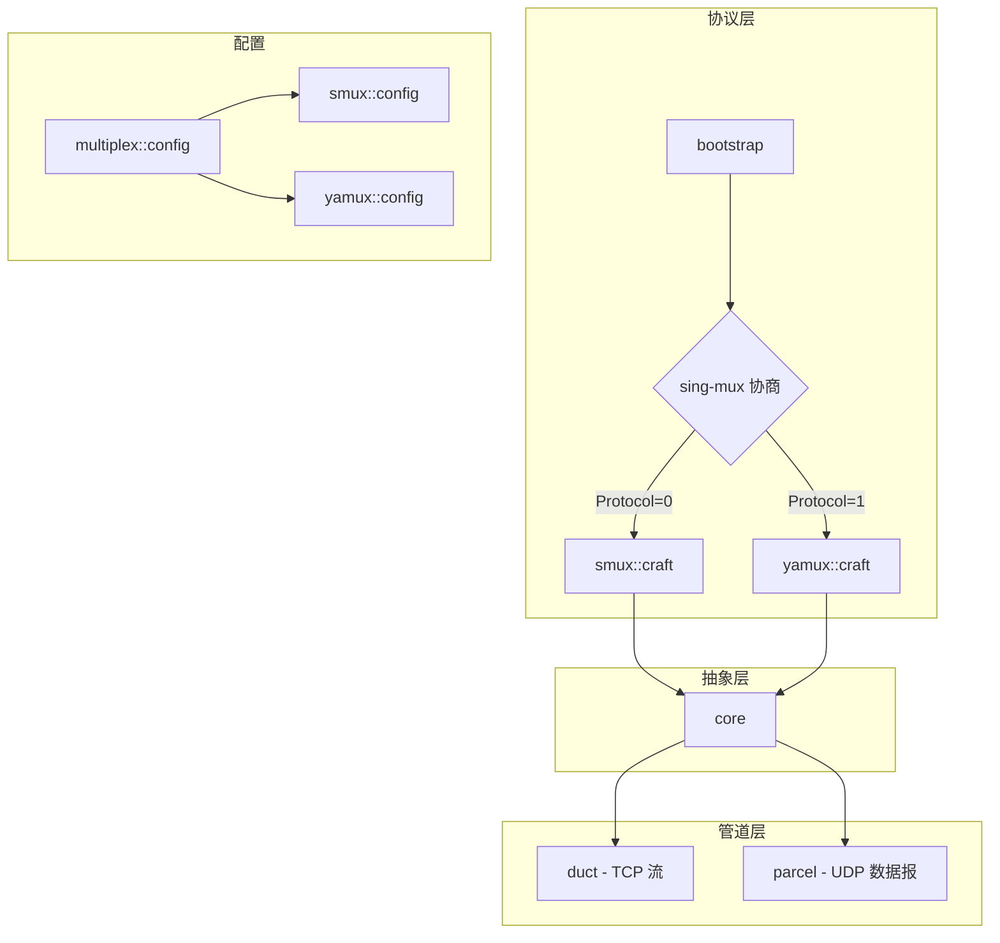
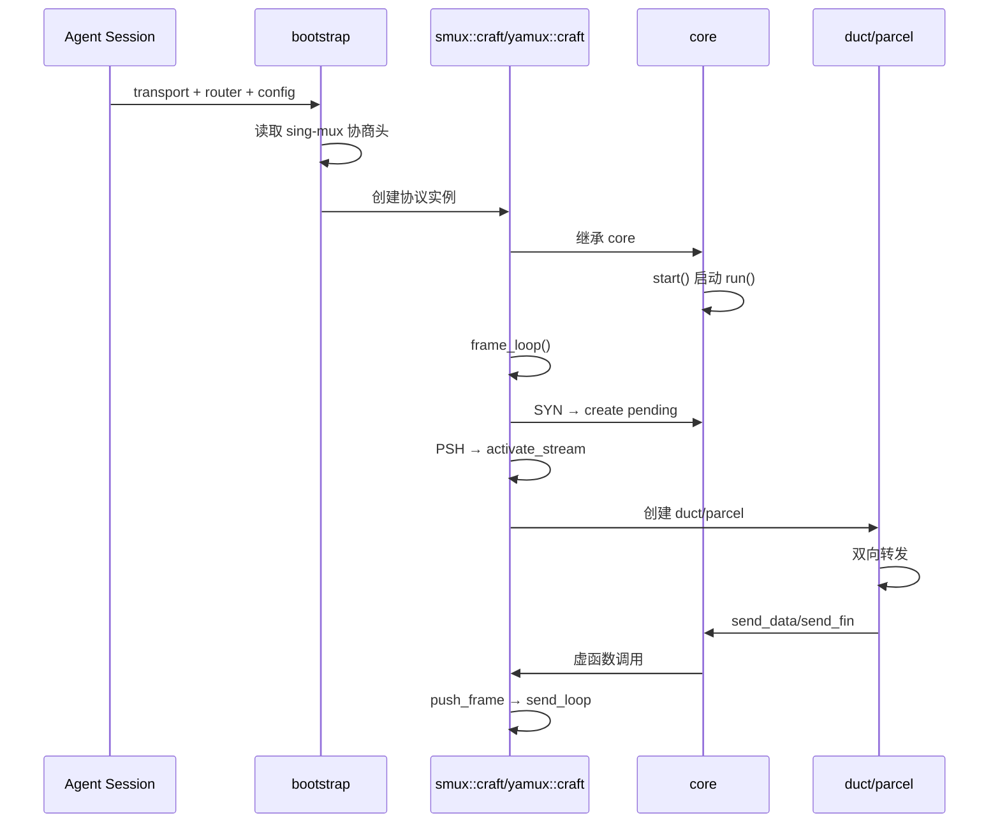

# multiplex - 多路复用模块

## 概述

`prism::multiplex` 模块实现多路复用协议，允许在单个传输层连接上承载多个独立的双向字节流。支持两种协议：smux（xtaci/smux v1）和 yamux（Hashicorp/yamux），均通过 sing-mux 协商动态选择。

## 模块架构



## 核心组件

| 组件 | 说明 |
|------|------|
| [[core/multiplex/core|core]] | 多路复用抽象基类，管理流生命周期 |
| [[core/multiplex/bootstrap|bootstrap]] | 会话引导，完成 sing-mux 协商 |
| [[core/multiplex/duct|duct]] | TCP 流双向转发管道 |
| [[core/multiplex/parcel|parcel]] | UDP 数据报中继管道 |
| [[core/multiplex/config|config]] | 多路复用通用配置 |

## 协议实现

### smux 协议

| 组件 | 说明 |
|------|------|
| [[core/multiplex/smux/craft|smux::craft]] | smux 协议服务端实现 |
| [[core/multiplex/smux/frame|smux::frame]] | smux 帧格式定义 |
| [[core/multiplex/smux/config|smux::config]] | smux 协议配置 |

特点：8 字节定长帧头，小端字节序，NOP 心跳（不回复）。

### yamux 协议

| 组件 | 说明 |
|------|------|
| [[core/multiplex/yamux/craft|yamux::craft]] | yamux 协议服务端实现 |
| [[core/multiplex/yamux/frame|yamux::frame]] | yamux 帧格式定义 |
| [[core/multiplex/yamux/config|yamux::config]] | yamux 协议配置 |

特点：12 字节定长帧头，大端字节序，完整流量控制（256KB 窗口），Ping 心跳。

## sing-mux 协商

sing-mux 是统一的协议协商格式：

```
基本格式（Version==0）：[Version 1B][Protocol 1B]
扩展格式（Version>0）：[Version 1B][Protocol 1B][PaddingLen 2B BE][Padding N bytes]
```

Protocol 值：
- 0 = smux
- 1 = yamux

## 流生命周期

```
客户端 SYN 帧
    ↓
服务端创建 pending_entry
    ↓
客户端首个 PSH 帧（携带地址）
    ↓
服务端解析地址 → activate_stream
    ↓
┌────────────┬────────────┐
│   TCP      │    UDP     │
│  创建 duct │ 创建 parcel│
└────────────┴────────────┘
    ↓            ↓
双向数据转发  数据报中继
    ↓            ↓
FIN/RST 关闭流
```

## 调用链



## 故障模式

### smux pending 流无超时

smux 协议的 pending 流（SYN 已收到但首个 PSH 帧未到达的流）没有超时机制。有 `max_streams=32` 兜底，每个 pending 的 buffer 最大几十字节。恶意客户端可占用 pending 槽位。

### yamux pending timeout

yamux 有 30s 的 pending 超时（`stream_open_timeout_ms`），比 smux 更健壮。

### 单会话资源上限

| 资源 | 上限 | 说明 |
|------|------|------|
| 并发流 | 32 | `max_streams` 硬限制 |
| 协程数 | 67 | 32 ducts × 2 + 控制流 |
| 内存 | ~66MB | 32 条 duct write_channel 满载的极端条件 |
| 文件描述符 | 65 | 1 底层 + 32 target + 32 UDP socket |

核心结论：多路复用系统设计健全，不存在严重的流泄漏或资源无限增长路径。

详见 [[dev/debugging/deep-dive/multiplex-boundaries|多路复用边界条件分析]]

## 设计决策

### 为什么三协议共存？

Prism 的 multiplex 模块同时实现了 smux、yamux 和 h2mux 三种多路复用协议，而非只选一种。

**问题**: 不同的代理客户端生态使用不同的多路复用协议。sing-box 生态使用 smux 或 yamux（通过 sing-mux 协商选择），TrustTunnel 方案使用 HTTP/2 CONNECT stream 多路复用。服务端必须兼容所有客户端。

**选择**: 实现三协议共存，通过统一入口分流：
- `bootstrap()` 处理 smux/yamux 的 sing-mux 协商头 `[Version][Protocol]` 自动分流
- `h2mux` 由 TrustTunnel scheme 直接创建，不走 bootstrap 协商
- 三者共享 `core` 抽象基类，`duct`/`parcel` 管道完全协议无关

**后果**: 维护成本增加（三套帧编解码），但 duct/parcel 层零重复代码。新增协议只需继承 `core` 实现四个纯虚函数。

### 为什么 duct/parcel 使用 weak_ptr<core>？

**问题**: duct/parcel 被 core 的 `ducts_`/`parcels_` 映射持有 `shared_ptr`，如果它们又通过 `shared_ptr` 持有 core，则形成循环引用导致内存泄漏。

**选择**: duct/parcel 的 `owner_` 使用 `weak_ptr<core>`。每次需要调用 core 方法时通过 `lock()` 获取临时 `shared_ptr`，core 销毁后 `lock()` 返回空指针，安全退出。

**后果**: 每次访问 core 需要一次 `lock()` 开销（原子操作），但彻底消除循环引用。源码依据：`duct.hpp:182`, `parcel.hpp:229`。

### 为什么发送路径使用 concurrent_channel 串行化？

**问题**: 多个 duct 的 `target_readloop` 可能同时调用 `core::send_data`，底层 transport 不支持并发写入，帧边界必须保持完整（不能交错）。

**选择**: 每个协议实现（craft）持有 `concurrent_channel<outbound_frame>`，所有发送操作推入通道，由独立的 `send_loop` 协程串行消费写入 transport。

**后果**: 发送操作被异步化（`async_send` 不阻塞帧循环），但引入一帧延迟。通道容量与 `max_streams` 对齐，满时反压到上游。

## 约束

### 单实例单线程约束

**类型**: 线程安全
**规则**: core 及其子对象（duct/parcel/craft）均非线程安全，必须在同一 executor 上串行使用
**违反后果**: 数据竞争导致帧交错、内存损坏或崩溃
**源码依据**: `core.hpp:12` 注释 "应在 transport executor 上串行使用"

### close() 幂等性

**类型**: 调用顺序
**规则**: `core::close()`、`duct::close()`、`parcel::close()` 均为幂等操作，可安全多次调用
**违反后果**: 无（设计上允许多次调用）
**源码依据**: `core.cpp:83` `active_.exchange(false, std::memory_order_acq_rel)` 首次返回 true 后立即返回

### duct 构造后必须调用 start()

**类型**: 调用顺序
**规则**: `make_duct()` 返回后必须调用 `duct->start()` 才会启动双向转发
**违反后果**: duct 存在于 `ducts_` 映射中但无数据流动，客户端请求挂起
**源码依据**: `duct.cpp:42` start() 才 co_spawn 两个循环

## 故障场景

### 底层传输断开

**触发条件**: TLS 连接中断、TCP RST、网络超时
**传播路径**: `transport->async_read_some` 返回错误 → `frame_loop` 退出 → `run()` 结束 → `on_exception` 回调 → `core::close()`
**外部表现**: 所有活跃 duct/parcel 同时关闭，客户端连接全部中断
**恢复机制**: 客户端需重新建立传输层连接并重新协商
**日志关键字**: `[Smux.Craft] read header failed`、`[Yamux.Craft] read header failed`、`[Mux.Core] session exception`

### 单流 target 连接失败

**触发条件**: 目标服务不可达、DNS 解析失败、连接超时
**传播路径**: `activate_stream` → `connect::async_forward` 返回错误 → 发送 0x01 错误状态 → `send_fin` → 从 `pending_` 移除
**外部表现**: 该流无法建立，其他流不受影响
**恢复机制**: 客户端收到 FIN 后可重试新建流
**日志关键字**: `[Smux.Craft] connect to` `failed`、`address parse failed`

### yamux pending 流超时

**触发条件**: 客户端发送 SYN 后 30 秒内未发送携带地址的 Data 帧
**传播路径**: `pending_timeout` → 检查流仍在 pending → 清理状态 → 发送 WindowUpdate(RST)
**外部表现**: 该流被服务端主动重置
**恢复机制**: 客户端收到 RST 后可重新打开流
**日志关键字**: `[Yamux.Craft] stream` `open timeout, resetting`

## 跨模块契约

| multiplex | connect | 契约内容 |
|-----------|---------|---------|
| core::activate_stream | connect::async_forward | activate_stream 调用 async_forward 获取目标连接，失败时发送错误状态 |
| duct | transport::transmission | duct 通过 shared_transmission 接口与 target 交互，不感知 TCP/TLS |
| parcel | connect::resolve_dgram | parcel 通过 resolve_dgram 做 DNS 解析，resolve_dgram 返回 {code, endpoint} |
| bootstrap | transport::shared_transmission | bootstrap 接收已建立的传输层连接，读取协商头后移交 craft |
| craft::send_loop | transport::async_write | send_loop 通过 transport::async_write 自由函数写入帧数据 |

| multiplex | stats | 契约内容 |
|-----------|-------|---------|
| core | stats::traffic::traffic_state | core 持有 per-worker 流量统计指针，close() 时 flush 累计流量 |

## 关联模块

- [[core/connect|connect]] - 连接层抽象
- [[core/resolve|resolve]] - DNS 解析和路由
- [[core/memory|memory]] - PMR 内存管理
- [[core/transport|transport]] - 传输层抽象
- [[core/stats|stats]] - 运行时统计
## 变更敏感度

### 对外影响

| 变更 | 影响范围 | 影响 |
|------|---------|------|
| `core` 纯虚函数签名变更（send_data/send_fin/executor/run） | `smux::craft`、`yamux::craft`、`h2mux` 实现 | 必须同步更新所有协议子类，否则编译失败 |
| `core_options` 结构变更 | `bootstrap` 引导流程、所有协议工厂 | 构造参数传递链路需修改 |
| `config` 字段变更（max_streams/ping_interval 等） | 资源上限、超时行为 | 运行时行为变化，可能影响稳定性 |
| `pending_entry` 结构变更 | `activate_stream` 地址解析逻辑 | SYN→PSH 数据累积和地址提取可能中断 |
| `duct`/`parcel` 公开接口变更 | `core` 内部的流管理逻辑 | 创建/关闭/移除流程需同步修改 |

### 对内影响

| 上游变更 | 本模块受影响 | 需要检查 |
|---------|------------|---------|
| `transport::transmission` 接口变更 | `frame_loop` 帧读取、`send_loop` 帧写入 | async_read_some/async_write 调用点 |
| `connect::router` 接口变更 | `activate_stream` 目标连接建立 | 路由选择和拨号逻辑 |
| `memory` 模块 PMR 容器变更 | `pending_`/`ducts_`/`parcels_` 映射、帧缓冲区 | 容器类型和分配器兼容性 |
| `protocol::protocol_type` 枚举变更 | `set_traffic` 流量统计归属 | stats 模块的协议分类统计 |
| `stats::traffic::traffic_state` 接口变更 | `accumulate_traffic` 和 `close` 时的 flush | 流量上报路径 |
| sing-mux 协商格式变更 | `bootstrap` 协议头解析 | Version/Protocol 字段读取和分流逻辑 |
