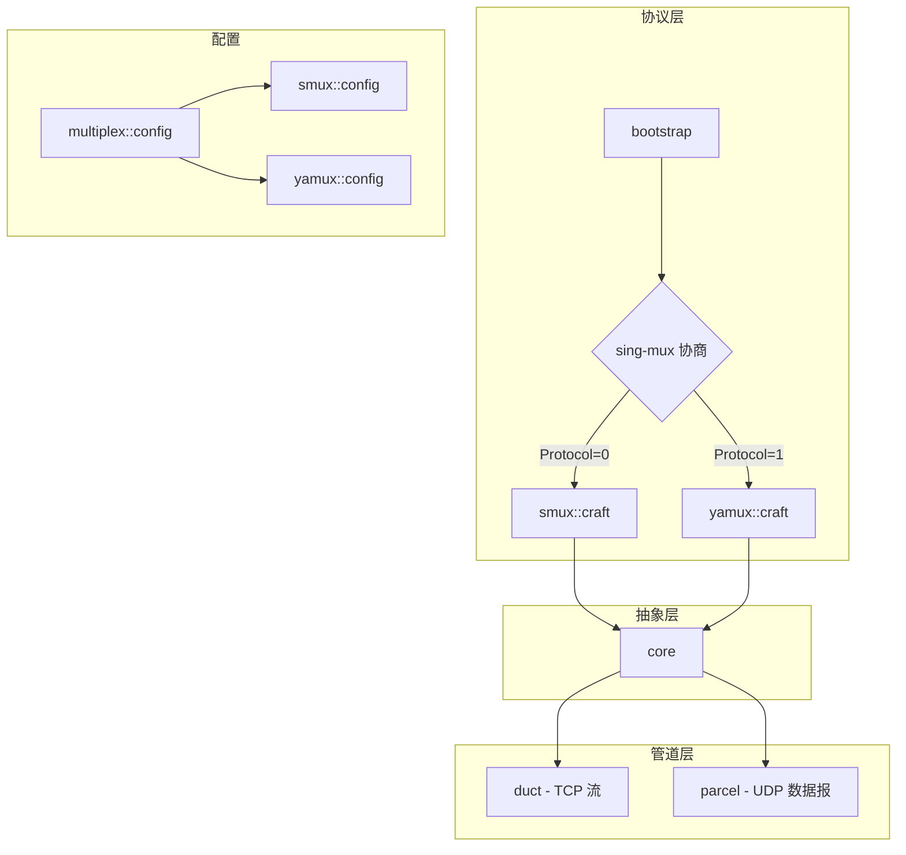
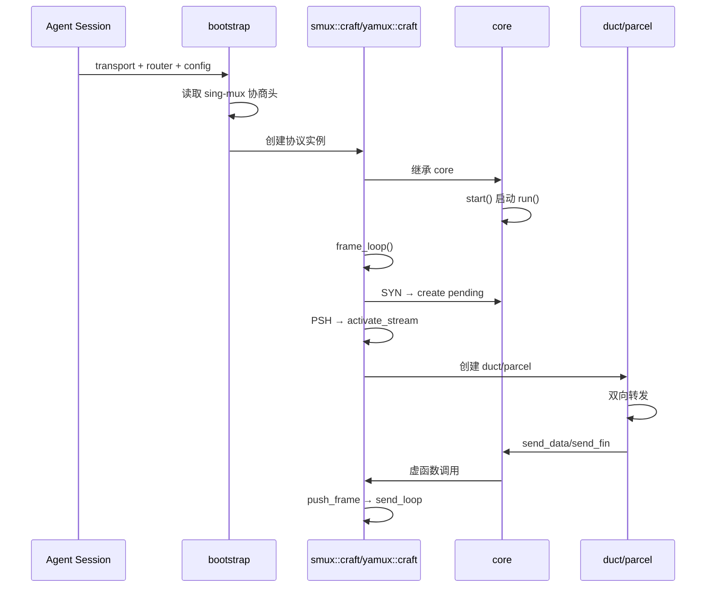

# multiplex - 多路复用模块

## 概述

`prism::multiplex` 模块实现多路复用协议，允许在单个传输层连接上承载多个独立的双向字节流。支持两种协议：smux（xtaci/smux v1）和 yamux（Hashicorp/yamux），均通过 sing-mux 协商动态选择。

## 模块架构



## 核心组件

| 组件 | 说明 |
|------|------|
| [[core/multiplex/core|core]] | 多路复用抽象基类，管理流生命周期 |
| [[core/multiplex/bootstrap|bootstrap]] | 会话引导，完成 sing-mux 协商 |
| [[core/multiplex/duct|duct]] | TCP 流双向转发管道 |
| [[core/multiplex/parcel|parcel]] | UDP 数据报中继管道 |
| [[core/multiplex/config|config]] | 多路复用通用配置 |

## 协议实现

### smux 协议

| 组件 | 说明 |
|------|------|
| [[core/multiplex/smux/craft|smux::craft]] | smux 协议服务端实现 |
| [[core/multiplex/smux/frame|smux::frame]] | smux 帧格式定义 |
| [[core/multiplex/smux/config|smux::config]] | smux 协议配置 |

特点：8 字节定长帧头，小端字节序，NOP 心跳（不回复）。

### yamux 协议

| 组件 | 说明 |
|------|------|
| [[core/multiplex/yamux/craft|yamux::craft]] | yamux 协议服务端实现 |
| [[core/multiplex/yamux/frame|yamux::frame]] | yamux 帧格式定义 |
| [[core/multiplex/yamux/config|yamux::config]] | yamux 协议配置 |

特点：12 字节定长帧头，大端字节序，完整流量控制（256KB 窗口），Ping 心跳。

## sing-mux 协商

sing-mux 是统一的协议协商格式：

```
基本格式（Version==0）：[Version 1B][Protocol 1B]
扩展格式（Version>0）：[Version 1B][Protocol 1B][PaddingLen 2B BE][Padding N bytes]
```

Protocol 值：
- 0 = smux
- 1 = yamux

## 流生命周期

```
客户端 SYN 帧
    ↓
服务端创建 pending_entry
    ↓
客户端首个 PSH 帧（携带地址）
    ↓
服务端解析地址 → activate_stream
    ↓
┌────────────┬────────────┐
│   TCP      │    UDP     │
│  创建 duct │ 创建 parcel│
└────────────┴────────────┘
    ↓            ↓
双向数据转发  数据报中继
    ↓            ↓
FIN/RST 关闭流
```

## 调用链



## 关联模块

- [[core/channel|channel]] - 传输层抽象
- [[core/resolve|resolve]] - DNS 解析和路由
- [[core/memory|memory]] - PMR 内存管理