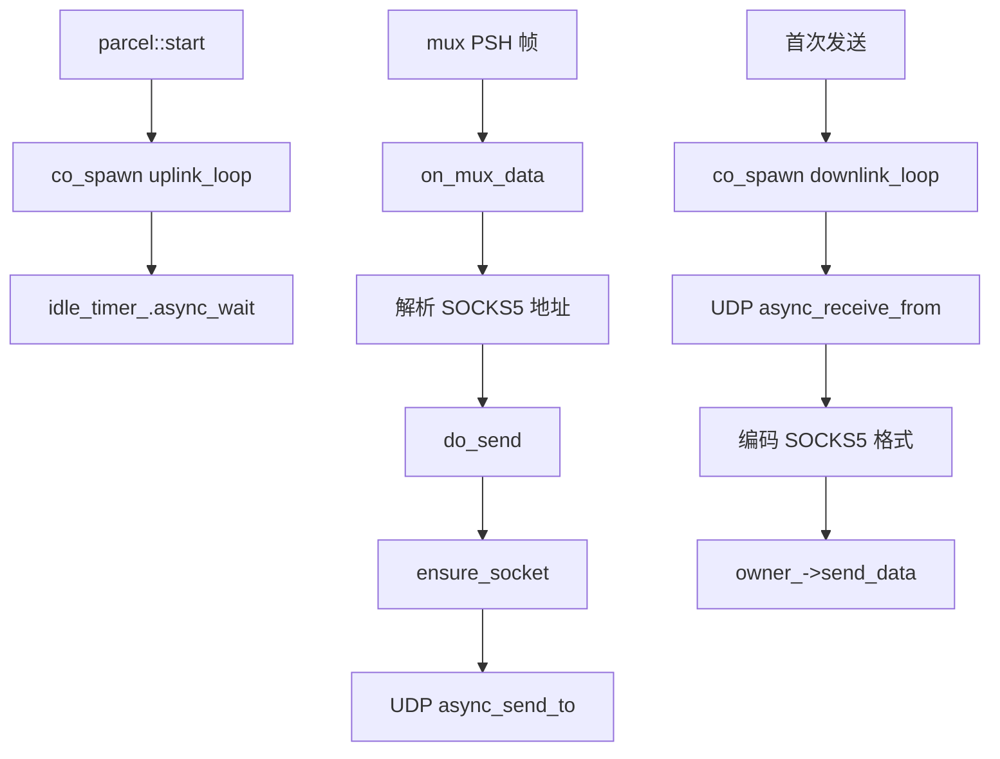
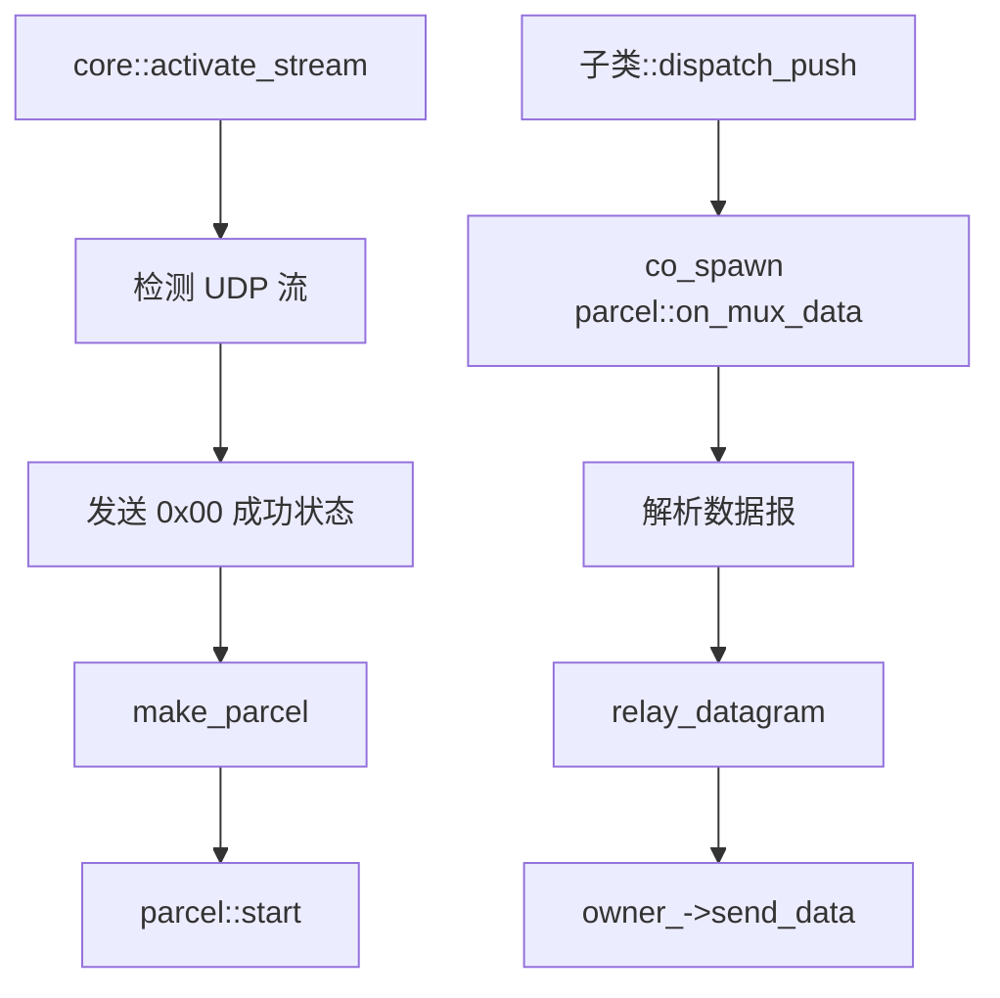

# multiplex::parcel - 多路复用 UDP 数据报管道

## 源码位置

`I:/code/Prism/include/prism/multiplex/parcel.hpp`

## 概述

`multiplex::parcel` 是协议无关的 UDP 数据报中继管道。每个 mux 流中的 UDP 流对应一个 parcel 实例。与 [[core/multiplex/duct|duct]] 的面向连接模型不同，parcel 是无连接的数据报中继。

## 设计原则

- parcel 是协议无关的，通过 [[core/multiplex/core|core]] 虚函数接口发送帧，不依赖具体协议
- 单个实例非线程安全，应在同一 executor 上串行使用
- 通过 `shared_from_this` 保活，协程持有 self 防止提前析构
- `owner_` 持有 core 的 weak_ptr，不构成循环引用

## UDP 数据格式

### PacketAddr 模式（packet_addr=true）

每帧携带 SOCKS5 UDP relay 格式：

```
[ATYP 1B][Addr(var)][Port 2B][Data]
```

### Length-prefixed 模式（packet_addr=false）

目标地址在 SYN 时已确定：

```
[Length 2B BE][Payload]
```

## 成员变量

```cpp
std::uint32_t id_;                   // 流标识符
std::weak_ptr<core> owner_;          // 所属 core 的弱引用
resolve::router &router_;            // 路由器引用
net::steady_timer idle_timer_;       // 空闲超时计时器
std::optional<net::ip::udp::socket> egress_socket_;  // 出站 UDP socket
bool packet_addr_ = false;           // PacketAddr 模式标志
memory::string destination_host_;    // 无 PacketAddr 模式时的目标主机
std::uint16_t destination_port_ = 0; // 无 PacketAddr 模式时的目标端口
memory::vector<std::byte> mux_buffer_; // mux 数据累积缓冲区
```

## 公开接口

```cpp
parcel(std::uint32_t stream_id,
       std::shared_ptr<core> owner,
       resolve::router &router,
       std::uint32_t udp_idle_timeout,
       std::uint32_t udp_max_dg,
       memory::resource_pointer mr,
       bool packet_addr = false);

void start();                                          // 启动空闲超时监控
auto on_mux_data(std::span<const std::byte> data) -> net::awaitable<void>;  // 接收 mux 数据报
void close();                                          // 关闭管道（幂等）
std::uint32_t stream_id() const noexcept;              // 获取流标识符
void set_destination(std::string_view host, std::uint16_t port);  // 设置固定目标地址
```

## 工厂函数

```cpp
[[nodiscard]] inline auto make_parcel(
    std::uint32_t stream_id,
    std::shared_ptr<core> owner,
    resolve::router &router,
    std::uint32_t udp_idle_timeout,
    std::uint32_t udp_max_dg,
    memory::resource_pointer mr = {},
    bool packet_addr = false
) -> std::shared_ptr<parcel>;
```

## 数据处理流程

### 入站数据报处理

```
mux PSH 帧 → on_mux_data → 解析 SOCKS5 地址 → relay_datagram → UDP 发送
```

### 出站数据报回传

```
UDP 响应 → downlink_loop → 编码 SOCKS5 格式 → owner_->send_data → mux 客户端
```

## 空闲超时机制

```
parcel 创建 → start() → uplink_loop 协程
                ↓
        idle_timer_ 超时等待
                ↓
每次 on_mux_data → touch_idle_timer() 重置
                ↓
超时 → close() 自动关闭
```

## 协程模型



## 调用链



## 关联文档

- [[core/multiplex/core|core]] - 多路复用核心抽象基类
- [[core/multiplex/duct|duct]] - TCP 流管道
- [[core/multiplex/smux/frame|smux::frame]] - smux 帧格式（UDP 数据报解析）
- [[core/multiplex/smux/craft|smux::craft]] - smux 协议实现
- [[core/multiplex/yamux/craft|yamux::craft]] - yamux 协议实现

---

## UDP 数据报管道机制

### 与 duct 的关键区别

| 特性 | duct (TCP) | parcel (UDP) |
|------|------------|--------------|
| 模型 | 面向连接 | 无连接 |
| 数据单元 | 字节流 | 独立数据报 |
| 目标地址 | SYN 时确定，固定 | 可能每帧携带 (PacketAddr 模式) |
| 出站 socket | target_transmission | egress_socket_ (动态创建) |
| 空闲超时 | 无 (TCP 连接保持) | 有 (idle_timer_) |
| 数据缓冲 | write_channel_ (有序队列) | mux_buffer_ (累积缓冲区) |

### 架构设计

```
┌──────────────────────────────────────────────────────────────┐
│                          parcel                               │
│                                                              │
│  入站方向 (mux → UDP):                                       │
│    mux PSH 帧 → on_mux_data → 解析地址 → relay_datagram      │
│                                    ↓                         │
│                          ┌───────────────┐                   │
│                          │ egress_socket │ → UDP async_send  │
│                          └───────────────┘                   │
│                                                              │
│  出站方向 (UDP → mux):                                       │
│    UDP recv ← downlink_loop ← 编码格式 ← owner_->send_data   │
│                                                              │
│  空闲监控:                                                    │
│    uplink_loop → idle_timer_ → 超时 → close()                │
└──────────────────────────────────────────────────────────────┘
```

## 数据报封装/解封装流程

### 入站：mux 数据报解封装

```
┌──────────────────────────────────────────────────────────────┐
│              on_mux_data(span<const byte>)                   │
│                                                              │
│  输入: mux PSH 帧载荷                                        │
│                                                              │
│  PacketAddr 模式 (packet_addr=true):                         │
│  ┌───────────────────────────────────────────┐              │
│  │ [ATYP 1B][Addr(var)][Port 2B][Data]       │              │
│  │                                           │              │
│  │ ATYP:                                     │              │
│  │   0x01 → IPv4 (Addr=4B)                  │              │
│  │   0x03 → 域名 (Addr=Len+域名)             │              │
│  │   0x04 → IPv6 (Addr=16B)                 │              │
│  │                                           │              │
│  │ 解析流程:                                 │              │
│  │   1. 读取 ATYP                           │              │
│  │   2. 根据 ATYP 读取地址                   │              │
│  │   3. 读取端口 (2B 大端)                   │              │
│  │   4. 剩余部分为 UDP 载荷                   │              │
│  │   5. 构造 udp::endpoint                   │              │
│  │   6. relay_datagram(endpoint, payload)    │              │
│  └───────────────────────────────────────────┘              │
│                                                              │
│  Length-prefixed 模式 (packet_addr=false):                   │
│  ┌───────────────────────────────────────────┐              │
│  │ [Length 2B BE][Payload]                   │              │
│  │                                           │              │
│  │ 解析流程:                                 │              │
│  │   1. 读取长度 (2B 大端)                   │              │
│  │   2. 提取 Payload                         │              │
│  │   3. 使用 SYN 时设置的固定目标地址         │              │
│  │   4. relay_datagram(fixed_ep, payload)    │              │
│  └───────────────────────────────────────────┘              │
└──────────────────────────────────────────────────────────────┘
```

### 出站：UDP 响应封装

```
┌──────────────────────────────────────────────────────────────┐
│              downlink_loop (出站方向)                         │
│                                                              │
│  循环:                                                       │
│    n = co_await egress_socket_.async_receive_from            │
│         (buffer, remote_endpoint)                            │
│                                                              │
│  PacketAddr 模式:                                            │
│  ┌───────────────────────────────────────────┐              │
│  │ 编码 SOCKS5 UDP relay 格式:               │              │
│  │                                           │              │
│  │ [ATYP 1B][Addr][Port 2B][UDP 数据]        │              │
│  │                                           │              │
│  │ ATYP 根据 remote_endpoint 类型决定:        │              │
│  │   IPv4 → 0x01                            │              │
│  │   IPv6 → 0x04                            │              │
│  │                                           │              │
│  │ 目的: 让客户端知道响应来源地址              │              │
│  └───────────────────────────────────────────┘              │
│                                                              │
│  Length-prefixed 模式:                                       │
│  ┌───────────────────────────────────────────┐              │
│  │ 直接发送 UDP 数据（不编码地址）             │              │
│  │ 客户端已知目标地址，无需额外信息            │              │
│  └───────────────────────────────────────────┘              │
│                                                              │
│  封装后:                                                     │
│    co_await owner_->send_data(stream_id, encoded_data)       │
└──────────────────────────────────────────────────────────────┘
```

### 数据累积与分帧

当单个 mux 帧包含多个 UDP 数据报时：

```
mux_buffer_ 累积缓冲区:
  ┌─────────────────────────────────┐
  │ [DG1][DG2][DG3 partial...]      │
  └─────────────────────────────────┘

on_mux_data 被调用:
  1. 将新数据追加到 mux_buffer_
  2. 循环解析:
     while mux_buffer_ 有完整数据报:
       解析一帧 → relay_datagram()
       从缓冲区移除已解析数据
  3. 若最后一帧不完整 → 保留在缓冲区，等待下次调用
```

### 空闲超时机制

```
┌──────────────────────────────────────────────────────────────┐
│                    idle_timer_ 管理                           │
│                                                              │
│  parcel::start():                                            │
│    co_spawn uplink_loop                                      │
│      │                                                       │
│      ├── idle_timer_.expires_after(udp_idle_timeout)         │
│      │                                                       │
│      ├── co_await idle_timer_.async_wait()                   │
│      │                                                       │
│      └── 超时 → close() → 释放 socket → 从 parcels_ 移除     │
│                                                              │
│  每次 on_mux_data 调用:                                       │
│    touch_idle_timer() → 重置超时                              │
│                                                              │
│  典型超时值: 30 秒                                           │
│    - 足够长: 不会中断正常的间歇性通信                          │
│    - 足够短: 及时释放闲置的 UDP socket                        │
└──────────────────────────────────────────────────────────────┘
```

### Socket 生命周期

```
首次 relay_datagram:
  │
  ensure_socket():
    ├── if egress_socket_ 已存在 → 复用
    └── 否则:
          ├── 创建 udp::socket (基于目标地址类型选择 v4/v6)
          ├── bind 到任意可用端口
          ├── co_spawn downlink_loop
          └── 存入 egress_socket_
  │
  async_send_to(payload, target_endpoint)
  │
  ...
  │
空闲超时或 close:
  │
  egress_socket_.close() → socket 释放
  downlink_loop 结束
  parcel 对象析构
```

### UDP 最大数据报限制

`udp_max_dg` 参数限制单个数据报的最大大小：

```
on_mux_data 解析数据报:
  if payload.size() > udp_max_dg:
    → 截断或丢弃 (取决于实现)
    → 记录错误日志
```

**推荐值**:
- 1500 字节: 匹配以太网 MTU，避免 IP 分片
- 65535 字节: UDP 最大理论值（实际受 MTU 限制）