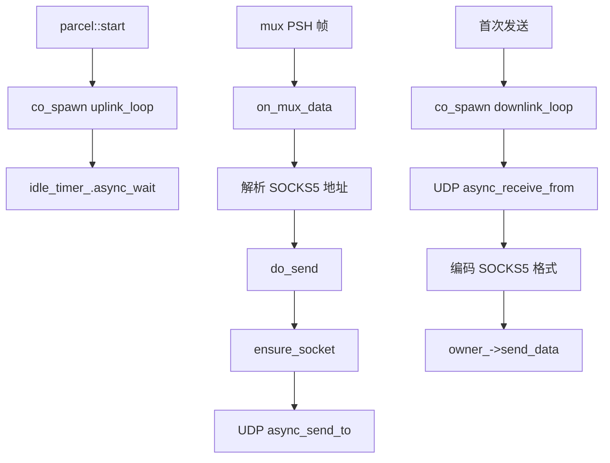
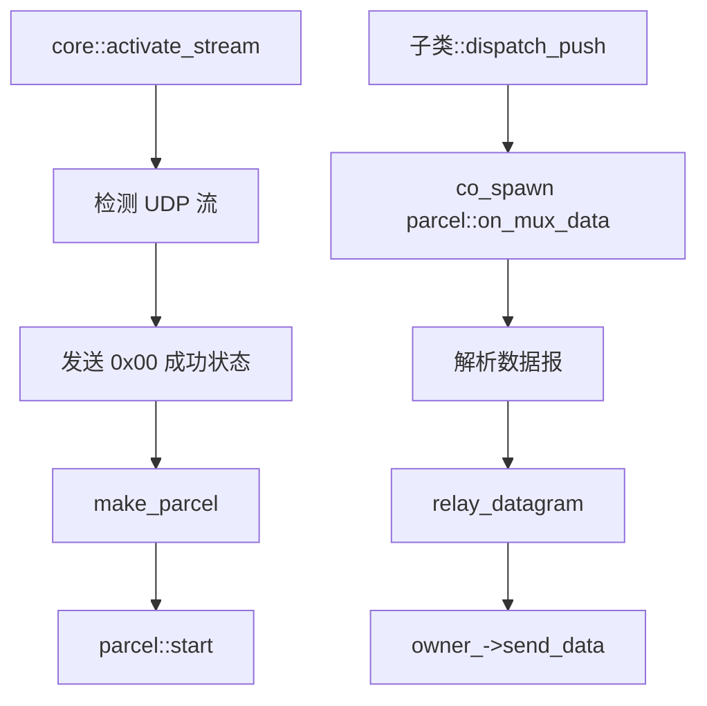

# multiplex::parcel - 多路复用 UDP 数据报管道

## 源码位置

`I:/code/Prism/include/prism/multiplex/parcel.hpp`

## 概述

`multiplex::parcel` 是协议无关的 UDP 数据报中继管道。每个 mux 流中的 UDP 流对应一个 parcel 实例。与 [[core/multiplex/duct|duct]] 的面向连接模型不同，parcel 是无连接的数据报中继。

## 设计原则

- parcel 是协议无关的，通过 [[core/multiplex/core|core]] 虚函数接口发送帧，不依赖具体协议
- 单个实例非线程安全，应在同一 executor 上串行使用
- 通过 `shared_from_this` 保活，协程持有 self 防止提前析构
- `owner_` 持有 core 的 weak_ptr，不构成循环引用

## UDP 数据格式

### PacketAddr 模式（packet_addr=true）

每帧携带 SOCKS5 UDP relay 格式：

```
[ATYP 1B][Addr(var)][Port 2B][Data]
```

### Length-prefixed 模式（packet_addr=false）

目标地址在 SYN 时已确定：

```
[Length 2B BE][Payload]
```

## 成员变量

```cpp
std::uint32_t id_;                   // 流标识符
std::weak_ptr<core> owner_;          // 所属 core 的弱引用
resolve::router &router_;            // 路由器引用
net::steady_timer idle_timer_;       // 空闲超时计时器
std::optional<net::ip::udp::socket> egress_socket_;  // 出站 UDP socket
bool packet_addr_ = false;           // PacketAddr 模式标志
memory::string destination_host_;    // 无 PacketAddr 模式时的目标主机
std::uint16_t destination_port_ = 0; // 无 PacketAddr 模式时的目标端口
memory::vector<std::byte> mux_buffer_; // mux 数据累积缓冲区
```

## 公开接口

```cpp
parcel(std::uint32_t stream_id,
       std::shared_ptr<core> owner,
       resolve::router &router,
       std::uint32_t udp_idle_timeout,
       std::uint32_t udp_max_dg,
       memory::resource_pointer mr,
       bool packet_addr = false);

void start();                                          // 启动空闲超时监控
auto on_mux_data(std::span<const std::byte> data) -> net::awaitable<void>;  // 接收 mux 数据报
void close();                                          // 关闭管道（幂等）
std::uint32_t stream_id() const noexcept;              // 获取流标识符
void set_destination(std::string_view host, std::uint16_t port);  // 设置固定目标地址
```

## 工厂函数

```cpp
[[nodiscard]] inline auto make_parcel(
    std::uint32_t stream_id,
    std::shared_ptr<core> owner,
    resolve::router &router,
    std::uint32_t udp_idle_timeout,
    std::uint32_t udp_max_dg,
    memory::resource_pointer mr = {},
    bool packet_addr = false
) -> std::shared_ptr<parcel>;
```

## 数据处理流程

### 入站数据报处理

```
mux PSH 帧 → on_mux_data → 解析 SOCKS5 地址 → relay_datagram → UDP 发送
```

### 出站数据报回传

```
UDP 响应 → downlink_loop → 编码 SOCKS5 格式 → owner_->send_data → mux 客户端
```

## 空闲超时机制

```
parcel 创建 → start() → uplink_loop 协程
                ↓
        idle_timer_ 超时等待
                ↓
每次 on_mux_data → touch_idle_timer() 重置
                ↓
超时 → close() 自动关闭
```

## 协程模型



## 调用链



## 关联文档

- [[core/multiplex/core|core]] - 多路复用核心抽象基类
- [[core/multiplex/duct|duct]] - TCP 流管道
- [[core/multiplex/smux/frame|smux::frame]] - smux 帧格式（UDP 数据报解析）
- [[core/multiplex/smux/craft|smux::craft]] - smux 协议实现
- [[core/multiplex/yamux/craft|yamux::craft]] - yamux 协议实现