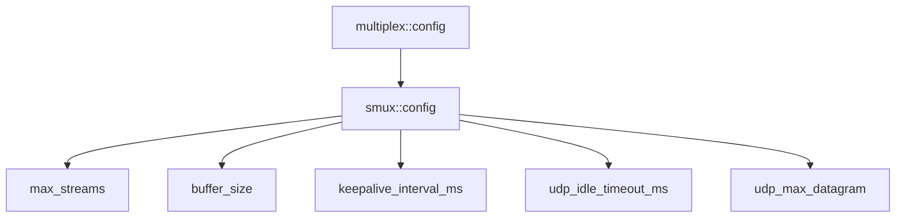

# smux::config - smux 协议配置

## 源码位置

`I:/code/Prism/include/prism/multiplex/smux/config.hpp`

## 概述

定义 smux 协议的全部配置参数，作为 [[core/multiplex/config|multiplex::config]] 的子配置存在。

## 配置结构

```cpp
struct config
{
    std::uint32_t max_streams = 32;              // 最大并发流数
    std::uint32_t buffer_size = 4096;            // 每流读取缓冲区
    std::uint32_t keepalive_interval_ms = 30000; // 心跳间隔
    std::uint32_t udp_idle_timeout_ms = 60000;   // UDP 管道空闲超时
    std::uint32_t udp_max_datagram = 65535;      // UDP 数据报最大长度
};
```

## 参数说明

| 参数 | 默认值 | 说明 |
|------|--------|------|
| max_streams | 32 | 单个 mux 会话最大并发流数，防止资源耗尽 |
| buffer_size | 4096 | 每流读取缓冲区大小，实际限制为 min(buffer_size, 65535) |
| keepalive_interval_ms | 30000 | NOP 心跳帧发送间隔，0 表示禁用 |
| udp_idle_timeout_ms | 60000 | UDP 管道空闲超时，超时自动关闭 |
| udp_max_datagram | 65535 | UDP 数据报最大长度 |

## 使用场景

- max_streams：限制单会话资源消耗，防止恶意客户端创建过多流
- buffer_size：平衡吞吐量与内存占用，小缓冲区减少延迟
- keepalive_interval_ms：保持连接活性，防止中间设备超时断开
- udp_idle_timeout_ms：及时释放空闲 UDP 管道，避免资源泄露

## 配置层级



## 关联文档

- [[core/multiplex/config|multiplex::config]] - 多路复用通用配置
- [[core/multiplex/smux/craft|smux::craft]] - smux 协议实现
- [[core/multiplex/smux/frame|smux::frame]] - smux 帧格式