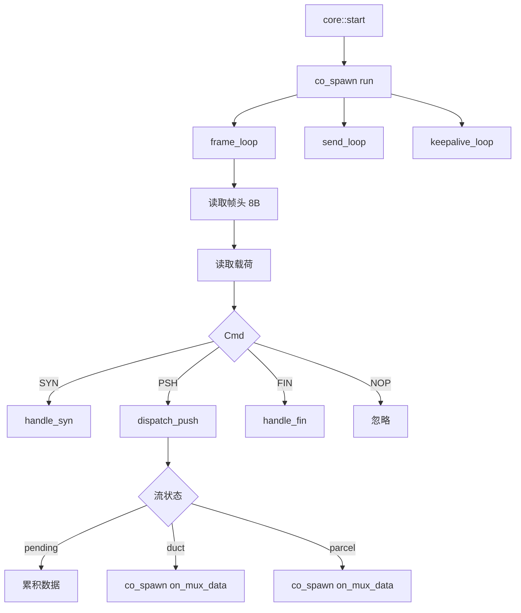
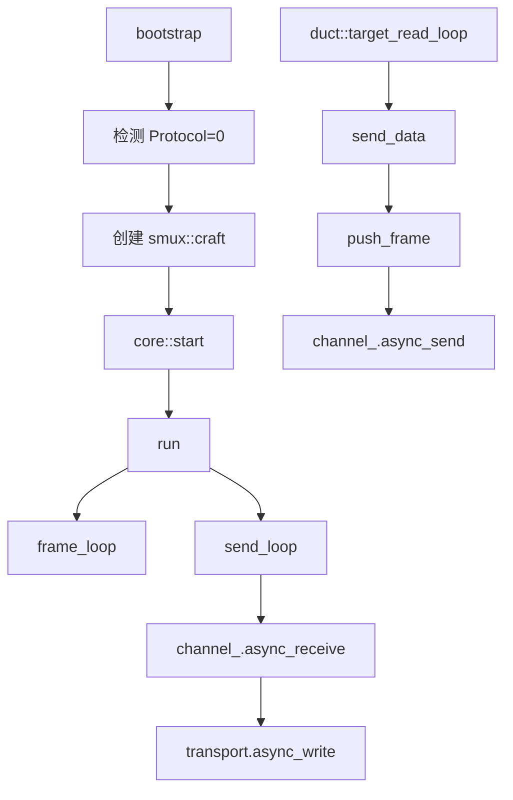

# smux::craft - smux 多路复用会话服务端

## 源码位置

`include/prism/multiplex/smux/craft.hpp`

## 概述

`smux::craft` 继承 [[core/multiplex/core|core]]，实现 smux v1 帧协议和 sing-mux 协议协商。兼容 Mihomo/xtaci/smux v1。

## 帧格式

8 字节定长帧头，小端字节序：

```
[Version 1B][Cmd 1B][Length 2B LE][StreamID 4B LE][Payload]
```

最大帧载荷：65535 字节

## 命令类型

| 命令 | 值 | 说明 |
|------|-----|------|
| SYN | 0 | 新建流 |
| FIN | 1 | 半关闭流 |
| PSH | 2 | 数据推送 |
| NOP | 3 | 心跳（不回复） |

## 核心成员

```cpp
using channel_type = net::experimental::concurrent_channel<
    void(boost::system::error_code, outbound_frame)>;
mutable channel_type channel_;  // 有界发送通道，串行化多流写入
```

## outbound_frame 结构

```cpp
struct outbound_frame
{
    std::array<std::byte, frame_header_size> header{};  // 8 字节帧头
    memory::vector<std::byte> payload;                  // 载荷数据
};
```

header 与 payload 分离传递，消除 payload memcpy。

## 公开接口

```cpp
craft(transport::shared_transmission transport,
      resolve::router &router,
      const multiplex::config &cfg,
      memory::resource_pointer mr = {});

auto send_data(std::uint32_t stream_id,
               memory::vector<std::byte> payload) const
    -> net::awaitable<void> override;

void send_fin(std::uint32_t stream_id) override;

net::any_io_executor executor() const override;
```

## 协程模型



## 发送路径

```
duct::target_read_loop → core::send_data → push_frame → channel_ → send_loop → transport
```

零拷贝：header 与 payload 分离写入，无需拼接。

## 流打开流程

```
客户端 SYN → handle_syn → 创建 pending_entry
客户端首个 PSH → dispatch_push → 累积数据
数据足够 → try_activate_pending → activate_stream
解析地址 → router 连接目标 → 创建 duct/parcel → 转发剩余数据
```

## 帧构建函数

```cpp
auto make_data_frame(std::uint32_t stream_id,
                     std::span<const std::byte> payload)
    -> memory::vector<std::byte>;

auto make_syn_frame(std::uint32_t stream_id)
    -> std::array<std::byte, frame_header_size>;

auto make_fin_frame(std::uint32_t stream_id)
    -> std::array<std::byte, frame_header_size>;
```

## 配置参数

参见 [[core/multiplex/smux/config|smux::config]]：
- max_streams：最大并发流数
- buffer_size：每流读取缓冲区
- keepalive_interval_ms：心跳间隔

## 调用链



## 关联文档

- [[core/multiplex/core|core]] - 多路复用核心抽象基类
- [[core/multiplex/smux/frame|smux::frame]] - smux 帧格式定义
- [[core/multiplex/smux/config|smux::config]] - smux 协议配置
- [[core/multiplex/duct|duct]] - TCP 流管道
- [[core/multiplex/parcel|parcel]] - UDP 数据报管道
## 设计决策

### 为什么 smux NOP 心跳不回复？

**问题**: 心跳帧需要保持连接活性，防止中间设备（NAT/防火墙）超时断开空闲连接。

**选择**: smux 的 NOP 命令仅发送不回复。与 yamux 的 Ping/Pong 不同，NOP 是单向的"我还在"信号。

**原因**: xtaci/smux v1 协议规范定义 NOP 为单向心跳。服务端收到 NOP 后忽略（`command::nop: default: break`），不需要回复。这比 Ping/Pong 更轻量，减少帧开销。

**后果**: 无法通过心跳检测对端是否存活。如果需要双向检测，应使用 yamux 的 Ping/Pong 机制。源码依据：`smux/craft.cpp:186-189`。

### 为什么 header 与 payload 分离传递？

**问题**: 传统做法是将 header+payload 拼接到一个 buffer 再写入 transport，需要 memcpy 整个 payload。

**选择**: `outbound_frame` 将 header（8 字节 fixed array）和 payload（PMR vector）分离存储。`send_loop` 分别写入两者。

**后果**: 消除了 payload 的 memcpy。但实际实现中对于有 payload 的帧仍然做了 combined 拷贝（`smux/craft.cpp:527-531`），这是 send_loop 的实现细节，未来可优化为 scatter-gather。

## 约束

### max_streams 同时计入 pending + ducts + parcels

**类型**: 资源上限
**规则**: `pending_.size() + ducts_.size() + parcels_.size() >= config_.smux.max_streams` 时拒绝新 SYN
**违反后果**: 新流被静默拒绝（不回复，不创建 pending）
**源码依据**: `smux/craft.cpp:199-203`

### pending 流无超时（smux 特有）

**类型**: 资源上限
**规则**: smux 的 pending 流没有超时机制，依赖 max_streams 兜底
**违反后果**: 恶意客户端可占用 pending 槽位（每个 buffer 最大几十字节）
**源码依据**: smux/craft.cpp 中无 pending_timer 相关代码
