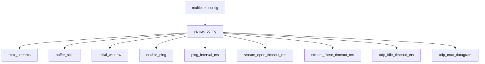

# yamux::config - yamux 协议配置

## 源码位置

`I:/code/Prism/include/prism/multiplex/yamux/config.hpp`

## 概述

定义 yamux 协议的全部配置参数，作为 [[core/multiplex/config|multiplex::config]] 的子配置存在。

## 配置结构

```cpp
struct config
{
    std::uint32_t max_streams = 32;                // 最大并发流数
    std::uint32_t buffer_size = 4096;              // 每流读取缓冲区
    std::uint32_t initial_window = 256 * 1024;     // 初始流窗口大小
    bool enable_ping = true;                       // 是否启用心跳
    std::uint32_t ping_interval_ms = 30000;        // 心跳间隔
    std::uint32_t stream_open_timeout_ms = 30000;  // 流打开超时
    std::uint32_t stream_close_timeout_ms = 30000; // 流关闭超时
    std::uint32_t udp_idle_timeout_ms = 60000;     // UDP 管道空闲超时
    std::uint32_t udp_max_datagram = 65535;        // UDP 数据报最大长度
};
```

## 参数说明

| 参数 | 默认值 | 说明 |
|------|--------|------|
| max_streams | 32 | 单个 mux 会话最大并发流数 |
| buffer_size | 4096 | 每流读取缓冲区大小 |
| initial_window | 256KB | 初始流窗口大小，影响单流吞吐量 |
| enable_ping | true | 是否启用 Ping 心跳 |
| ping_interval_ms | 30000 | Ping 心跳间隔 |
| stream_open_timeout_ms | 30000 | pending 流打开超时 |
| stream_close_timeout_ms | 30000 | 流关闭超时 |
| udp_idle_timeout_ms | 60000 | UDP 管道空闲超时 |
| udp_max_datagram | 65535 | UDP 数据报最大长度 |

## 流量控制配置

`initial_window` 影响单流吞吐量：
- 增大可提升高延迟链路的传输效率
- 减小可防止慢速流占用过多内存

## 超时配置

| 超时 | 说明 |
|------|------|
| stream_open_timeout_ms | pending 流未在超时内收到完整地址数据时发送 RST |
| stream_close_timeout_ms | 流关闭后等待清理的超时 |
| udp_idle_timeout_ms | UDP 管道无数据活动时自动关闭 |

## 配置层级



## 与 smux::config 对比

| 参数 | smux | yamux |
|------|------|-------|
| 心跳 | keepalive_interval_ms | ping_interval_ms + enable_ping |
| 流窗口 | 无 | initial_window |
| 流超时 | 无 | stream_open/close_timeout_ms |

## 关联文档

- [[core/multiplex/config|multiplex::config]] - 多路复用通用配置
- [[core/multiplex/yamux/craft|yamux::craft]] - yamux 协议实现
- [[core/multiplex/yamux/frame|yamux::frame]] - yamux 帧格式
## 配置映射

### 源码字段到使用方的追踪

| 配置字段 | 使用位置 | 效果 |
|----------|----------|------|
| `max_streams` | `craft::handle_syn` / `handle_winupd` 中的流数上限检查 | 阻止超过限制的并发流 |
| `max_streams` | `craft` 构造函数中 `channel_` 容量 | 发送通道最大缓冲帧数 |
| `buffer_size` | `activate_tcp` 中 `duct_options.opts.buffer_size` | duct 从 target 单次读取上限 |
| `initial_window` | `handle_syn` 中 WindowUpdate(ACK) 的 Length 字段 | 通告给客户端的服务端窗口 |
| `initial_window` | `handle_winupd` 中 WindowUpdate(SYN) 的客户端窗口 fallback | 客户端未指定窗口时使用默认值 |
| `initial_window` | `update_recv_win` 中发送 WindowUpdate 的阈值 | `initial_window / 2` 时触发 |
| `enable_ping` | `craft::run` 中决定是否启动 `ping_loop` | false 时禁用心跳 |
| `ping_interval` | `ping_loop` 中定时器间隔 | Ping(SYN) 帧发送间隔 |
| `open_timeout` | `start_pending` 中创建 pending 超时定时器 | 0 时不创建定时器 |
| `close_timeout` | 预留字段，当前未使用 | 流关闭超时（未来迭代） |
| `udp_idle` | `activate_udp` 中 `parcel_config.idle_timeout` | UDP 管道空闲超时 |
| `max_dgram` | `activate_udp` 中 `parcel_config.max_dgram` | UDP 数据报最大长度 |

### stream_open_timeout 调优指南

| 场景 | 推荐值 | 原因 |
|------|--------|------|
| 高延迟网络 | 60000ms | 给客户端足够时间发送地址数据 |
| 正常网络 | 30000ms（默认） | 平衡资源占用和响应速度 |
| 高安全要求 | 10000ms | 快速清理僵尸 pending |
| 禁用超时 | 0 | 回退到 smux 行为（仅 max_streams 兜底） |

### initial_window 调优指南

| 场景 | 推荐值 | 原因 |
|------|--------|------|
| 大文件传输 | 1048576 (1MB) | 减少窗口更新频率，最大化吞吐 |
| 正常使用 | 262144 (256KB, 默认) | 平衡内存和吞吐 |
| 低内存环境 | 65536 (64KB) | 限制单流内存占用 |
