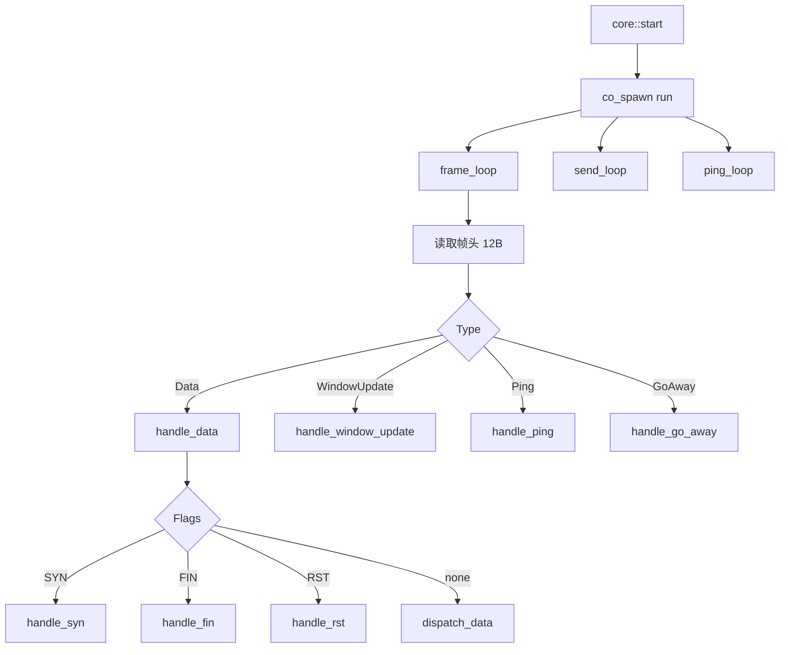
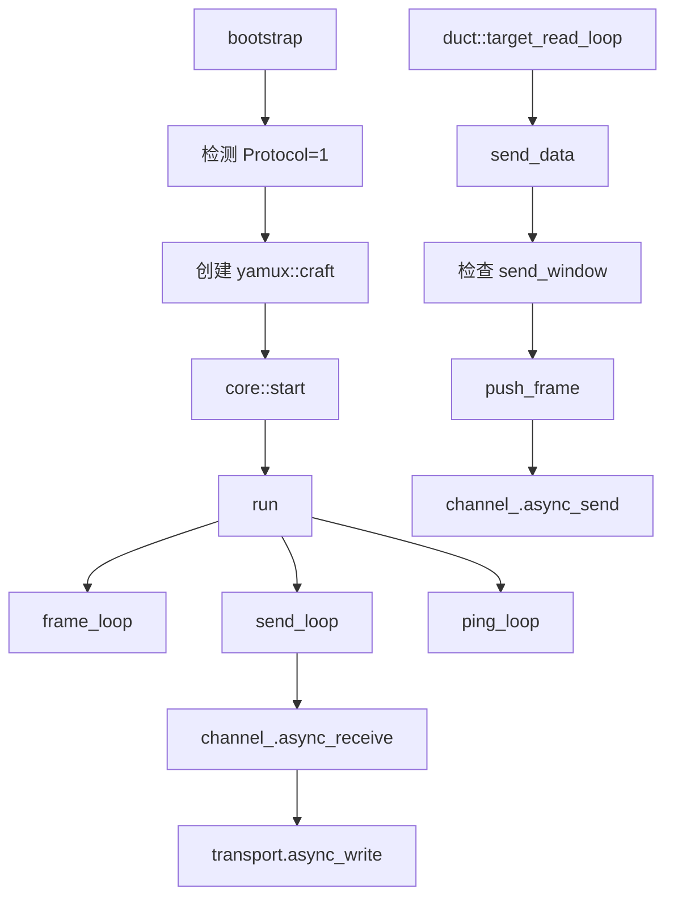

# yamux::craft - yamux 多路复用会话服务端

## 源码位置

`I:/code/Prism/include/prism/multiplex/yamux/craft.hpp`

## 概述

`yamux::craft` 继承 [[core/multiplex/core|core]]，实现 yamux 协议服务端逻辑。兼容 Hashicorp/yamux + sing-mux 协商。与 [[core/multiplex/smux/craft|smux]] 相比，yamux 提供完整的流量控制（256KB 初始窗口）、标志位系统和 Ping 心跳机制。

## 帧格式

12 字节定长帧头，大端字节序：

```
[Version 1B][Type 1B][Flags 2B BE][StreamID 4B BE][Length 4B BE]
```

## 与 smux 对比

| 特性 | smux | yamux |
|------|------|-------|
| 帧头大小 | 8 字节 | 12 字节 |
| 字节序 | 小端 | 大端 |
| 流量控制 | 无 | 256KB 窗口 |
| 心跳 | NOP（不回复） | Ping（请求/响应） |
| 标志位 | 命令类型 | SYN/ACK/FIN/RST |

## 核心成员

### outbound_frame

```cpp
struct outbound_frame
{
    std::array<std::byte, frame_header_size> header{};  // 12 字节帧头
    memory::vector<std::byte> payload;                  // 载荷数据
};
```

### stream_window

```cpp
struct stream_window
{
    std::atomic<std::uint32_t> send_window{initial_stream_window};  // 发送窗口
    std::atomic<std::uint32_t> recv_consumed{0};                    // 已消费接收数据
    std::shared_ptr<net::steady_timer> window_signal;               // 窗口更新信号
};
```

## 公开接口

```cpp
craft(transport::shared_transmission transport,
      resolve::router &router,
      const multiplex::config &cfg,
      memory::resource_pointer mr = {});

auto send_data(std::uint32_t stream_id,
               memory::vector<std::byte> payload) const
    -> net::awaitable<void> override;

void send_fin(std::uint32_t stream_id) override;

net::any_io_executor executor() const override;

void remove_duct(std::uint32_t stream_id) override;   // 清理窗口
void remove_parcel(std::uint32_t stream_id) override; // 清理窗口
void close() override;                                // 取消定时器
```

## 消息类型处理

### Data 帧

| Flags | 处理 |
|-------|------|
| SYN | handle_syn - 创建流并回复 ACK |
| FIN | handle_fin - 半关闭流 |
| RST | handle_rst - 强制重置流 |
| none | dispatch_data - 分发数据 |

### WindowUpdate 帧

| Flags | 处理 |
|-------|------|
| SYN | 客户端打开新流，回复 ACK |
| SYN+ACK | 服务端发起流确认（不支持） |
| none | 增加 send_window |

### Ping 帧

| Flags | 处理 |
|-------|------|
| SYN | 心跳请求，回复 ACK |
| ACK | 心跳响应，忽略 |

### GoAway 帧

关闭整个会话。

## 流打开流程（sing-mux 兼容模式）

```
客户端 WindowUpdate(SYN) → 服务端创建 pending 回复 WindowUpdate(ACK)
客户端 Data(none) 携带地址 → 服务端解析地址连接目标
服务端 Data(none) 携带 0x00 → 创建 duct/parcel
```

## 协程模型



## 窗口管理

### 发送窗口

- 初始值：256KB
- 收到 WindowUpdate 时增加
- 发送数据时消耗
- 窗口不足时等待 window_signal

### 接收窗口

- 累积 recv_consumed
- 达到阈值（128KB）时发送 WindowUpdate

## pending 超时

```cpp
memory::unordered_map<std::uint32_t,
    std::shared_ptr<net::steady_timer>> pending_timers_;
```

stream_open_timeout_ms > 0 时，为 pending 流设置超时定时器。

## 配置参数

参见 [[core/multiplex/yamux/config|yamux::config]]：
- max_streams：最大并发流数
- initial_window：初始流窗口大小
- enable_ping：是否启用心跳
- ping_interval_ms：心跳间隔
- stream_open_timeout_ms：流打开超时

## 调用链



## 关联文档

- [[core/multiplex/core|core]] - 多路复用核心抽象基类
- [[core/multiplex/yamux/frame|yamux::frame]] - yamux 帧格式定义
- [[core/multiplex/yamux/config|yamux::config]] - yamux 协议配置
- [[core/multiplex/duct|duct]] - TCP 流管道
- [[core/multiplex/parcel|parcel]] - UDP 数据报管道
## 设计决策

### 为什么 yamux send_data 使用 CAS 窗口等待？

**问题**: yamux 协议要求发送方遵守对端通告的窗口大小。如果当前窗口不足以容纳待发送数据，必须等待 WindowUpdate 帧扩大窗口。

**选择**: `send_data` 使用 CAS（compare_exchange_weak）循环原子地扣减窗口。窗口不足时通过 `window_signal` 定时器挂起协程，收到 WindowUpdate 后 cancel 唤醒发送方。

**后果**: 发送路径无锁，仅使用原子操作和定时器。但窗口不足时协程挂起，增加一次调度延迟。CAS 循环在窗口足够时快速通过，不会空转。

**替代方案**: 使用 mutex + condition_variable 会阻塞 io_context 线程，违反协程纯度原则。

**源码依据**: `yamux/craft.cpp:766-815`

### 为什么 pending 流有超时但 smux 没有？

**问题**: 客户端可能发送 SYN 后不发送地址数据，pending 流永久占用资源。

**选择**: yamux 为每个 pending 流设置 `open_timeout` 超时定时器。超时后清理状态并发送 RST。

**后果**: 比 smux 的 max_streams 兜底更精确，每个 pending 流有独立的超时控制。代价是每个 pending 流额外一个 `steady_timer` 对象。

**源码依据**: `yamux/craft.cpp:676-713`

## 约束

### 窗口更新阈值为 initial_window / 2

**类型**: 资源上限
**规则**: 当 `recv_consumed` 累积达到 `initial_window / 2`（128KB）时发送 WindowUpdate
**违反后果**: 不发送 WindowUpdate 会导致对端窗口耗尽，停止发送数据
**源码依据**: `yamux/craft.cpp:751`

### oversized Data 帧触发 GoAway

**类型**: 协议安全
**规则**: Data 帧载荷超过 `max_frame_payload`（65535）时发送 GoAway 并关闭会话
**违反后果**: 整个 mux 会话终止，所有流中断
**源码依据**: `yamux/craft.cpp:114-119`
