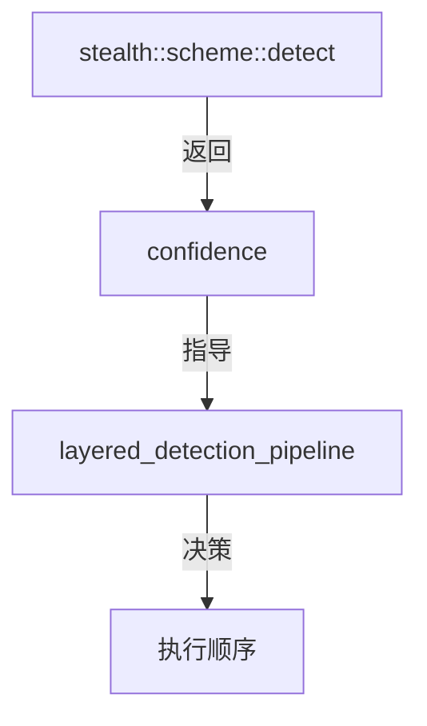

# confidence.hpp

检测置信度枚举定义。

## 源码位置

`I:/code/Prism/include/prism/recognition/confidence.hpp`

## 核心类型

### confidence

检测置信度级别枚举，指导方案执行顺序。

```cpp
enum class confidence : std::uint8_t
{
    high,   // 高置信度：特征完全匹配
    medium, // 中置信度：特征部分匹配
    low,    // 低置信度：不确定
    none    // 无特征：标准 TLS
};
```

| 值 | 说明 | 执行策略 |
|----|------|----------|
| `high` | 特征完全匹配，可直接执行对应方案 | 直接执行，无需验证 |
| `medium` | 特征部分匹配，需完整验证 | 优先执行，失败后继续候选 |
| `low` | 特征部分匹配但不确定 | 靠后执行，需验证 |
| `none` | 标准 TLS，无伪装特征 | 执行 Native 兜底方案 |

## 使用场景

### 方案检测评分

各 scheme 的 `detect()` 根据特征匹配程度返回置信度：

```cpp
// Reality: session_id 包含标记 → high
if (has_reality_marker(session_id)) {
    return {.candidates = {"reality"}, .score = confidence::high};
}

// ShadowTLS: HMAC 验证通过 → high
if (verify_hmac(client_hello)) {
    return {.candidates = {"shadowtls"}, .score = confidence::high};
}

// SNI 匹配但无其他特征 → medium
if (sni_matches_scheme(sni)) {
    return {.candidates = {"shadowtls"}, .score = confidence::medium};
}
```

### 执行策略决策

分层检测管道根据置信度决定执行顺序：

```cpp
// 高置信度直接返回单一候选
if (result.score == confidence::high) {
    return {.deterministic_hit = true, .exclusive_scheme = result.candidates[0]};
}

// 中/低置信度加入候选列表
candidates.push_back({.name = name, .score = to_score(result.score)});
```

## 调用链



## 引用关系

### 被引用

- [[result]]：分析结果结构使用
- [[layered-pipeline]]：分层检测管道使用
- [[../stealth/scheme|stealth::scheme]]：方案检测返回值