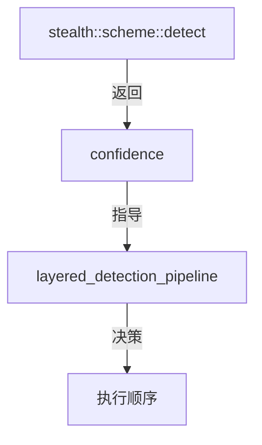

# confidence.hpp

检测置信度枚举定义。

## 源码位置

`I:/code/Prism/include/prism/recognition/confidence.hpp`

## 核心类型

### confidence

检测置信度级别枚举，指导方案执行顺序。

```cpp
enum class confidence : std::uint8_t
{
    high,   // 高置信度：特征完全匹配
    medium, // 中置信度：特征部分匹配
    low,    // 低置信度：不确定
    none    // 无特征：标准 TLS
};
```

| 值 | 说明 | 执行策略 |
|----|------|----------|
| `high` | 特征完全匹配，可直接执行对应方案 | 直接执行，无需验证 |
| `medium` | 特征部分匹配，需完整验证 | 优先执行，失败后继续候选 |
| `low` | 特征部分匹配但不确定 | 靠后执行，需验证 |
| `none` | 标准 TLS，无伪装特征 | 执行 Native 兜底方案 |

## 使用场景

### 方案检测评分

各 scheme 的 `detect()` 根据特征匹配程度返回置信度：

```cpp
// Reality: session_id 包含标记 → high
if (has_reality_marker(session_id)) {
    return {.candidates = {"reality"}, .score = confidence::high};
}

// ShadowTLS: HMAC 验证通过 → high
if (verify_hmac(client_hello)) {
    return {.candidates = {"shadowtls"}, .score = confidence::high};
}

// SNI 匹配但无其他特征 → medium
if (sni_matches_scheme(sni)) {
    return {.candidates = {"shadowtls"}, .score = confidence::medium};
}
```

### 执行策略决策

分层检测管道根据置信度决定执行顺序：

```cpp
// 高置信度直接返回单一候选
if (result.score == confidence::high) {
    return {.deterministic_hit = true, .exclusive_scheme = result.candidates[0]};
}

// 中/低置信度加入候选列表
candidates.push_back({.name = name, .score = to_score(result.score)});
```

## 调用链



## 引用关系

### 被引用

- [[result]]：分析结果结构使用
- [[layered_pipeline]]：分层检测管道使用
- [[../stealth/scheme|stealth::scheme]]：方案检测返回值

---

## 置信度计算模型

### 评分公式

每个 scheme 的检测函数 `detect()` 返回一个基础置信度，分层检测管道将其映射为数值分数后进行加权合并：

```
score(scheme) = w_sni · f_sni(sni)
              + w_sid · f_sid(session_id)
              + w_alpn · f_alpn(alpn_list)
              + w_cipher · f_cipher(cipher_suites)
              + w_ext · f_ext(extensions)
```

其中：
- `w_*` 为各特征维度的权重系数
- `f_*()` 为该维度的匹配函数，返回 `[0, 1]`
- 总分归一化后映射回 confidence 枚举

### 权重系数

| 特征维度 | 权重 | 说明 |
|----------|------|------|
| SNI 匹配 | 0.30 | 方案路由表中的 SNI 精确匹配 |
| session_id | 0.25 | 标记数据或特定模式 |
| ALPN 列表 | 0.15 | 应用层协议协商值 |
| Cipher suites | 0.15 | 加密套件组合特征 |
| Extensions | 0.15 | 扩展类型和顺序 |

### 特征匹配函数

#### f_sni — SNI 匹配度

```
f_sni(sni) =
    1.0  if sni 在 scheme_route_table 中精确匹配
    0.8  if sni 匹配通配符规则 (如 *.example.com)
    0.5  if sni 的域名后缀匹配
    0.0  otherwise
```

#### f_sid — Session ID 分析

```
f_sid(session_id) =
    1.0  if session_id 包含方案标记 (reality_marker, shadowtls_hmac)
    0.6  if session_id 长度/熵异常
    0.3  if session_id 为空 (32 字节全零)
    0.0  otherwise
```

#### f_alpn — ALPN 匹配

```
f_alpn(alpn_list) =
    1.0  if alpn_list 包含方案期望值
    0.5  if alpn_list 为空但方案不要求 ALPN
    0.0  otherwise
```

### 置信度阈值映射

加权总分映射回枚举：

```
total_score ∈ [0, 1]

total_score ≥ 0.85  →  confidence::high
total_score ≥ 0.50  →  confidence::medium
total_score ≥ 0.20  →  confidence::low
total_score < 0.20  →  confidence::none
```

## 阈值判定逻辑

### 确定性命中 (Deterministic Hit)

当任一方案达到 `confidence::high` 时，检测管道立即短路返回：

```cpp
struct detection_result {
    bool deterministic_hit{false};      // 是否有高置信度命中
    std::string exclusive_scheme;        // 排他性方案名称
    std::vector<scheme_candidate> candidates;  // 完整候选列表
};

// 短路逻辑
if (any_score >= high_threshold) {
    result.deterministic_hit = true;
    result.exclusive_scheme = top_candidate.name;
    return result;  // 不再执行后续 L2/L3 检测
}
```

**优势**: 高置信度场景下跳过昂贵的 L3 层计算（HMAC 验证、熵分析），减少检测延迟。

### 候选列表构建

当无确定性命中时，收集所有非 `none` 置信度的方案：

```cpp
// 候选排序逻辑
std::sort(candidates.begin(), candidates.end(),
    [](const auto& a, const auto& b) {
        // 1. 置信度等级优先
        if (a.score != b.score)
            return confidence_rank(a.score) > confidence_rank(b.score);
        // 2. 同等级按原始分数排序
        return a.raw_score > b.raw_score;
    });
```

### 降级判定

```
confidence::high   → 仅一个方案，直接执行
confidence::medium → 可能有多个方案，按序尝试
confidence::low    → 作为备选，排在 medium 之后
confidence::none   → 不加入候选列表
```

## 候选协议排序算法

### 排序维度

候选列表按以下优先级排序：

1. **置信度等级**: high > medium > low > none
2. **原始分数**: 同一等级内按加权总分降序
3. **检测层优先级**: 同一分数时 L1 层发现的方案优先于 L3 层（L1 检测成本更低）

### 排序示例

```
原始检测结果:
  reality:    score=0.92  → high
  shadowtls:  score=0.55  → medium
  restls:     score=0.48  → low

排序后候选列表:
  [1] reality (high, 0.92)     → 直接执行
  [2] shadowtls (medium, 0.55) → 备选
  [3] restls (low, 0.48)       → 最后备选

因 reality 为 high → deterministic_hit=true
→ 仅执行 reality，忽略 shadowtls 和 restls
```

### 多候选执行策略

当 `deterministic_hit=false` 时：

```cpp
for (const auto& candidate : candidates) {
    try {
        auto transmission = co_await scheme::execute(
            candidate.name, transport, pre_read_data);
        if (transmission) {
            return transmission;  // 首个成功的方案
        }
    } catch (...) {
        // 握手失败，继续下一候选
        continue;
    }
}
// 所有候选失败 → fallback 到 Native
return co_await native_tls_handshake(transport, pre_read_data);
```

## 置信度与性能的关系

| 置信度场景 | L1 执行 | L2 执行 | L3 执行 | 典型延迟 |
|------------|---------|---------|---------|----------|
| high (确定性命中) | 是 | 跳过 | 跳过 | < 0.1ms |
| medium (需验证) | 是 | 是 | 按需 | 0.5-2ms |
| low (不确定) | 是 | 是 | 是 | 2-5ms |
| none (标准 TLS) | 是 | 部分 | 跳过 | < 0.1ms |

**设计目标**: 大多数流量（标准 TLS 或高置信度方案）在 L1 层即可判定，L2/L3 层仅在模糊场景下触发。