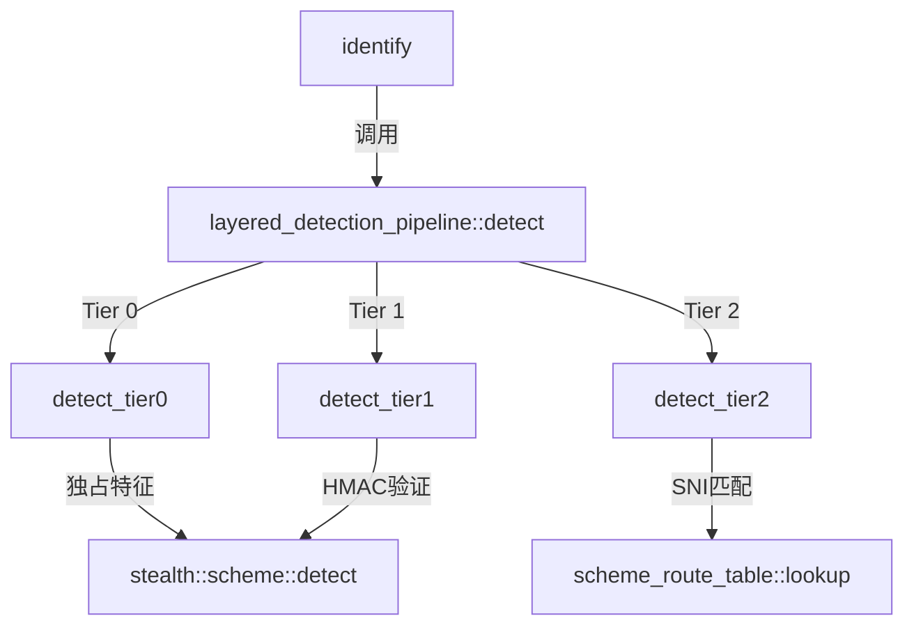

# layered_pipeline.hpp

分层检测管道，按成本和确定性分层执行检测。

## 源码位置

`I:/code/Prism/include/prism/recognition/layered_pipeline.hpp`

## 设计理念

避免不必要的计算，按成本分层：

| 层级 | 成本 | 检测方式 | 示例 |
|------|------|----------|------|
| Tier 0 | 零成本 | 字节比较 | Reality session_id 标记 |
| Tier 1 | 有成本 | HMAC/解密验证 | ShadowTLS HMAC |
| Tier 2 | 模糊 | SNI 路由匹配 | SNI 匹配配置 |

## 核心类型

### candidate_entry

检测候选条目。

```cpp
struct candidate_entry
{
    memory::string name;        // 方案名称
    std::uint16_t score{0};     // 评分（0-1000）
    std::uint8_t tier{2};       // 检测层级
    bool is_deterministic{false}; // 是否确定性命中
};
```

### pipeline_result

分层检测管道结果。

```cpp
struct pipeline_result
{
    bool deterministic_hit{false};           // 是否确定性命中
    memory::string exclusive_scheme;         // 独占命中的方案名称
    memory::vector<candidate_entry> candidates; // 候选列表
    memory::string reason;                   // 检测原因（日志用）
};
```

## layered_detection_pipeline

### 构造

从 stealth 注册表构建管道：

```cpp
explicit layered_detection_pipeline(
    const std::vector<stealth::shared_scheme> &schemes);
```

内部将方案分配到三个层级：

```cpp
std::vector<stealth::shared_scheme> tier0_schemes_;  // 独占特征
std::vector<stealth::shared_scheme> tier1_schemes_;  // HMAC验证
std::vector<stealth::shared_scheme> tier2_schemes_;  // 模糊匹配
stealth::shared_scheme native_scheme_;                // 兜底
```

### detect()

执行分层检测：

```cpp
auto detect(
    std::uint32_t bitmap,
    const protocol::tls::client_hello_features &features,
    std::span<const std::byte> raw,
    const psm::config &cfg,
    const std::vector<stealth::shared_scheme> &matched_schemes) const
    -> pipeline_result;
```

### 检测流程

```
┌─────────────┐
│   Tier 0    │ ──▶ 独占特征命中？
└──────┬──────┘
       │ 否
       ▼
┌─────────────┐
│   Tier 1    │ ──▶ HMAC验证通过？
└──────┬──────┘
       │ 否
       ▼
┌─────────────┐
│   Tier 2    │ ──▶ SNI路由匹配
└──────┬──────┘
       │ 兜底
       ▼
┌─────────────┐
│   Native    │
└─────────────┘
```

**执行顺序**：

1. **Tier 0**：检查独占特征（如 Reality session_id 标记）
   - 如果独占命中，直接返回单一候选
2. **Tier 1**：检查 HMAC 等有成本验证
   - 如果确定性命中，返回单一候选
3. **Tier 2**：返回多候选列表
   - 根据 SNI 路由匹配

## 调用链



## 引用关系

### 依赖

- [[confidence]]：置信度枚举
- [[scheme-route-table]]：SNI 路由表
- [[../stealth/scheme|stealth::scheme]]：伪装方案
- [[../protocol/tls/types|protocol::tls::client_hello_features]]：TLS 特征
- [[../protocol/tls/feature_bitmap|feature_bitmap]]：特征位图

### 被引用

- [[recognition]]：identify() 中使用