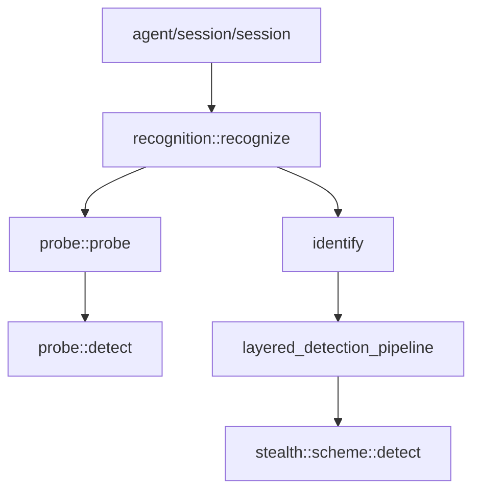

# Recognition 模块

Recognition 模块负责协议识别与伪装方案检测，是 Prism 入口流量分发的核心模块。

## 模块职责

- **外层协议探测**：从预读数据检测 HTTP/SOCKS5/TLS/Shadowsocks
- **TLS 伪装方案识别**：分析 ClientHello 特征，识别 Reality/ShadowTLS/Restls 等
- **分层检测管道**：按成本分层执行检测，优化性能

## 子模块

| 子模块 | 说明 |
|--------|------|
| [[recognition]] | 聚合头文件，提供统一入口 `recognize()` |
| [[result]] | 分析结果结构 `analysis_result` |
| [[confidence]] | 检测置信度枚举 |
| [[layered-pipeline]] | 分层检测管道 |
| [[scheme-route-table]] | SNI 路由表 |
| [[probe/probe]] | 外层协议探测 |
| [[probe/analyzer]] | 外层协议检测（纯内存） |

## 核心流程

```
┌─────────────┐     ┌─────────────┐     ┌─────────────┐
│   Probe     │────▶│   Identify  │────▶│   Execute   │
│ 外层协议探测 │     │ TLS方案识别  │     │  方案执行    │
└─────────────┘     └─────────────┘     └─────────────┘
      │                    │                   │
      ▼                    ▼                   ▼
 HTTP/SOCKS5/     Reality/ShadowTLS/     建立传输层
 TLS/Shadowsocks  Restls/Native
```

## 调用链



## 相关模块

- [[../stealth/overview|Stealth 模块]]：伪装方案实现
- [[../protocol/tls/types|TLS ClientHello]]：协议解析
- [[../channel/transport/transmission|Transport]]：传输层抽象