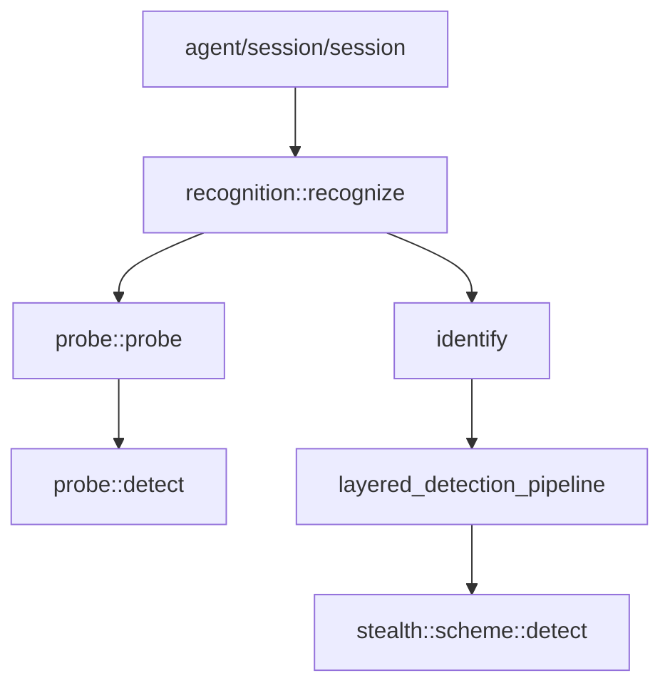

# Recognition 模块

Recognition 模块负责协议识别与伪装方案检测，是 Prism 入口流量分发的核心模块。

## 模块职责

- **外层协议探测**：从预读数据检测 HTTP/SOCKS5/TLS/Shadowsocks
- **TLS 伪装方案识别**：分析 ClientHello 特征，识别 Reality/ShadowTLS/Restls 等
- **分层检测管道**：按成本分层执行检测，优化性能

## 子模块

| 子模块 | 说明 |
|--------|------|
| [[recognition]] | 聚合头文件，提供统一入口 `recognize()` |
| [[result]] | 分析结果结构 `analysis_result` |
| [[confidence]] | 检测置信度枚举 |
| [[layered-pipeline]] | 分层检测管道 |
| [[scheme-route-table]] | SNI 路由表 |
| [[probe/probe]] | 外层协议探测 |
| [[probe/analyzer]] | 外层协议检测（纯内存） |

## 核心流程

```
┌─────────────┐     ┌─────────────┐     ┌─────────────┐
│   Probe     │────▶│   Identify  │────▶│   Execute   │
│ 外层协议探测 │     │ TLS方案识别  │     │  方案执行    │
└─────────────┘     └─────────────┘     └─────────────┘
      │                    │                   │
      ▼                    ▼                   ▼
 HTTP/SOCKS5/     Reality/ShadowTLS/     建立传输层
 TLS/Shadowsocks  Restls/Native
```

## 调用链



## 相关模块

- [[../stealth/overview|Stealth 模块]]：伪装方案实现
- [[../protocol/tls/types|TLS ClientHello]]：协议解析
- [[../channel/transport/transmission|Transport]]：传输层抽象

---

## 三阶段检测流水线详解

Recognition 模块的核心是三阶段检测流水线：**Probe（探测）→ Identify（识别）→ Execute（执行）**。每一阶段的输出是下一阶段的输入，形成单向数据流。

### 阶段一：Probe — 外层协议探测

```
输入: transmission 传输层对象
      ↓
  async_read_some(max_peek_size=24)
      ↓ 预读数据不消费传输层
      ↓
  peek_data[0..N] (N ≤ 24)
      ↓
  probe::detect(peek_data)
      ↓ 按顺序匹配: SOCKS5 → TLS → HTTP → Shadowsocks
      ↓
输出: probe_result {
    protocol_type type,        // 检测到的外层协议
    pre_read_data[32],         // 预读数据缓冲区
    pre_read_size,             // 实际预读字节数
    fault::code ec             // 错误码
}
```

**关键设计**:
- `async_read_some` 以 peek 模式读取，数据保留在传输层缓冲区
- 预读数据通过 `probe_result::pre_read_data` 传递给后续阶段，避免重复读取
- 超时或读取失败时返回 `fault::code`，触发 fallback 到 TLS

### 阶段二：Identify — TLS 伪装方案识别

```
输入: probe_result (来自 Probe 阶段)
      ↓
  如果 type == TLS:
      ↓ 提取 ClientHello
      ↓ 解析 pre_read_data 中的 TLS Record Layer
      ↓
  ClientHello 解析:
      ├── SNI 提取
      ├── ALPN 提取
      ├── session_id 分析
      ├── cipher_suites 列表
      └── extensions 遍历
      ↓
  分层检测管道 layered_detection_pipeline:
      ├── L1 (低成本): SNI 路由表匹配
      ├── L2 (中成本): session_id 标记检测
      └── L3 (高成本): HMAC 验证 / 统计特征分析
      ↓
  各 scheme::detect() 返回 detection_result:
      { candidates: [scheme_name], score: confidence }
      ↓
  合并评分 → 排序候选列表
      ↓
输出: analysis_result {
    protocol_type outer_protocol,    // 外层协议
    vector<scheme_candidate> candidates,  // 排序后的候选方案
    confidence overall_score         // 综合置信度
}
```

**分层检测策略**:
- **L1 层**: 仅检查 SNI 是否在 scheme_route_table 中，O(1) 哈希查找
- **L2 层**: 解析 session_id 内容，检查是否有 scheme 特定标记
- **L3 层**: 执行计算密集型验证（如 HMAC、熵分析），仅在 L1/L2 产生候选后执行

### 阶段三：Execute — 方案执行

```
输入: analysis_result (来自 Identify 阶段)
      ↓
  根据 overall_score 决策:
      │
      ├── high → 确定性命中
      │     直接执行 exclusive_scheme
      │     跳过所有候选验证
      │
      ├── medium → 优先候选
      │     按评分排序依次尝试
      │     每个 scheme::execute() 验证
      │     失败则继续下一候选
      │
      ├── low → 靠后候选
      │     排在 medium 之后尝试
      │     必须通过完整验证
      │
      └── none → 标准 TLS
            执行 Native 兜底方案
            建立标准 TLS 连接
      ↓
  scheme::execute(transport, pre_read_data):
      ├── 消费预读数据（注入传输层）
      ├── 执行方案特定握手
      ├── 建立传输通道
      └── 返回已建立的 transmission
      ↓
输出: shared_transmission (已建立连接)
```

### 完整数据流

```
┌──────────────────────────────────────────────────────────────┐
│                     recognize()                              │
│                                                              │
│  ┌────────────┐    ┌────────────┐    ┌────────────┐         │
│  │  Phase 1   │    │  Phase 2   │    │  Phase 3   │         │
│  │   Probe    │───▶│  Identify  │───▶│  Execute   │         │
│  └─────┬──────┘    └─────┬──────┘    └─────┬──────┘         │
│        │                 │                 │                │
│        ▼                 ▼                 ▼                │
│   预读 24 字节     ClientHello 解析    方案握手执行          │
│   首字节特征匹配   分层检测评分       传输通道建立            │
│   protocol_type   analysis_result   shared_transmission     │
│                                                              │
│   错误处理:                                                   │
│   ┌─────────────────────────────────────┐                   │
│   │ 任何阶段失败 → fallback to Native   │                   │
│   │ pre_read_data 始终保留用于重试       │                   │
│   └─────────────────────────────────────┘                   │
└──────────────────────────────────────────────────────────────┘
```

### 阶段间数据传递

| 传递数据 | 来源阶段 | 目标阶段 | 用途 |
|----------|----------|----------|------|
| `pre_read_data` | Probe | Identify, Execute | ClientHello 解析 / 握手注入 |
| `protocol_type` | Probe | Identify | 决定是否进入 TLS 识别 |
| `analysis_result` | Identify | Execute | 方案选择和执行顺序 |
| `confidence` | Identify | Execute | 执行策略决策 |

### 错误处理与回退

```
Probe 失败 (读取超时/连接关闭)
    ↓
返回 protocol_type::unknown → 触发 Native 兜底

Identify 无候选方案 (全部 confidence::none)
    ↓
执行 Native TLS 握手

Execute 方案握手失败
    ↓
尝试下一候选方案
所有候选失败 → 回退到 Native
```

## 识别弱点与误判

### SS2022 salt 误判窗口

SS2022 salt 的前两字节如果是 `0x16 0x03`，会被误判为 TLS 记录。概率约 1/65536，极低但非零。表现为 SS2022 客户端偶尔连接失败且日志显示 TLS 解析错误。

### VLESS 弱特征

VLESS 仅以 4 个字节作为检测特征（`b0==0, b17==0, b18 in {1,2,0x7F}, b21 in {1,2,3}`），与其他协议特征相比区分度最低。

### 排除法归类

不匹配 SOCKS5（1B）、TLS（2B）、HTTP（4B+）的流量统一归为 Shadowsocks。任何未知非标准协议都会被错误归类。

详见 [[dev/debugging/deep-dive/recognition-weaknesses|协议识别弱点与误判分析]]