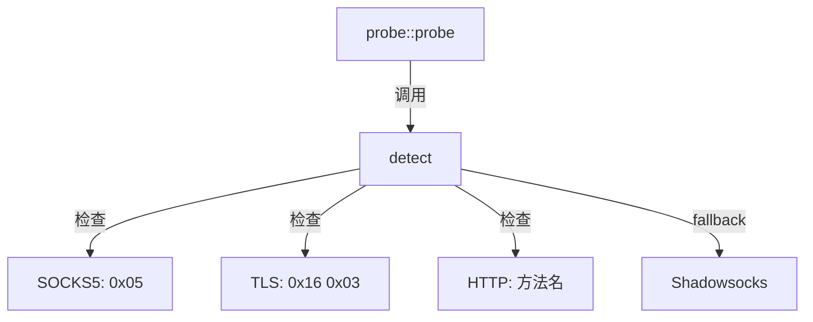

# analyzer.hpp

外层协议检测（纯内存操作），通过魔术字节判断协议类型。

## 源码位置

`I:/code/Prism/include/prism/recognition/probe/analyzer.hpp`

## 核心函数

### detect()

从预读数据检测外层协议类型。

```cpp
[[nodiscard]] auto detect(std::string_view peek_data) -> protocol::protocol_type;
```

| 参数 | 类型 | 说明 |
|------|------|------|
| `peek_data` | `string_view` | 预读数据（通常是前 24 字节） |

**返回**：协议类型枚举值

## 检测顺序

采用排除法检测：

```
┌───────────────┐
│ 首字节 0x05?  │ ──▶ SOCKS5
└───────┬───────┘
        │ 否
        ▼
┌───────────────┐
│前两字节 0x16 0x03?│ ──▶ TLS
└───────┬───────┘
        │ 否
        ▼
┌───────────────┐
│ HTTP 方法名?  │ ──▶ HTTP
└───────┬───────┘
        │ 否
        ▼
┌───────────────┐
│   fallback    │ ──▶ Shadowsocks
└───────────────┘
```

## 协议特征

### SOCKS5

```cpp
if (peek_data[0] == 0x05) {
    return protocol_type::socks5;
}
```

### TLS

```cpp
// 必须检查两字节，SS2022 salt 有约 1/256 概率首字节为 0x16
if (peek_data.size() >= 2 &&
    peek_data[0] == 0x16 && peek_data[1] == 0x03) {
    return protocol_type::tls;
}
```

### HTTP

```cpp
// 检查常见 HTTP 方法名
if (starts_with(peek_data, "GET ") ||
    starts_with(peek_data, "POST ") ||
    starts_with(peek_data, "HEAD ") ||
    // ... 其他方法
    ) {
    return protocol_type::http;
}
```

### Shadowsocks

排除已知协议后，fallback 到 Shadowsocks：

```cpp
return protocol_type::shadowsocks;
```

## 特性

- **纯内存操作**：无网络 I/O
- **线程安全**：无状态，可并发调用
- **零拷贝**：使用 `string_view`

## 注意事项

- TLS 检测必须检查两字节（`0x16 0x03`）
- SS2022 salt 有约 1/256 概率首字节恰好为 `0x16`
- 探测结果基于有限数据，后续数据可能推翻判断

## 调用链



## 引用关系

### 依赖

- [[../protocol/analysis|protocol::protocol_type]]：协议类型枚举

### 被引用

- [[probe]]：probe() 中调用

---

## 分析器架构

### 分析器接口定义

`detect()` 函数是分析器的核心接口，采用纯函数设计：

```cpp
namespace prism::recognition::probe {

/// 外层协议检测器接口
class analyzer_interface {
public:
    virtual ~analyzer_interface() = default;

    /// 从预读数据检测协议类型
    /// @param peek_data 预读数据视图（不拥有所有权）
    /// @return 检测到的协议类型
    [[nodiscard]] virtual auto detect(std::string_view peek_data)
        -> protocol::protocol_type = 0;

    /// 获取分析器名称（用于调试和日志）
    [[nodiscard]] virtual auto name() const -> std::string_view = 0;
};

/// 默认分析器实现（header-only）
class default_analyzer : public analyzer_interface {
public:
    [[nodiscard]] auto detect(std::string_view peek_data)
        -> protocol::protocol_type override;
    [[nodiscard]] auto name() const -> std::string_view override {
        return "default";
    }
};

} // namespace prism::recognition::probe
```

**接口设计原则**:
- 纯虚函数接口支持自定义分析器实现
- `string_view` 参数实现零拷贝
- 无状态设计，天然线程安全
- 返回确定性枚举，无异常抛出

### 分析器注册机制

系统支持运行时注册自定义分析器：

```cpp
namespace prism::recognition::probe {

/// 分析器注册表
class analyzer_registry {
public:
    /// 注册自定义分析器
    void register_analyzer(
        std::string_view name,
        std::unique_ptr<analyzer_interface> analyzer);

    /// 获取已注册的分析器
    auto get_analyzer(std::string_view name)
        -> analyzer_interface*;

    /// 设置默认分析器
    void set_default(std::unique_ptr<analyzer_interface> analyzer);

    /// 获取默认分析器
    auto default_analyzer() -> analyzer_interface*;

private:
    memory::unordered_map<memory::string,
        std::unique_ptr<analyzer_interface>> registry_;
    std::unique_ptr<analyzer_interface> default_;
};

/// 全局注册表（单例）
auto global_registry() -> analyzer_registry&;

} // namespace prism::recognition::probe
```

**注册示例**:

```cpp
// 注册自定义分析器
auto my_analyzer = std::make_unique<custom_protocol_analyzer>();
prism::recognition::probe::global_registry()
    .register_analyzer("custom", std::move(my_analyzer));
```

**注册时机**: 通常在程序启动时、配置加载后执行注册。

## 检测算法详解

### 字节级匹配策略

`detect()` 采用多层过滤策略，按检测成本和特异性从低到高执行：

```
┌─────────────────────────────────────────────────┐
│                  detect()                        │
│                                                  │
│  输入: peek_data (std::string_view)              │
│                                                  │
│  Step 1: 空数据检查                               │
│  ┌─────────────────────────────────────┐        │
│  │ if peek_data.empty() → unknown      │        │
│  └─────────────────────────────────────┘        │
│                                                  │
│  Step 2: SOCKS5 检测 (1 字节)                     │
│  ┌─────────────────────────────────────┐        │
│  │ if peek_data[0] == 0x05 → socks5    │        │
│  └─────────────────────────────────────┘        │
│                                                  │
│  Step 3: TLS 检测 (2 字节)                        │
│  ┌─────────────────────────────────────┐        │
│  │ if data[0] == 0x16 && data[1] == 0x03  │   │
│  │     → tls                           │        │
│  └─────────────────────────────────────┘        │
│                                                  │
│  Step 4: HTTP 方法匹配 (4-8 字节)                 │
│  ┌─────────────────────────────────────┐        │
│  │ if starts_with(data, "GET ") → http │        │
│  │ if starts_with(data, "POST ") → http│        │
│  │ ... 其他 HTTP 方法                   │        │
│  └─────────────────────────────────────┘        │
│                                                  │
│  Step 5: Fallback                                │
│  ┌─────────────────────────────────────┐        │
│  │ → shadowsocks (排除法兜底)           │        │
│  └─────────────────────────────────────┘        │
└─────────────────────────────────────────────────┘
```

### HTTP 方法匹配表

```cpp
// 支持的 HTTP 方法（按常见程度排序）
static constexpr std::array methods = {
    "GET ",     // 4 bytes - 最常见
    "POST ",    // 5 bytes
    "HEAD ",    // 5 bytes
    "PUT ",     // 4 bytes
    "DELETE ",  // 7 bytes
    "CONNECT ", // 8 bytes
    "OPTIONS ", // 8 bytes
    "PATCH ",   // 6 bytes
    "TRACE ",   // 6 bytes
};
```

**优化**: 使用 `memcmp` 而非 `string_view::starts_with` 在编译器优化后可生成更高效的 SIMD 指令。

## 分析结果合并策略

当系统中存在多个分析器时，结果合并遵循以下策略：

### 合并算法

```cpp
auto merge_analysis_results(
    const std::vector<protocol_type>& results) -> protocol_type
{
    // 1. 统计投票
    std::unordered_map<protocol_type, int> votes;
    for (const auto& r : results) {
        votes[r]++;
    }

    // 2. 找最高票数
    auto max_it = std::max_element(votes.begin(), votes.end(),
        [](const auto& a, const auto& b) { return a.second < b.second; });

    // 3. 多数表决
    if (max_it->second > results.size() / 2) {
        return max_it->first;  // 多数一致
    }

    // 4. 平局时优先 TLS（安全性最高）
    if (votes.contains(protocol_type::tls)) {
        return protocol_type::tls;
    }

    // 5. 最终回退
    return protocol_type::unknown;
}
```

### 合并优先级

| 场景 | 策略 | 结果 |
|------|------|------|
| 所有分析器一致 | 直接采纳 | 确定性结果 |
| 多数一致 (>50%) | 多数表决 | 高置信度结果 |
| 票数持平 | 优先 TLS | 安全优先原则 |
| 无明确结果 | 返回 unknown | 触发 fallback |

## 性能特性

| 检测步骤 | 操作 | 复杂度 | 最坏情况 |
|----------|------|--------|----------|
| 空检查 | `empty()` | O(1) | O(1) |
| SOCKS5 | 单字节比较 | O(1) | O(1) |
| TLS | 双字节比较 | O(1) | O(1) |
| HTTP | 方法名遍历 | O(N·M) | N=方法数, M=方法名长度 |
| 总体 | 顺序执行 | O(1) | 常数次字节比较 |

**内存特性**: 零堆分配，仅使用 `string_view`，无状态，栈友好。预期延迟 < 10 纳秒。