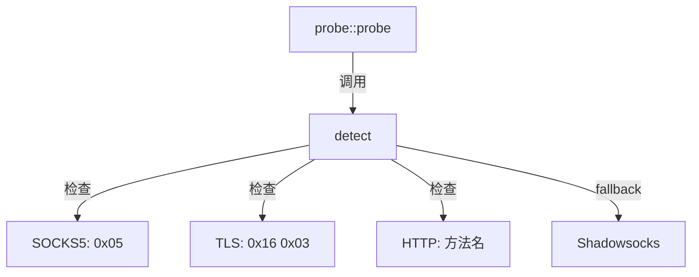

# analyzer.hpp

外层协议检测（纯内存操作），通过魔术字节判断协议类型。

## 源码位置

`I:/code/Prism/include/prism/recognition/probe/analyzer.hpp`

## 核心函数

### detect()

从预读数据检测外层协议类型。

```cpp
[[nodiscard]] auto detect(std::string_view peek_data) -> protocol::protocol_type;
```

| 参数 | 类型 | 说明 |
|------|------|------|
| `peek_data` | `string_view` | 预读数据（通常是前 24 字节） |

**返回**：协议类型枚举值

## 检测顺序

采用排除法检测：

```
┌───────────────┐
│ 首字节 0x05?  │ ──▶ SOCKS5
└───────┬───────┘
        │ 否
        ▼
┌───────────────┐
│前两字节 0x16 0x03?│ ──▶ TLS
└───────┬───────┘
        │ 否
        ▼
┌───────────────┐
│ HTTP 方法名?  │ ──▶ HTTP
└───────┬───────┘
        │ 否
        ▼
┌───────────────┐
│   fallback    │ ──▶ Shadowsocks
└───────────────┘
```

## 协议特征

### SOCKS5

```cpp
if (peek_data[0] == 0x05) {
    return protocol_type::socks5;
}
```

### TLS

```cpp
// 必须检查两字节，SS2022 salt 有约 1/256 概率首字节为 0x16
if (peek_data.size() >= 2 &&
    peek_data[0] == 0x16 && peek_data[1] == 0x03) {
    return protocol_type::tls;
}
```

### HTTP

```cpp
// 检查常见 HTTP 方法名
if (starts_with(peek_data, "GET ") ||
    starts_with(peek_data, "POST ") ||
    starts_with(peek_data, "HEAD ") ||
    // ... 其他方法
    ) {
    return protocol_type::http;
}
```

### Shadowsocks

排除已知协议后，fallback 到 Shadowsocks：

```cpp
return protocol_type::shadowsocks;
```

## 特性

- **纯内存操作**：无网络 I/O
- **线程安全**：无状态，可并发调用
- **零拷贝**：使用 `string_view`

## 注意事项

- TLS 检测必须检查两字节（`0x16 0x03`）
- SS2022 salt 有约 1/256 概率首字节恰好为 `0x16`
- 探测结果基于有限数据，后续数据可能推翻判断

## 调用链



## 引用关系

### 依赖

- [[../protocol/analysis|protocol::protocol_type]]：协议类型枚举

### 被引用

- [[probe]]：probe() 中调用