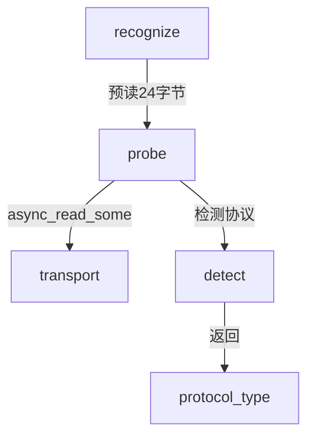

# probe.hpp

外层协议探测，从传输层预读数据检测协议类型。

## 源码位置

`I:/code/Prism/include/prism/recognition/probe/probe.hpp`

## 核心类型

### probe_result

外层协议探测结果。

```cpp
struct probe_result
{
    protocol::protocol_type type;                  // 检测到的协议类型
    std::array<std::byte, 32> pre_read_data{};      // 预读数据缓冲区
    std::size_t pre_read_size{0};                   // 实际预读大小
    fault::code ec{fault::code::success};           // 错误代码
};
```

| 字段 | 类型 | 说明 |
|------|------|------|
| `type` | `protocol_type` | 检测到的协议类型 |
| `pre_read_data` | `array<byte, 32>` | 预读数据缓冲区（最大 32 字节） |
| `pre_read_size` | `size_t` | 实际预读数据大小 |
| `ec` | `fault::code` | 错误代码 |

### 成员函数

```cpp
[[nodiscard]] auto success() const noexcept -> bool;
[[nodiscard]] auto preload_view() const noexcept -> std::string_view;
[[nodiscard]] auto preload_bytes() const noexcept -> std::span<const std::byte>;
```

## probe()

从传输层预读数据并检测协议类型。

```cpp
auto probe(
    channel::transport::transmission &transport,
    const std::size_t max_peek_size = 24)
    -> net::awaitable<probe_result>;
```

### 参数

| 参数 | 类型 | 说明 |
|------|------|------|
| `transport` | `transmission &` | 传输层对象 |
| `max_peek_size` | `size_t` | 最大预读字节数（默认 24） |

### 流程

```
┌─────────────┐
│ async_read  │ ──▶ 预读 24 字节
└──────┬──────┘
       │
       ▼
┌─────────────┐
│   detect()  │ ──▶ 协议类型检测
└──────┬──────┘
       │
       ▼
┌─────────────┐
│probe_result │ ──▶ 返回结果
└─────────────┘
```

## 协议类型

检测支持的协议类型（[[../protocol/analysis|protocol_type]]）：

| 协议 | 首字节/特征 | 检测方式 |
|------|------------|----------|
| SOCKS5 | `0x05` | 首字节比较 |
| TLS | `0x16 0x03` | 前两字节比较 |
| HTTP | `GET/POST/...` | 方法名匹配 |
| Shadowsocks | 其他 | 排除法 fallback |
| Unknown | 空/无效 | 默认值 |

## 调用链



## 引用关系

### 依赖

- [[analyzer]]：detect() 函数
- [[../channel/transport/transmission|transmission]]：传输层
- [[../protocol/analysis|protocol_type]]：协议类型枚举
- [[../fault/code|fault::code]]：错误码

### 被引用

- [[../recognition]]：recognize() 中调用

---

## 探测字节分析流程

### 完整探测流水线

```
┌──────────────────────────────────────────────────────────────┐
│                    probe()                                   │
│                                                              │
│  ┌──────────────┐                                           │
│  │ Step 1: Read │                                           │
│  │ async_read   │ ──────▶ 从 transport 读取数据              │
│  │ (peek 模式)  │        数据保留在缓冲区，后续可重新读取      │
│  └──────┬───────┘                                           │
│         │                                                    │
│         ▼                                                    │
│  ┌──────────────┐                                           │
│  │ Step 2: Copy │                                           │
│  │ 预读数据复制  │ ──────▶ 复制到 pre_read_data[32] 缓冲区   │
│  │ → pre_read   │        记录实际大小 pre_read_size          │
│  └──────┬───────┘                                           │
│         │                                                    │
│         ▼                                                    │
│  ┌──────────────┐                                           │
│  │ Step 3: Detect│                                          │
│  │ detect()     │ ──────▶ 调用 analyzer::detect(peek_data)  │
│  │              │        按协议特征表匹配                    │
│  └──────┬───────┘                                           │
│         │                                                    │
│         ▼                                                    │
│  ┌──────────────┐                                           │
│  │ Step 4: Wrap │                                           │
│  │ probe_result │ ──────▶ 封装结果返回                      │
│  └──────────────┘                                           │
└──────────────────────────────────────────────────────────────┘
```

### 预读 24 字节的原理

**为什么是 24 字节？**

1. **TLS Record Layer 头**: 5 字节（1 字节类型 + 2 字节版本 + 2 字节长度）
2. **TLS ClientHello 固定字段**:
   - 2 字节版本号
   - 32 字节 Random（但我们只需要前几个字节判断）
   - 1 字节 Session ID 长度
3. **HTTP 方法名**: 最长方法名 `OPTIONS` + 空格 = 8 字节，加上 `HTTP/1.1` = 16 字节
4. **SOCKS5 握手**: 首字节 `0x05` + 方法数 = 2 字节

综合考量：
- 24 字节足以覆盖所有目标协议的识别特征
- 不会过度预读导致延迟（通常一个 TCP 段就包含这些数据）
- 避免预读过多导致 handshake 数据不完整

**预读大小配置**:

```cpp
auto probe(
    channel::transport::transmission &transport,
    const std::size_t max_peek_size = 24)  // 默认 24，可调整
    -> net::awaitable<probe_result>;
```

- 最小值 2 字节（仅 TLS 版本判断）
- 推荐值 24 字节（覆盖所有协议）
- 最大值 32 字节（pre_read_data 缓冲区上限）

### 各协议首字节特征表

| 协议 | 特征字节序列 | 匹配长度 | 误判率 | 说明 |
|------|-------------|----------|--------|------|
| **SOCKS5** | `0x05` | 1 字节 | ~0.39% | 随机数据首字节为 0x05 的概率 = 1/256 |
| **TLS** | `0x16 0x03` | 2 字节 | ~0.004% | 前两字节恰好匹配的概率 = 1/65536 |
| **TLS 1.3** | `0x16 0x03 0x03` | 3 字节 | ~0.000015% | 进一步降低误判 |
| **HTTP GET** | `47 45 54 20` ("GET ") | 4 字节 | 极低 | ASCII 方法名 + 空格 |
| **HTTP POST** | `50 4F 53 54 20` ("POST ") | 5 字节 | 极低 | 同上 |
| **HTTP HEAD** | `48 45 41 44 20` ("HEAD ") | 5 字节 | 极低 | 同上 |
| **HTTP PUT** | `50 55 54 20` ("PUT ") | 4 字节 | 极低 | 同上 |
| **HTTP DELETE** | `44 45 4C 45 54 45 20` | 7 字节 | 极低 | 同上 |
| **HTTP CONNECT** | `43 4F 4E 4E 45 43 54 20` | 8 字节 | 极低 | 同上 |
| **HTTP OPTIONS** | `4F 50 54 49 4F 4E 53 20` | 8 字节 | 极低 | 同上 |
| **HTTP PATCH** | `50 41 54 43 48 20` | 6 字节 | 极低 | 同上 |

### Shadowsocks 误判分析

Shadowsocks 2022 (SS2022) 使用随机 salt 作为前缀：

```
SS2022 数据包: [salt N bytes][encrypted payload]
```

- salt 为随机字节，首字节为 `0x05` 的概率 = 1/256 ≈ 0.39%
- 前两字节为 `0x16 0x03` 的概率 = 1/65536 ≈ 0.0015%

**缓解策略**:
- TLS 检测必须检查两字节 `0x16 0x03`，不能仅检查首字节
- SS2022 被误判为 TLS 时，后续 ClientHello 解析会失败，触发 fallback
- 最终在 execute 阶段通过握手验证纠正错误判断

### Peek 模式读取详解

```cpp
// probe() 使用 peek 模式读取，不消费传输层缓冲区
auto n = co_await transport.async_read_some(
    boost::asio::buffer(pre_read_data),
    boost::asio::socket_base::message_peek);
```

**Peek 模式保证**:
1. 数据保留在 socket 接收缓冲区
2. 后续 `async_read_some` 仍可读取相同数据
3. pre_read_data 作为副本传递给分析器和执行器
4. 方案执行时将 pre_read_data 注入传输层流中

### 错误场景处理

| 错误场景 | 返回 protocol_type | 处理方式 |
|----------|-------------------|----------|
| 读取超时 | `unknown` | fallback 到 Native TLS |
| 连接已关闭 | `unknown` | 返回错误码 |
| 读取 0 字节 | `unknown` | 等待更多数据或超时 |
| 读取 1 字节 = 0x05 | `socks5` | 进入 SOCKS5 处理流程 |
| 读取 1 字节 = 0x16 | 继续读第 2 字节 | 确认 TLS 或误判 |