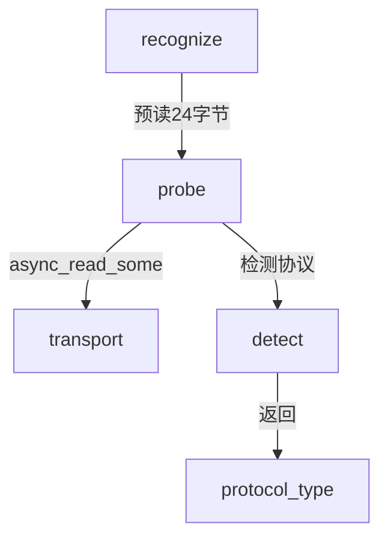

# probe.hpp

外层协议探测，从传输层预读数据检测协议类型。

## 源码位置

`I:/code/Prism/include/prism/recognition/probe/probe.hpp`

## 核心类型

### probe_result

外层协议探测结果。

```cpp
struct probe_result
{
    protocol::protocol_type type;                  // 检测到的协议类型
    std::array<std::byte, 32> pre_read_data{};      // 预读数据缓冲区
    std::size_t pre_read_size{0};                   // 实际预读大小
    fault::code ec{fault::code::success};           // 错误代码
};
```

| 字段 | 类型 | 说明 |
|------|------|------|
| `type` | `protocol_type` | 检测到的协议类型 |
| `pre_read_data` | `array<byte, 32>` | 预读数据缓冲区（最大 32 字节） |
| `pre_read_size` | `size_t` | 实际预读数据大小 |
| `ec` | `fault::code` | 错误代码 |

### 成员函数

```cpp
[[nodiscard]] auto success() const noexcept -> bool;
[[nodiscard]] auto preload_view() const noexcept -> std::string_view;
[[nodiscard]] auto preload_bytes() const noexcept -> std::span<const std::byte>;
```

## probe()

从传输层预读数据并检测协议类型。

```cpp
auto probe(
    channel::transport::transmission &transport,
    const std::size_t max_peek_size = 24)
    -> net::awaitable<probe_result>;
```

### 参数

| 参数 | 类型 | 说明 |
|------|------|------|
| `transport` | `transmission &` | 传输层对象 |
| `max_peek_size` | `size_t` | 最大预读字节数（默认 24） |

### 流程

```
┌─────────────┐
│ async_read  │ ──▶ 预读 24 字节
└──────┬──────┘
       │
       ▼
┌─────────────┐
│   detect()  │ ──▶ 协议类型检测
└──────┬──────┘
       │
       ▼
┌─────────────┐
│probe_result │ ──▶ 返回结果
└─────────────┘
```

## 协议类型

检测支持的协议类型（[[../protocol/analysis|protocol_type]]）：

| 协议 | 首字节/特征 | 检测方式 |
|------|------------|----------|
| SOCKS5 | `0x05` | 首字节比较 |
| TLS | `0x16 0x03` | 前两字节比较 |
| HTTP | `GET/POST/...` | 方法名匹配 |
| Shadowsocks | 其他 | 排除法 fallback |
| Unknown | 空/无效 | 默认值 |

## 调用链



## 引用关系

### 依赖

- [[analyzer]]：detect() 函数
- [[../channel/transport/transmission|transmission]]：传输层
- [[../protocol/analysis|protocol_type]]：协议类型枚举
- [[../fault/code|fault::code]]：错误码

### 被引用

- [[../recognition]]：recognize() 中调用