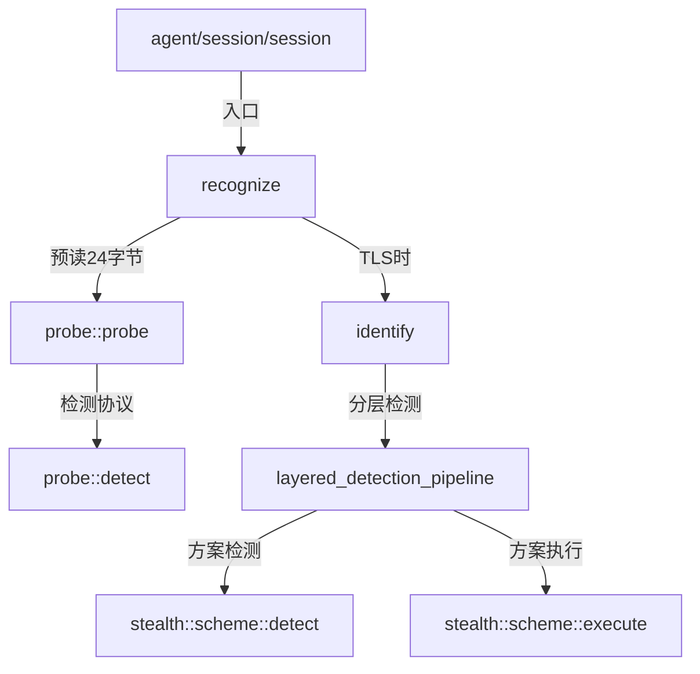

# recognition.hpp

Recognition 模块聚合头文件，提供统一的协议识别入口。

## 源码位置

`I:/code/Prism/include/prism/recognition/recognition.hpp`

## 核心类型

### recognize_context

完整识别流程输入上下文。

```cpp
struct recognize_context
{
    transport::shared_transmission transport;  // 传输层
    const psm::config *cfg;                              // 全局配置
    resolve::router *router;                             // 路由器
    agent::session_context *session;                      // 会话上下文
    memory::frame_arena *frame_arena;                    // 帧内存池
};
```

### recognize_result

完整识别流程输出结果。

```cpp
struct recognize_result
{
    transport::shared_transmission transport;  // 最终传输层
    protocol::protocol_type detected;                    // 检测到的协议类型
    memory::vector<std::byte> preread;                  // 预读数据
    fault::code error;                                  // 错误码
    memory::string executed_scheme;                      // 成功执行的方案名称
    bool success;                                       // 是否成功识别
};
```

### identify_context

TLS 协议识别上下文。

```cpp
struct identify_context
{
    transport::shared_transmission transport;   // 传输层
    const psm::config *cfg;                               // 全局配置
    std::span<const std::byte> preread;                  // 预读数据
    resolve::router *router;                             // 路由器
    agent::session_context *session;                      // 会话上下文
    memory::frame_arena *frame_arena;                    // 帧内存池
};
```

### identify_result

协议识别结果。

```cpp
struct identify_result
{
    transport::shared_transmission transport;  // 最终传输层
    protocol::protocol_type detected;                   // 检测到的协议类型
    memory::vector<std::byte> preread;                  // 内层预读数据
    fault::code error;                                  // 错误码
    memory::string executed_scheme;                      // 成功执行的方案名称
    bool success;                                       // 是否成功
};
```

## 核心函数

### recognize()

执行完整协议识别流程。

```cpp
auto recognize(recognize_context ctx) -> net::awaitable<recognize_result>;
```

**流程**：

1. **Phase 1: Probe（外层探测）**
   - 预读 24 字节
   - 检测 HTTP/SOCKS5/TLS/Shadowsocks

2. **Phase 2: Identify（仅当 TLS）**
   - 读取完整 ClientHello
   - 特征分析
   - 方案执行

### identify()

执行 TLS 伪装方案识别。

```cpp
auto identify(identify_context ctx) -> net::awaitable<identify_result>;
```

**流程**：

1. **Read**：从传输层读取完整 TLS ClientHello
2. **Parse**：解析 ClientHello 结构，提取特征
3. **Detect**：遍历所有 scheme 的 detect()，收集候选方案
4. **Execute**：按候选顺序执行 scheme

## 调用链



## 引用关系

### 被引用

- [[../agent/session/session|agent::session]]：调用 recognize() 入口

### 依赖

- [[confidence]]：置信度枚举
- [[result]]：分析结果
- [[layered_pipeline]]：分层检测管道
- [[scheme-route-table]]：SNI 路由表
- [[probe/probe]]：外层协议探测
- [[probe/analyzer]]：协议类型检测
- [[../stealth/scheme|stealth::scheme]]：伪装方案
- [[../channel/transport/transmission|transport]]：传输层
- [[../protocol/analysis|protocol::protocol_type]]：协议类型枚举