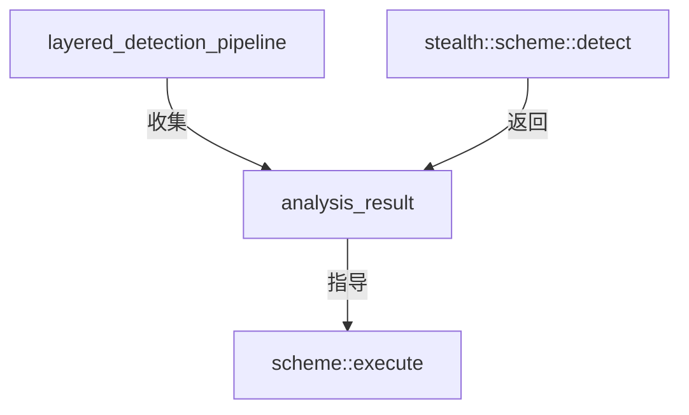

# result.hpp

ClientHello 特征分析结果结构定义。

## 源码位置

`I:/code/Prism/include/prism/recognition/result.hpp`

## 核心类型

### analysis_result

ClientHello 特征分析结果，由各 scheme 的 detect() 返回。

```cpp
struct analysis_result
{
    memory::vector<memory::string> candidates;    // 候选方案列表
    confidence score;                              // 整体置信度
    protocol::tls::client_hello_features features; // 提取的特征
    fault::code error;                             // 解析错误码
};
```

| 字段 | 类型 | 说明 |
|------|------|------|
| `candidates` | `vector<string>` | 候选方案名称列表（按置信度排序，high 在前） |
| `score` | [[confidence]] | 整体置信度，取最高候选的置信度 |
| `features` | `client_hello_features` | 提取的 ClientHello 原始特征 |
| `error` | `fault::code` | 解析错误码，成功时为 success |

## 使用场景

### 方案检测返回

各伪装方案的 `detect()` 方法返回此结构：

```cpp
auto reality_scheme::detect(const detect_context &ctx) -> analysis_result;
auto shadowtls_scheme::detect(const detect_context &ctx) -> analysis_result;
```

### 调用方处理

调用方根据 `candidates` 顺序依次尝试方案执行：

```cpp
auto result = scheme->detect(ctx);
if (result.score == confidence::high) {
    // 高置信度，直接执行
    execute_scheme(result.candidates[0]);
} else if (result.score == confidence::medium) {
    // 中置信度，需验证
    try_schemes(result.candidates);
} else {
    // 低/无置信度，fallback 到 native
    execute_native();
}
```

## 调用链



## 引用关系

### 依赖

- [[confidence]]：置信度枚举
- [[../protocol/tls/types|protocol::tls::client_hello_features]]：TLS 特征结构
- [[../fault/code|fault::code]]：错误码

### 被引用

- [[recognition]]：识别入口使用
- [[layered-pipeline]]：分层检测管道使用
- [[../stealth/scheme|stealth::scheme]]：方案检测返回值