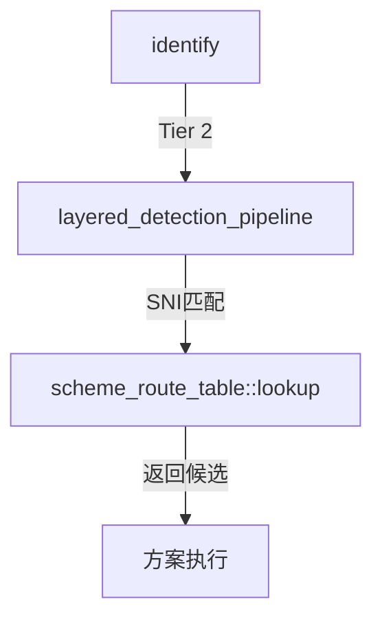

# scheme_route_table.hpp

SNI 路由表，根据 ClientHello SNI 快速路由到对应伪装方案。

## 源码位置

`I:/code/Prism/include/prism/recognition/scheme_route_table.hpp`

## 设计理念

从配置构建 SNI → 方案名称的映射表，启动时初始化，实现 O(log n) 查找。

支持多方案共享同一 SNI，返回多个候选方案。

## scheme_route_table

### build()

从配置构建路由表。

```cpp
static auto build(const psm::config &cfg) -> scheme_route_table;
```

遍历所有 stealth 方案的 `server_names` 配置，构建映射。

### lookup()

根据 SNI 查找匹配方案。

```cpp
[[nodiscard]] auto lookup(std::string_view sni) const
    -> memory::vector<memory::string>;
```

| 参数 | 类型 | 说明 |
|------|------|------|
| `sni` | `string_view` | ClientHello 中的 SNI |

**返回**：匹配的方案名称列表（通常只有一个）

### matches_any()

检查 SNI 是否匹配任意方案。

```cpp
[[nodiscard]] auto matches_any(std::string_view sni) const -> bool;
```

### all_registered_snis()

获取所有已注册的 SNI 列表（调试用）。

```cpp
[[nodiscard]] auto all_registered_snis() const
    -> memory::vector<memory::string>;
```

### empty()

检查路由表是否为空。

```cpp
[[nodiscard]] auto empty() const noexcept -> bool;
```

## 路由规则

| 方案 | 配置字段 | SNI 示例 |
|------|----------|----------|
| Reality | `server_names` | `"example.com"` |
| ShadowTLS | `server_names` | `"example.org"` |
| Restls | `server_names` | `"example.net"` |
| 未匹配 | - | 返回空列表 → fallback native |

## 多方案共享 SNI

同一 SNI 可配置在多个方案中：

```yaml
# 配置示例
reality:
  server_names: ["example.com"]

shadowtls:
  server_names: ["example.com"]  # 共享 SNI

# lookup("example.com") → ["reality", "shadowtls"]
```

执行时按优先级顺序尝试。

## 调用链



## 引用关系

### 依赖

- [[../config|psm::config]]：全局配置

### 被引用

- [[layered-pipeline]]：Tier 2 检测使用
- [[../recognition]]：识别入口引用