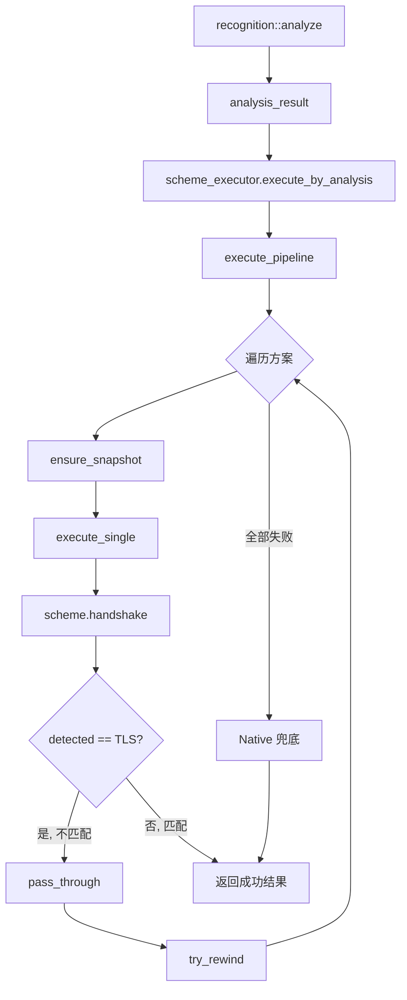

# executor 模块

## 源码位置

`I:/code/Prism/include/prism/stealth/executor.hpp`

## 模块职责

伪装方案执行器，根据分析结果依次尝试伪装方案，直到某个方案成功。每个方案执行后通过 `detected` 类型判断是否"是我"：返回 TLS 表示不匹配，继续下一个；返回具体协议表示匹配，终止执行。全部失败时返回错误。执行器从 `scheme_registry` 构建，不硬编码方案列表。

## 主要组件

### scheme_executor 类

伪装方案执行器，按候选方案列表依次尝试执行，支持分析驱动模式。

#### 构造函数

```cpp
explicit scheme_executor(const scheme_registry &registry);
```

从注册表构建执行器，获取所有已注册方案。

#### 公共方法

| 方法 | 返回类型 | 说明 |
|------|----------|------|
| `execute_by_analysis(analysis, ctx)` | `net::awaitable<handshake_result>` | 按分析结果驱动执行方案管道 |
| `execute(candidates, ctx)` | `net::awaitable<handshake_result>` | 按候选列表执行方案管道 |

#### execute_by_analysis 方法

```cpp
[[nodiscard]] auto execute_by_analysis(
    const recognition::analysis_result &analysis,
    handshake_context ctx) const
    -> net::awaitable<handshake_result>;
```

按分析结果驱动执行方案管道：
- 候选为空时按注册顺序执行
- 全部失败则执行 Native 兜底
- 每个方案返回 TLS 表示"不是我"，transport 和 preread 数据传递给下一个方案

#### execute 方法

```cpp
[[nodiscard]] auto execute(
    const memory::vector<memory::string> &candidates,
    handshake_context ctx) const
    -> net::awaitable<handshake_result>;
```

按候选列表执行方案管道。

#### 私有成员

| 成员 | 类型 | 说明 |
|------|------|------|
| `schemes_` | `std::vector<shared_scheme>` | 所有注册的方案列表 |

#### 私有方法

| 方法 | 说明 |
|------|------|
| `find_scheme(name)` | 按名称查找方案 |
| `execute_single(scheme, ctx)` | 执行单个方案 |
| `pass_through(ctx, res)` | 传递 transport 和 preread 到下一个方案 |
| `ensure_snapshot(ctx)` | 确保传输层有快照（用于重试） |
| `try_rewind(ctx)` | 尝试回滚传输层到快照 |
| `execute_pipeline(order, ctx)` | 执行方案管道 |

## 执行流程

```
execute_by_analysis(analysis, ctx)
           │
           ▼
    解析候选方案列表
           │
           ├── 候选列表非空 ──→ 按候选顺序执行
           │
           └── 候选列表为空 ──→ 按注册顺序执行
                    │
                    ▼
            execute_pipeline(order, ctx)
                    │
                    ▼
         ┌──────────────────────┐
         │  for each scheme:    │
         │                      │
         │  ensure_snapshot()   │ ← 保存传输层状态
         │         │            │
         │         ▼            │
         │  execute_single()    │
         │         │            │
         │         ▼            │
         │  ┌────────────────┐ │
         │  │ detected == TLS │ │
         │  └────────────────┘ │
         │      │       │       │
         │      │ 否    │ 是    │
         │      │       │       │
         │      │       ▼       │
         │      │  pass_through │ ← 传递给下一个
         │      │       │       │
         │      │  try_rewind() │ ← 回滚状态
         │      │       │       │
         │      │       ▼       │
         │      │  下一个方案   │
         │      │               │
         │      ▼               │
         │  返回成功结果         │
         └──────────────────────┘
                    │
                    ▼ (全部失败)
            Native 兜底执行
                    │
                    ▼
            handshake_result
```

## 状态传递机制

执行器在方案之间传递状态：

1. **快照保存**: 执行前通过 `ensure_snapshot()` 保存传输层状态
2. **方案执行**: 调用 `execute_single()` 执行方案
3. **结果判断**:
   - 返回非 TLS 协议 → 匹配成功，返回结果
   - 返回 TLS → 不匹配，继续下一个
4. **状态传递**: `pass_through()` 将 transport 和 preread 传递给下一个方案
5. **状态回滚**: `try_rewind()` 回滚到快照状态

## 调用链



## 设计要点

### 非硬编码方案列表

执行器从 `scheme_registry` 构建，而非硬编码方案列表。新增方案只需注册到 registry，无需修改执行器代码。

### 协程纯度

所有执行方法返回 `net::awaitable<handshake_result>`，使用协程实现异步操作。

### 状态保护

通过快照/回滚机制保护传输层状态，确保方案失败后可以尝试下一个方案。

### Native 兜底

全部方案失败时，自动执行 Native 方案作为兜底，确保连接不会因方案不匹配而中断。

## 故障模式

### rewind 不可逆限制

- `try_rewind()` 只在纯读取时有效
- 一旦方案向传输层写入数据（如 Reality 的 ServerHello），snapshot 的 `wrote_=true`，无法回退
- **Reality 不可逆点**：`async_write_scatter` 发送 ServerHello 后（Stage 3）
- **ShadowTLS 不可逆点**：转发 ClientHello 到后端后

### 确定性命中风险

- Tier 0 独占命中时只执行单个方案，无回退可能
- Reality 为 Tier 0 方案，命中后失败则直接返回错误

### 空壳方案

以下方案 `handshake()` 直接返回 `detected=tls`，不执行实际操作：
- Restls、AnyTLS、TrustTunnel
- ECH 解密完全未实现（`decrypt.cpp` 返回 `not_supported`）

用户配置了这些方案但实际上无效，流量最终走 native 兜底。

详见 [[dev/debugging/deep-dive/stealth-limitations|伪装方案执行器限制与故障分析]]

## 相关文档

- [[overview|Stealth 模块总览]]
- [[scheme|方案基类详解]]
- [[registry|注册表详解]]
- [[native|Native 方案]]
- [[../recognition/recognition|Recognition 模块]]