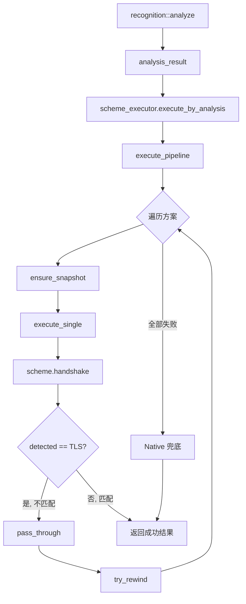

# executor 模块

## 源码位置

`I:/code/Prism/include/prism/stealth/executor.hpp`

## 模块职责

伪装方案执行器，根据分析结果依次尝试伪装方案，直到某个方案成功。每个方案执行后通过 `detected` 类型判断是否"是我"：返回 TLS 表示不匹配，继续下一个；返回具体协议表示匹配，终止执行。全部失败时返回错误。执行器从 `scheme_registry` 构建，不硬编码方案列表。

## 主要组件

### scheme_executor 类

伪装方案执行器，按候选方案列表依次尝试执行，支持分析驱动模式。

#### 构造函数

```cpp
explicit scheme_executor(const scheme_registry &registry);
```

从注册表构建执行器，获取所有已注册方案。

#### 公共方法

| 方法 | 返回类型 | 说明 |
|------|----------|------|
| `execute_by_analysis(analysis, ctx)` | `net::awaitable<handshake_result>` | 按分析结果驱动执行方案管道 |
| `execute(candidates, ctx)` | `net::awaitable<handshake_result>` | 按候选列表执行方案管道 |

#### execute_by_analysis 方法

```cpp
[[nodiscard]] auto execute_by_analysis(
    const recognition::analysis_result &analysis,
    handshake_context ctx) const
    -> net::awaitable<handshake_result>;
```

按分析结果驱动执行方案管道：
- 候选为空时按注册顺序执行
- 全部失败则执行 Native 兜底
- 每个方案返回 TLS 表示"不是我"，transport 和 preread 数据传递给下一个方案

#### execute 方法

```cpp
[[nodiscard]] auto execute(
    const memory::vector<memory::string> &candidates,
    handshake_context ctx) const
    -> net::awaitable<handshake_result>;
```

按候选列表执行方案管道。

#### 私有成员

| 成员 | 类型 | 说明 |
|------|------|------|
| `schemes_` | `std::vector<shared_scheme>` | 所有注册的方案列表 |

#### 私有方法

| 方法 | 说明 |
|------|------|
| `find_scheme(name)` | 按名称查找方案 |
| `execute_single(scheme, ctx)` | 执行单个方案 |
| `pass_through(ctx, res)` | 传递 transport 和 preread 到下一个方案 |
| `ensure_snapshot(ctx)` | 确保传输层有快照（用于重试） |
| `try_rewind(ctx)` | 尝试回滚传输层到快照 |
| `execute_pipeline(order, ctx)` | 执行方案管道 |

## 执行流程

```
execute_by_analysis(analysis, ctx)
           │
           ▼
    解析候选方案列表
           │
           ├── 候选列表非空 ──→ 按候选顺序执行
           │
           └── 候选列表为空 ──→ 按注册顺序执行
                    │
                    ▼
            execute_pipeline(order, ctx)
                    │
                    ▼
         ┌──────────────────────┐
         │  for each scheme:    │
         │                      │
         │  ensure_snapshot()   │ ← 保存传输层状态
         │         │            │
         │         ▼            │
         │  execute_single()    │
         │         │            │
         │         ▼            │
         │  ┌────────────────┐ │
         │  │ detected == TLS │ │
         │  └────────────────┘ │
         │      │       │       │
         │      │ 否    │ 是    │
         │      │       │       │
         │      │       ▼       │
         │      │  pass_through │ ← 传递给下一个
         │      │       │       │
         │      │  try_rewind() │ ← 回滚状态
         │      │       │       │
         │      │       ▼       │
         │      │  下一个方案   │
         │      │               │
         │      ▼               │
         │  返回成功结果         │
         └──────────────────────┘
                    │
                    ▼ (全部失败)
            Native 兜底执行
                    │
                    ▼
            handshake_result
```

## 状态传递机制

执行器在方案之间传递状态：

1. **快照保存**: 执行前通过 `ensure_snapshot()` 保存传输层状态
2. **方案执行**: 调用 `execute_single()` 执行方案
3. **结果判断**:
   - 返回非 TLS 协议 → 匹配成功，返回结果
   - 返回 TLS → 不匹配，继续下一个
4. **状态传递**: `pass_through()` 将 transport 和 preread 传递给下一个方案
5. **状态回滚**: `try_rewind()` 回滚到快照状态

## 调用链



## 设计决策（WHY）

### 为什么用 snapshot/rewind 而非重新建立连接

代理服务器处理的是已建立的 TCP 连接，无法"重新连接客户端"。当一个伪装方案尝试失败后，传输层中可能已经被方案读取了若干字节（如 TLS 握手数据）。`snapshot` 在执行前保存传输层的读取位置，`rewind` 将读取位置重置到快照点，让下一个方案能从头开始读取。

### 为什么 rewind 有 `clean`/`polluted` 两种模式

区分两种模式的原因是**数据已发送不可撤回**：

- **clean**：方案只读取了数据但未写入，`snapshot` 可以安全 rewind 到读取前状态。
- **polluted**：方案已经向客户端写入了数据（如发送了 ServerHello）。此时 rewind 到快照点会导致"服务端认为没发过数据，但客户端已经收到了数据"的状态不一致。因此 `try_rewind()` 对 `polluted` 模式直接返回 `false`。

这个 `polluted` 标记来自 `handshake_result.polluted`，方案在 `handshake()` 中执行任何 `async_write` 后必须自行设置此字段。

### 为什么执行器从 registry 而非硬编码构建

`register_schemes()` 在启动时注册所有方案到 `scheme_registry`，执行器构造时从 registry 获取方案列表的副本（`schemes_`）。这意味着：
- 新增方案只需修改 `register_schemes()`，无需改执行器
- 执行器实例可以独立于 registry 存在（构造后不依赖 registry 生命周期）
- `find_scheme()` 是线性查找而非 map，因为方案数量极少（<10）

### 为什么 `pass_through` 用 `preview` 包装 preread

`pass_through()` 将失败方案的 `transport` 和 `preread` 传递给下一个方案。`preread` 通过 `transport::preview` 包装而非直接传递，因为 `preview` 可以将预读数据与新 transport 的读取操作透明合并——下一个方案调用 `async_read_some()` 时，先读到的是 preread 中的数据，读完后才从底层 transport 读取新数据。

### 为什么 execute_pipeline 优先 rewind 而非 pass_through

当方案返回 `detected=tls`（不匹配）时，执行器先尝试 `try_rewind()`，失败才 `pass_through()`。这是因为 rewind 将传输层完全恢复到方案执行前状态，语义更干净。而 `pass_through` 传递的是方案修改后的 transport 和 preread，可能包含方案写入的中间状态数据。

## 约束

| 约束 | 来源 | 说明 |
|------|------|------|
| 方案执行顺序不可变 | `execute_pipeline` 按候选列表顺序 | 无法根据运行时条件重排 |
| `ensure_snapshot()` 只包装一次 | 检查 `as<snapshot>` 是否已存在 | 重复包装 snapshot 是无意义的嵌套 |
| rewind 只能恢复读取位置 | `snapshot` 机制限制 | 无法撤回已发送的 TCP 数据 |
| `execute_single` 复制 context | `handshake_context{ctx}` 拷贝构造 | 原始 ctx 不被方案修改，用于 rewind |
| Native 兜底只在无候选时触发 | `execute_by_analysis` 逻辑 | 有候选列表时，全部失败返回 `not_supported` 错误 |

## 失败场景

| 场景 | 触发条件 | 执行器行为 | 后果 |
|------|----------|-----------|------|
| rewind 成功 + 下一方案成功 | 方案只读取未写入 | `try_rewind()` → 下一个方案 | 正常，这是理想路径 |
| rewind 成功 + 下一方案也失败 | 多个方案均不匹配 | 继续遍历直到列表耗尽 | 返回 `not_supported` |
| rewind 失败（polluted） | 方案写入了数据 | 跳过 rewind，`pass_through` | 传递可能不完整的 transport |
| rewind 失败 + 无 pass_through 数据 | 方案返回空 transport | `ctx.inbound` 不变 | 继续用原始 transport |
| Tier 0 独占方案失败 | Reality `sniff` hit + `handshake()` 失败 | 管道中只有这一个候选 | 直接返回错误，无回退 |
| 候选列表为空 | 所有 Tier 检测未命中 | 按注册顺序全量执行 + Native 兜底 | 性能退化但不断连 |
| Native 兜底也失败 | TLS 证书错误等 | `execute_single(native)` 失败 | 连接中断 |
| `find_scheme` 返回 nullptr | 方案名拼写错误或未注册 | 跳过该方案，打印 warn 日志 | 静默跳过 |

## 跨模块契约

| 契约 | 方向 | 说明 |
|------|------|------|
| `recognition` → `executor` | 调用 | `analysis_result.candidates` 作为 `execute_by_analysis` 的输入 |
| `executor` → `scheme_registry` | 构造时依赖 | 构造时复制 registry 的方案列表，之后独立 |
| `executor` → `transport::snapshot` | 运行时依赖 | `ensure_snapshot` / `try_rewind` 依赖 snapshot 的 `can_rewind()`/`rewind()` |
| `executor` → `transport::preview` | 运行时依赖 | `pass_through` 用 preview 包装 preread 数据 |
| `executor` → `stealth_scheme` | 运行时调用 | 调用 `active()`、`handshake()` |
| `executor` → `fault::code` | 运行时使用 | 判断 `fault::failed()` 和设置 `not_supported` |
| `executor` → `trace` | 日志依赖 | 所有分支路径都有 debug/warn 日志 |

## 变更敏感性

| 变更 | 影响范围 | 风险 |
|------|----------|------|
| 修改 `rewind_mode` 枚举 | `try_rewind()` 逻辑 | 高：rewind 策略是执行器的核心 |
| 修改 `execute_pipeline` 的判断条件 | 所有方案的执行流程 | 高：`detected != tls` 的判断决定成功/失败 |
| 修改 `pass_through` 的 preview 包装逻辑 | 方案间状态传递 | 中：可能导致 preread 数据丢失 |
| 修改 `execute_by_analysis` 的 Native 兜底触发条件 | 兜底行为 | 中：错误条件下可能跳过兜底 |
| `snapshot` 接口变更 | `ensure_snapshot`/`try_rewind` | 高：执行器的回滚机制依赖 snapshot |

## 设计要点

### 非硬编码方案列表

执行器从 `scheme_registry` 构建，而非硬编码方案列表。新增方案只需注册到 registry，无需修改执行器代码。

### 协程纯度

所有执行方法返回 `net::awaitable<handshake_result>`，使用协程实现异步操作。

### 状态保护

通过快照/回滚机制保护传输层状态，确保方案失败后可以尝试下一个方案。

### Native 兜底

全部方案失败时，自动执行 Native 方案作为兜底，确保连接不会因方案不匹配而中断。

## 故障模式

### rewind 不可逆限制

- `try_rewind()` 只在纯读取时有效
- 一旦方案向传输层写入数据（如 Reality 的 ServerHello），snapshot 的 `wrote_=true`，无法回退
- **Reality 不可逆点**：`async_write_scatter` 发送 ServerHello 后（Stage 3）
- **ShadowTLS 不可逆点**：转发 ClientHello 到后端后

### 确定性命中风险

- Tier 0 独占命中时只执行单个方案，无回退可能
- Reality 为 Tier 0 方案，命中后失败则直接返回错误

### 空壳方案

以下方案 `handshake()` 直接返回 `detected=tls`，不执行实际操作：
- Restls、AnyTLS、TrustTunnel
- ECH 解密完全未实现（`decrypt.cpp` 返回 `not_supported`）

用户配置了这些方案但实际上无效，流量最终走 native 兜底。

详见 [[dev/debugging/deep-dive/stealth-limitations|伪装方案执行器限制与故障分析]]

## 相关文档

- [[overview|Stealth 模块总览]]
- [[scheme|方案基类详解]]
- [[registry|注册表详解]]
- [[native|Native 方案]]
- [[core/recognition/recognition|Recognition 模块]]