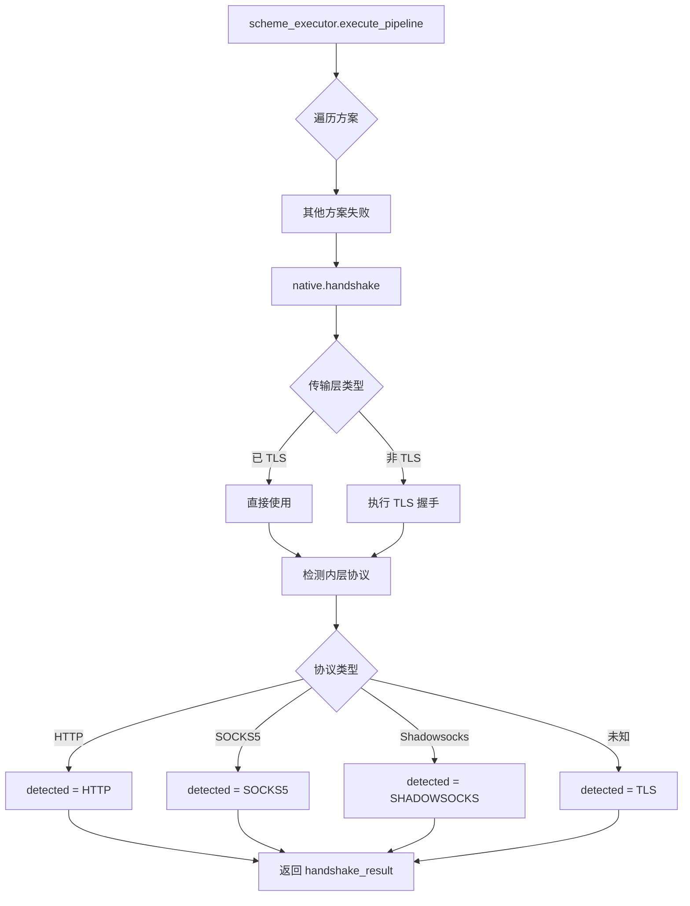

# native 模块

## 源码位置

`include/prism/stealth/native.hpp`

## 模块职责

原生 TLS 伪装方案（兜底），封装标准 TLS 握手和内层协议检测。继承 `stealth_scheme` 基类，作为 Tier 2 方案处理无法匹配其他方案的 TLS 连接。

## 主要组件

### native 类

原生 TLS 方案，作为所有伪装方案的兜底。

#### 基本信息

| 方法 | 返回值 | 说明 |
|------|--------|------|
| `name()` | `"native"` | 方案名称 |
| `tier()` | `2` | Tier 2 方案 |
| `unique()` | `false` | 无独占特征 |

#### 配置检查

```cpp
[[nodiscard]] auto active(const psm::config &cfg) const noexcept
    -> bool override;
```

判断 Native 方案是否启用。Native 方案通常始终启用，作为兜底方案。

#### Tier 2 模糊检测

```cpp
[[nodiscard]] auto guess(const psm::config &cfg) const
    -> verify_result override;
```

Native 作为 Tier 2 方案，只支持模糊匹配。返回权重分（默认 50），较低优先级确保在其他方案之后执行。

#### 执行方法

```cpp
[[nodiscard]] auto handshake(stealth::handshake_context ctx)
    -> net::awaitable<stealth::handshake_result> override;
```

执行标准 TLS 握手和内层协议检测：
1. 如果传输层已经是 TLS，直接使用
2. 否则执行 TLS 握手
3. 握手完成后检测内层协议
4. 返回 `handshake_result`

#### 权重

```cpp
[[nodiscard]] auto weight() const noexcept
    -> std::uint16_t override { return 50; }
```

返回权重 50，低于大多数其他方案（默认 100），确保作为兜底。

## 设计决策（WHY）

### 为什么 weight=50 而非更低或更高

`weight()` 返回 50，低于所有其他 Tier 2 方案的默认值 100。这意味着在模糊匹配阶段，Native 的评分最低，排在所有其他 Tier 2 方案之后。但不能设为 0——因为 `guess()` 的默认实现直接返回 `weight()` 作为 `score`，score=0 意味着"完全不匹配"，可能导致执行器跳过 Native。

50 这个值给了一个明确的语义："我可能是，但其他方案更可能是"。

### 为什么 Native 始终 active

`active()` 返回 true 不依赖任何配置。因为 Native 是兜底方案——如果所有伪装方案都失败或未配置，Native 必须可用以处理标准 TLS 连接。如果 Native 也被禁用，未匹配的 TLS 连接会被直接断开。

### 为什么 Native 不实现 sniff/verify

Native 处理的是"标准 TLS 流量"，没有特殊的 ClientHello 特征。标准 TLS 的 ClientHello 形态千变万化（不同浏览器、不同 TLS 库），不存在可靠的字节级或 HMAC 特征。Native 的定位就是"什么都不匹配时的最后选择"。

### 为什么 Native 能检测内层协议

`handshake()` 在完成 TLS 握手后，需要判断 TLS 隧道内部的协议类型（HTTP、SOCKS5、Shadowsocks 等）。这通过读取 TLS 应用数据的前几个字节并匹配协议特征实现（类似 recognition 的 probe 阶段，但在 TLS 层内部）。

## 约束

| 约束 | 来源 | 说明 |
|------|------|------|
| 必须最后注册 | 隐式协议 | 注册顺序 = 无候选时的执行顺序 |
| `active()` 始终返回 true | 兜底职责 | 不依赖配置 |
| `handshake()` 可能返回 `detected=TLS` | 无法识别内层时 | 表示是原始 TLS 流量，无代理协议 |
| 无 `sniff()`/`verify()` 重写 | 基类默认空实现 | 永远不会在 Tier 0/1 被选中 |

## 失败场景

| 场景 | 触发条件 | 表现 | 后果 |
|------|----------|------|------|
| TLS 证书错误 | 配置的证书无效或过期 | TLS 握手失败 | 连接中断，无更多回退 |
| 内层协议检测失败 | 客户端发送的数据不匹配任何协议 | `detected=TLS` | 后续处理可能作为原始 TLS 流量 |
| TLS 握手超时 | 客户端未完成握手 | 超时错误 | 连接被关闭 |
| Native 作为非兜底方案执行 | 候选列表包含 "native" | 正常执行但跳过了伪装方案 | 功能正确但可能不符合用户意图 |

## 跨模块契约

| 契约 | 方向 | 说明 |
|------|------|------|
| `scheme_executor` → `native` | 调用 | 执行器在所有方案失败后执行 Native 兜底 |
| `native` → `transport::encrypted` | 依赖 | `handshake()` 需要执行 TLS 握手 |
| `native` → `protocol` | 依赖 | 返回 `protocol::protocol_type` 标识内层协议 |
| `native` → `psm::config` | 依赖 | 读取 TLS 证书和私钥配置 |

## 变更敏感性

| 变更 | 影响范围 | 风险 |
|------|----------|------|
| 修改 `weight()` 值 | Native 在 Tier 2 中的排序 | 中：过高会抢占其他方案 |
| 修改 `active()` 为配置依赖 | 兜底机制 | 高：可能导致无方案可用 |
| 修改 `handshake()` 的协议检测逻辑 | 内层协议识别准确性 | 高：错误识别导致协议处理器不匹配 |

## 方案特点

| 特性 | 值 | 说明 |
|------|-----|------|
| Tier | 2 | 最低优先级 |
| 独占 | 否 | 不阻止其他方案 |
| 权重 | 50 | 低优先级，作为兜底 |
| 检测 | guess | 仅支持模糊匹配 |

## 执行流程

```
native::handshake(ctx)
           │
           ▼
    检查传输层类型
           │
           ├── 已是 TLS ──→ 直接使用
           │
           └── 非 TLS ──→ 执行 TLS 握手
                    │
                    ▼
            TLS 握手完成
                    │
                    ▼
            检测内层协议
                    │
                    ├── HTTP ──→ detected = HTTP
                    ├── SOCKS5 ──→ detected = SOCKS5
                    ├── Shadowsocks ──→ detected = SHADOWSOCKS
                    │
                    └── 无法识别 ──→ detected = TLS (原始 TLS)
                    │
                    ▼
            返回 handshake_result
```

## 调用链



## 兜底机制

Native 方案作为兜底，确保连接不会因方案不匹配而中断：

1. **最低优先级**: Tier 2 + 低权重确保最后执行
2. **始终启用**: 作为基础方案始终可用
3. **广泛支持**: 标准 TLS 处理所有常规 TLS 连接
4. **协议检测**: 握手后检测内层协议，支持 HTTP/SOCKS5 等

## 设计要点

### 无独占特征

Native 方案无 ClientHello 独占特征，不实现 `sniff()` 和 `verify()`，仅依赖 `guess()`。

### 低优先级

权重 50 确保在其他 Tier 2 方案（默认 100）之后执行。

### 协议检测

握手完成后检测内层协议，支持多种协议类型：
- HTTP/HTTPS
- SOCKS5
- Shadowsocks
- 原始 TLS

### 异步执行

`handshake()` 返回协程类型 `net::awaitable<handshake_result>`，支持异步 TLS 握手。

## 相关文档

- [[overview|Stealth 模块总览]]
- [[scheme|方案基类详解]]
- [[executor|执行器详解]]
- [[registry|注册表详解]]
- [[core/protocol/tls/types|TLS 类型定义]]