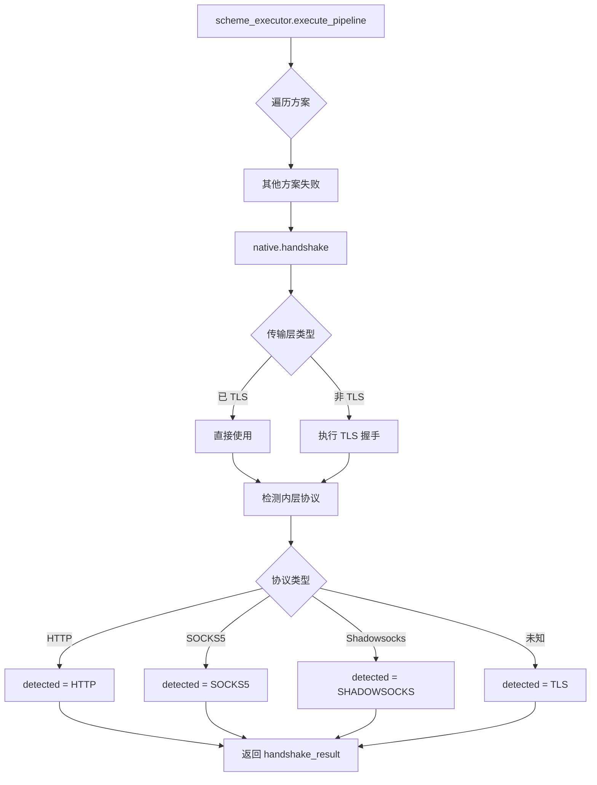

# native 模块

## 源码位置

`I:/code/Prism/include/prism/stealth/native.hpp`

## 模块职责

原生 TLS 伪装方案（兜底），封装标准 TLS 握手和内层协议检测。继承 `stealth_scheme` 基类，作为 Tier 2 方案处理无法匹配其他方案的 TLS 连接。

## 主要组件

### native 类

原生 TLS 方案，作为所有伪装方案的兜底。

#### 基本信息

| 方法 | 返回值 | 说明 |
|------|--------|------|
| `name()` | `"native"` | 方案名称 |
| `tier()` | `2` | Tier 2 方案 |
| `unique()` | `false` | 无独占特征 |

#### 配置检查

```cpp
[[nodiscard]] auto active(const psm::config &cfg) const noexcept
    -> bool override;
```

判断 Native 方案是否启用。Native 方案通常始终启用，作为兜底方案。

#### Tier 2 模糊检测

```cpp
[[nodiscard]] auto guess(const psm::config &cfg) const
    -> verify_result override;
```

Native 作为 Tier 2 方案，只支持模糊匹配。返回权重分（默认 50），较低优先级确保在其他方案之后执行。

#### 执行方法

```cpp
[[nodiscard]] auto handshake(stealth::handshake_context ctx)
    -> net::awaitable<stealth::handshake_result> override;
```

执行标准 TLS 握手和内层协议检测：
1. 如果传输层已经是 TLS，直接使用
2. 否则执行 TLS 握手
3. 握手完成后检测内层协议
4. 返回 `handshake_result`

#### 权重

```cpp
[[nodiscard]] auto weight() const noexcept
    -> std::uint16_t override { return 50; }
```

返回权重 50，低于大多数其他方案（默认 100），确保作为兜底。

## 方案特点

| 特性 | 值 | 说明 |
|------|-----|------|
| Tier | 2 | 最低优先级 |
| 独占 | 否 | 不阻止其他方案 |
| 权重 | 50 | 低优先级，作为兜底 |
| 检测 | guess | 仅支持模糊匹配 |

## 执行流程

```
native::handshake(ctx)
           │
           ▼
    检查传输层类型
           │
           ├── 已是 TLS ──→ 直接使用
           │
           └── 非 TLS ──→ 执行 TLS 握手
                    │
                    ▼
            TLS 握手完成
                    │
                    ▼
            检测内层协议
                    │
                    ├── HTTP ──→ detected = HTTP
                    ├── SOCKS5 ──→ detected = SOCKS5
                    ├── Shadowsocks ──→ detected = SHADOWSOCKS
                    │
                    └── 无法识别 ──→ detected = TLS (原始 TLS)
                    │
                    ▼
            返回 handshake_result
```

## 调用链



## 兜底机制

Native 方案作为兜底，确保连接不会因方案不匹配而中断：

1. **最低优先级**: Tier 2 + 低权重确保最后执行
2. **始终启用**: 作为基础方案始终可用
3. **广泛支持**: 标准 TLS 处理所有常规 TLS 连接
4. **协议检测**: 握手后检测内层协议，支持 HTTP/SOCKS5 等

## 设计要点

### 无独占特征

Native 方案无 ClientHello 独占特征，不实现 `sniff()` 和 `verify()`，仅依赖 `guess()`。

### 低优先级

权重 50 确保在其他 Tier 2 方案（默认 100）之后执行。

### 协议检测

握手完成后检测内层协议，支持多种协议类型：
- HTTP/HTTPS
- SOCKS5
- Shadowsocks
- 原始 TLS

### 异步执行

`handshake()` 返回协程类型 `net::awaitable<handshake_result>`，支持异步 TLS 握手。

## 相关文档

- [[overview|Stealth 模块总览]]
- [[scheme|方案基类详解]]
- [[executor|执行器详解]]
- [[registry|注册表详解]]
- [[../protocol/tls/types|TLS 类型定义]]