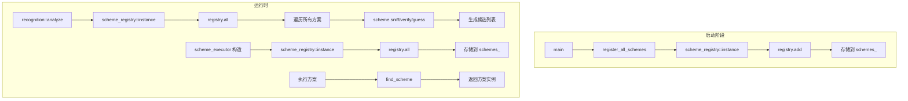

# registry 模块

## 源码位置

`I:/code/Prism/include/prism/stealth/registry.hpp`

## 模块职责

伪装方案注册表（单例模式），管理所有 `stealth_scheme` 的注册和查询。启动阶段通过 `register_all_schemes()` 手动注册所有方案，运行时只读，无需同步。

## 主要组件

### scheme_registry 类

伪装方案注册表，单例模式，管理所有伪装方案的注册和查询。

#### 单例访问

```cpp
static auto instance() -> scheme_registry &;
```

获取全局单例引用。

#### 注册方法

```cpp
auto add(shared_scheme scheme) -> void;
```

注册方案实例。应在启动阶段调用，运行时不再修改。

#### 查询方法

| 方法 | 返回类型 | 说明 |
|------|----------|------|
| `all()` | `const std::vector<shared_scheme>&` | 获取所有已注册方案（按注册顺序 = 默认优先级） |
| `find(name)` | `shared_scheme` | 按名称查找方案，未找到返回 nullptr |

### 全局注册函数

```cpp
auto register_all_schemes() -> void;
```

注册所有伪装方案。在 `main()` 或启动阶段调用，注册 reality/shadowtls/restls/native 等。新增方案只需在此函数中添加一行。

## 使用流程

```
启动阶段:
    │
    ├── register_all_schemes()
    │       │
    │       ├── registry.add(reality_scheme)
    │       ├── registry.add(shadowtls_scheme)
    │       ├── registry.add(anytls_scheme)
    │       ├── registry.add(restls_scheme)
    │       ├── registry.add(trusttunnel_scheme)
    │       └── registry.add(native_scheme)
    │
    ▼
运行时:
    │
    ├── recognition 模块调用
    │       │
    │       ├── scheme_registry::instance().all()
    │       │       └── 获取所有方案
    │       │
    │       └── 对每个方案调用 detect()
    │               └── 生成候选列表
    │
    └── scheme_executor 构建
            │
            └── 从 registry 获取方案执行
```

## 内部结构

```cpp
class scheme_registry
{
public:
    static auto instance() -> scheme_registry &;
    auto add(shared_scheme scheme) -> void;
    [[nodiscard]] auto all() const -> const std::vector<shared_scheme> &;
    [[nodiscard]] auto find(std::string_view name) const -> shared_scheme;

private:
    std::vector<shared_scheme> schemes_;  // 按注册顺序存储
};
```

## 注册顺序

方案按注册顺序存储，注册顺序即为默认优先级：

| 注册顺序 | 方案 | Tier | 说明 |
|----------|------|------|------|
| 1 | Reality | 0 | 最高优先级，独占特征检测 |
| 2 | ShadowTLS | 1 | HMAC 验证 |
| 3 | AnyTLS | 1 | ECH 解密 |
| 4 | Restls | 2 | 模糊匹配 |
| 5 | TrustTunnel | 2 | 模糊匹配 |
| 6 | Native | 2 | 兜底方案 |

## 调用链



## 设计决策（WHY）

### 为什么是单例而非依赖注入

`scheme_registry` 使用 Meyer's 单例（`static auto instance() -> scheme_registry &`），原因是：
1. 方案注册发生在 `main()` 启动阶段，此时 IoC 容器尚未就绪
2. `scheme_executor` 和 `recognition` 模块在不同层级都需要访问方案列表，单例避免了在多层构造函数中传递 registry 引用
3. 运行时只读，不存在单例常见的并发修改问题

### 为什么运行时只读

`register_schemes()` 在启动阶段一次性注册，之后 `all()` 和 `find()` 只做读取。这个约束带来了关键好处：
- **无锁**：`std::vector<shared_scheme>` 不需要 `mutex` 保护，`all()` 返回引用无拷贝开销
- **缓存友好**：`vector` 连续存储，遍历方案时内存局部性好
- **生命周期安全**：`shared_ptr` 保证方案对象不被提前销毁

如果运行时需要动态注册/注销方案，就需要引入 `shared_mutex` 或 `RWMutex`，增加复杂度且对热路径有性能影响。

### 为什么用 `std::vector` 而非 `std::unordered_map`

`find()` 是线性查找（O(n)），看起来不如 map 的 O(1)。但方案总数 < 10，线性查找的 cache-friendly 特性反而更快。同时 `all()` 返回引用，`vector` 的连续内存保证了遍历性能。

### 为什么注册顺序有意义

`register_schemes()` 的注册顺序直接等于无候选列表时的执行优先级（见 `execute_by_analysis` 的默认路径）。如果 Reality 不是第一个注册，Tier 0 的零成本检测优势就丧失了。因此注册顺序是一个隐式协议。

## 约束

| 约束 | 来源 | 说明 |
|------|------|------|
| 注册必须在所有 worker 线程启动前完成 | 启动流程顺序 | 否则 worker 线程可能读到不完整的方案列表 |
| `register_schemes()` 只能调用一次 | 启动逻辑 | 重复注册会导致方案重复，检测行为异常 |
| `add()` 非线程安全 | 无锁设计 | 仅在单线程启动阶段调用 |
| `shared_scheme`（`shared_ptr`）引用计数开销 | 智能指针 | 方案数量极少，开销可忽略 |

## 失败场景

| 场景 | 触发条件 | 表现 |
|------|----------|------|
| 方案未注册 | `register_schemes()` 遗漏 | `find()` 返回 nullptr，执行器跳过该方案 |
| 重复注册 | `add()` 同一方案两次 | `all()` 返回重复方案，执行器会执行两次 |
| 注册后修改方案状态 | 方案对象非 const | 理论上可能，但所有现有方案都是无状态的 |
| `instance()` 在 `main()` 之前调用 | 静态初始化顺序问题 | Meyer's 单例保证首次访问时初始化，安全 |

## 跨模块契约

| 契约 | 方向 | 说明 |
|------|------|------|
| `main()` → `register_schemes()` | 调用 | 启动时注册所有方案 |
| `scheme_executor` → `scheme_registry` | 构造时 | 构造函数接收 registry 引用，复制方案列表 |
| `recognition` → `scheme_registry` | 运行时 | 调用 `all()` 遍历方案进行检测 |
| `scheme_registry` → `stealth_scheme` | 持有 | `shared_ptr` 持有方案实例 |

## 变更敏感性

| 变更 | 影响范围 | 风险 |
|------|----------|------|
| 修改 `register_schemes()` 注册顺序 | 无候选时的 fallback 顺序 | 中：可能导致错误的方案优先级 |
| 新增方案但未注册 | 新方案不可用 | 低：`find()` 返回 nullptr 被静默跳过 |
| 修改 `add()` 为线程安全 | 启动流程可延迟注册 | 中：需要引入锁，影响 `all()` 的无锁保证 |
| 修改容器为 `unordered_map` | `all()` 返回类型变更 | 高：执行器依赖 vector 的顺序性 |

## 设计要点

### 单例模式

全局唯一实例，避免多处重复注册。

### 启动时注册

所有方案在启动阶段一次性注册，运行时只读，避免线程同步开销。

### 注册顺序即优先级

方案按注册顺序存储，确保检测顺序可预测。

### 无锁设计

运行时只读访问，无需同步机制，性能最优。

## 相关文档

- [[overview|Stealth 模块总览]]
- [[scheme|方案基类详解]]
- [[executor|执行器详解]]
- [[native|Native 方案]]
- [[core/startup|启动流程详解]]