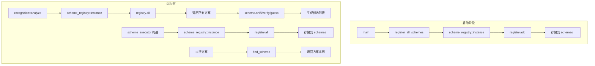

# registry 模块

## 源码位置

`I:/code/Prism/include/prism/stealth/registry.hpp`

## 模块职责

伪装方案注册表（单例模式），管理所有 `stealth_scheme` 的注册和查询。启动阶段通过 `register_all_schemes()` 手动注册所有方案，运行时只读，无需同步。

## 主要组件

### scheme_registry 类

伪装方案注册表，单例模式，管理所有伪装方案的注册和查询。

#### 单例访问

```cpp
static auto instance() -> scheme_registry &;
```

获取全局单例引用。

#### 注册方法

```cpp
auto add(shared_scheme scheme) -> void;
```

注册方案实例。应在启动阶段调用，运行时不再修改。

#### 查询方法

| 方法 | 返回类型 | 说明 |
|------|----------|------|
| `all()` | `const std::vector<shared_scheme>&` | 获取所有已注册方案（按注册顺序 = 默认优先级） |
| `find(name)` | `shared_scheme` | 按名称查找方案，未找到返回 nullptr |

### 全局注册函数

```cpp
auto register_all_schemes() -> void;
```

注册所有伪装方案。在 `main()` 或启动阶段调用，注册 reality/shadowtls/restls/native 等。新增方案只需在此函数中添加一行。

## 使用流程

```
启动阶段:
    │
    ├── register_all_schemes()
    │       │
    │       ├── registry.add(reality_scheme)
    │       ├── registry.add(shadowtls_scheme)
    │       ├── registry.add(anytls_scheme)
    │       ├── registry.add(restls_scheme)
    │       ├── registry.add(trusttunnel_scheme)
    │       └── registry.add(native_scheme)
    │
    ▼
运行时:
    │
    ├── recognition 模块调用
    │       │
    │       ├── scheme_registry::instance().all()
    │       │       └── 获取所有方案
    │       │
    │       └── 对每个方案调用 detect()
    │               └── 生成候选列表
    │
    └── scheme_executor 构建
            │
            └── 从 registry 获取方案执行
```

## 内部结构

```cpp
class scheme_registry
{
public:
    static auto instance() -> scheme_registry &;
    auto add(shared_scheme scheme) -> void;
    [[nodiscard]] auto all() const -> const std::vector<shared_scheme> &;
    [[nodiscard]] auto find(std::string_view name) const -> shared_scheme;

private:
    std::vector<shared_scheme> schemes_;  // 按注册顺序存储
};
```

## 注册顺序

方案按注册顺序存储，注册顺序即为默认优先级：

| 注册顺序 | 方案 | Tier | 说明 |
|----------|------|------|------|
| 1 | Reality | 0 | 最高优先级，独占特征检测 |
| 2 | ShadowTLS | 1 | HMAC 验证 |
| 3 | AnyTLS | 1 | ECH 解密 |
| 4 | Restls | 2 | 模糊匹配 |
| 5 | TrustTunnel | 2 | 模糊匹配 |
| 6 | Native | 2 | 兜底方案 |

## 调用链



## 设计要点

### 单例模式

全局唯一实例，避免多处重复注册。

### 启动时注册

所有方案在启动阶段一次性注册，运行时只读，避免线程同步开销。

### 注册顺序即优先级

方案按注册顺序存储，确保检测顺序可预测。

### 无锁设计

运行时只读访问，无需同步机制，性能最优。

## 相关文档

- [[overview|Stealth 模块总览]]
- [[scheme|方案基类详解]]
- [[executor|执行器详解]]
- [[native|Native 方案]]
- [[../core/startup|启动流程详解]]