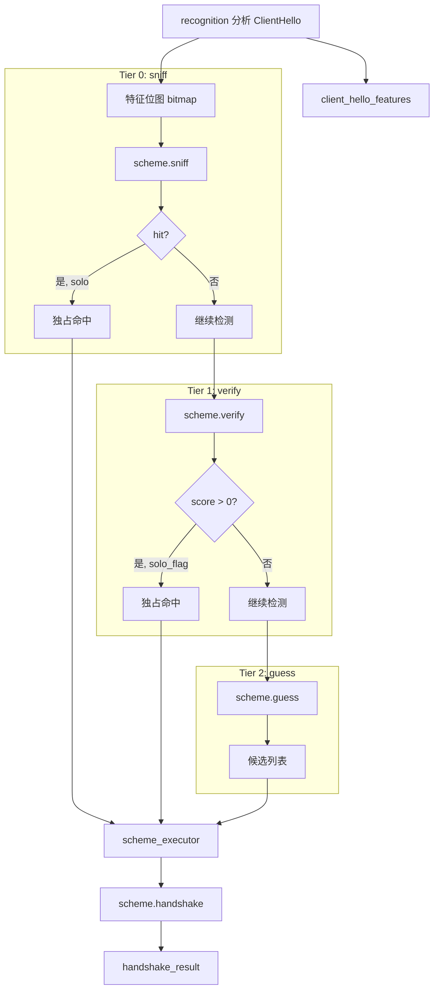

# scheme 模块

## 源码位置

`include/prism/stealth/scheme.hpp`

## 模块职责

定义 `stealth_scheme` 抽象基类，作为所有 TLS 伪装方案的统一接口。每个方案代表一种传输层伪装方式（如 Reality、ShadowTLS、Native TLS）。通过 `handshake()` 接口完成握手和协议检测，获得最终传输层和检测到的协议类型。

## 主要组件

### sniff_result 结构体

Tier 0 快速检测结果，零成本字节比较。

| 成员 | 类型 | 说明 |
|------|------|------|
| `hit` | `bool` | 是否命中此方案 |
| `solo` | `bool` | 是否独占命中（命中后不再检测其他方案） |
| `hint` | `std::uint16_t` | 评分提示（供 Tier 2 参考，范围 0-1000） |
| `note` | `memory::string` | 检测原因（用于日志和调试） |

### verify_result 结构体

Tier 1/2 详细检测结果，评分制支持优先级排序。

| 成员 | 类型 | 说明 |
|------|------|------|
| `score` | `std::uint16_t` | 评分（0-1000，越高越确定） |
| `solo_flag` | `std::uint16_t` | 独占标记（非零表示独占，跳过其他方案） |
| `note` | `memory::string` | 检测原因（用于日志和调试） |

### handshake_result 结构体

伪装方案执行结果，包含执行后的传输层、检测到的内层协议和预读数据。

| 成员 | 类型 | 说明 |
|------|------|------|
| `transport` | `shared_transmission` | 最终传输层 |
| `detected` | `protocol::protocol_type` | 检测到的内层协议 |
| `preread` | `memory::vector<std::byte>` | 内层预读数据 |
| `error` | `fault::code` | 错误码 |
| `scheme` | `memory::string` | 成功执行的方案名 |

### handshake_context 结构体

伪装方案执行上下文，封装 `handshake()` 所需的所有参数。

| 成员 | 类型 | 说明 |
|------|------|------|
| `inbound` | `shared_transmission` | 当前传输层（应包含预读数据） |
| `cfg` | `const psm::config*` | 服务器配置 |
| `router` | `resolve::router*` | 路由器（fallback 用） |
| `session` | `agent::session_context*` | 会话上下文 |
| `preread` | `memory::vector<std::byte>` | 来自 identify 的 preread 数据（完整 ClientHello） |

### stealth_scheme 抽象基类

传输层伪装方案抽象基类，支持分层检测。

#### 基本信息方法

| 方法 | 返回类型 | 说明 |
|------|----------|------|
| `name()` | `std::string_view` | 方案名称（用于日志） |
| `tier()` | `std::uint8_t` | 检测层级（0-2），默认 Tier 2 |
| `unique()` | `bool` | 是否有独占特征，默认 false |

#### 配置方法

| 方法 | 返回类型 | 说明 |
|------|----------|------|
| `active(cfg)` | `bool` | 判断此方案是否在当前配置下启用 |
| `snis(cfg)` | `memory::vector<memory::string>` | 获取 SNI 白名单，默认空 |

#### Tier 0: 快速检测

```cpp
[[nodiscard]] virtual auto sniff(
    std::uint32_t bitmap,
    const protocol::tls::client_hello_features &features) const
    -> sniff_result;
```

零成本字节比较，不涉及 HMAC 或解密。例如 Reality 检查 `session_id[0:3] == [0x01, 0x08, 0x02]`。默认返回 `{.hit = false, .solo = false, .hint = 0, .note = "no sniff"}`。

#### Tier 1: 详细检测

```cpp
[[nodiscard]] virtual auto verify(
    const protocol::tls::client_hello_features &features,
    std::span<const std::byte> raw,
    const psm::config &cfg) const
    -> verify_result;
```

涉及 HMAC 验证或解密，延迟执行。例如 ShadowTLS HMAC 验证、AnyTLS ECH 解密。默认返回 `{.score = 0, .solo_flag = 0, .note = "no verify"}`。

#### Tier 2: 模糊检测

```cpp
[[nodiscard]] virtual auto guess(const psm::config &cfg) const
    -> verify_result;
```

无 ClientHello 独占特征，依赖 SNI 匹配。例如 Restls、TrustTunnel、Native。默认返回 `{.score = weight(), .solo_flag = 0, .note = "guess"}`。

#### 执行方法

```cpp
[[nodiscard]] virtual auto handshake(handshake_context ctx)
    -> net::awaitable<handshake_result> = 0;
```

执行握手，返回处理结果。纯虚函数，子类必须实现。

#### 保护方法

| 方法 | 返回类型 | 说明 |
|------|----------|------|
| `weight()` | `std::uint16_t` | 权重分（Tier 2 使用），默认 100 |

### 类型别名

```cpp
using shared_scheme = std::shared_ptr<stealth_scheme>;
```

方案共享指针类型。

## 设计决策（WHY）

### 为什么检测是三个独立方法而非一个

`sniff()` / `verify()` / `guess()` 三个方法对应三种截然不同的成本和确定性。合并为一个方法会导致：

1. **性能退化**：Tier 2 方案（Restls/TrustTunnel）不需要 HMAC 计算，合并后必须为每个方案执行有成本的验证。
2. **独占逻辑丢失**：`sniff_result.solo` 和 `verify_result.solo_flag` 允许 Tier 0/1 方案独占命中后立即终止检测管道。单一方法无法表达"我可以跳过所有后续检测"的语义。
3. **延迟执行的必要性**：`verify()` 接收原始 ClientHello 字节和配置，这些数据在 `sniff()` 阶段可能不需要加载。分层让执行器可以选择性准备参数。

### 为什么 `guess()` 不接收 ClientHello 参数

`guess()` 的签名是 `guess(const psm::config &cfg)`，不接收 `features` 或 `raw`。这是有意为之——Tier 2 方案的定义就是"无法从 ClientHello 确定身份"。如果需要 ClientHello 特征来检测，它应该是 Tier 0 或 Tier 1。

### 为什么 `handshake_result` 包含 `polluted` 字段

`polluted` 标记方案是否已向传输层写入了数据。这直接影响执行器的 rewind 策略：一旦写入，`snapshot` 无法回退到写入前状态。方案在 `handshake()` 中一旦执行了 `async_write` 类操作，就必须在返回的 `handshake_result` 中设置 `polluted=true`。

### 为什么 `handshake_context` 用指针而非引用

`cfg`、`router`、`session` 都是指针（可为 `nullptr`），因为某些场景下部分参数不可用。例如 Native 兜底执行时可能没有 `router`，测试场景可能没有 `session`。引用要求调用方必须提供所有参数，增加不必要的耦合。

## 约束

| 约束 | 来源 | 说明 |
|------|------|------|
| `handshake()` 是纯虚函数 | 基类定义 | 所有方案必须实现，无默认行为 |
| `sniff()`/`verify()`/`guess()` 有默认空实现 | 基类定义 | 方案只需重写自己需要的层级 |
| `tier()` 返回 0-2 | 接口约定 | 超出范围的值无意义 |
| `score` 范围 0-1000 | 接口约定 | 执行器按此排序候选 |
| `weight()` 默认 100 | 基类默认值 | Native 重写为 50 以降低优先级 |
| `name()` 返回 `string_view` | 非拥有引用 | 方案名必须是静态字符串或方案对象生命周期内的稳定引用 |

## 失败场景

| 场景 | 触发条件 | 表现 |
|------|----------|------|
| 方案未重写任何检测方法 | 默认实现全部返回空 | 方案永远不会被识别，只能通过 execute 全量遍历 |
| `handshake()` 返回 `error != success` | 方案内部错误 | 执行器检查 `fault::failed()` 决定是否继续 |
| `handshake()` 返回 `detected=tls` 且 `polluted=true` | 方案发送了数据但未能识别协议 | 执行器无法 rewind，管道终止 |
| `snis()` 返回空列表 | 方案未配置 SNI | Tier 2 检测跳过此方案 |

## 跨模块契约

| 契约 | 方向 | 说明 |
|------|------|------|
| `recognition` → `stealth_scheme` | 调用 | recognition 调用 `sniff()`/`verify()`/`guess()` 生成候选列表 |
| `scheme_executor` → `stealth_scheme` | 调用 | 执行器调用 `handshake()` 执行方案 |
| `stealth_scheme` → `protocol::protocol_type` | 依赖 | `handshake_result.detected` 必须是有效的协议类型 |
| `stealth_scheme` → `transport::transmission` | 依赖 | `handshake_result.transport` 必须是可用的传输层 |
| `stealth_scheme` → `fault::code` | 依赖 | 错误通过 `fault::code` 传递，不抛异常 |
| `stealth_scheme` → `psm::config` | 依赖 | `active()`/`snis()`/`verify()` 都依赖配置格式 |

## 变更敏感性

| 变更 | 影响范围 | 风险 |
|------|----------|------|
| 修改 `sniff_result` 字段 | 所有 Tier 0 方案 + 执行器 | 高 |
| 修改 `verify_result` 字段 | 所有 Tier 1/2 方案 + 执行器 | 高 |
| 修改 `handshake_context` 字段 | 所有方案的 `handshake()` 签名 | 高 |
| 修改 `weight()` 默认值 | 所有未重写的 Tier 2 方案 | 中 |
| 修改 `guess()` 默认实现 | 所有未重写 `guess()` 的方案 | 中 |

## 分层检测策略

| Tier | 方法 | 成本 | 独占性 | 典型方案 |
|------|------|------|--------|----------|
| 0 | `sniff()` | 零成本字节比较 | 可独占跳过其他 | Reality |
| 1 | `verify()` | HMAC/解密 | 可独占跳过其他 | ShadowTLS, AnyTLS |
| 2 | `guess()` | SNI 路由 | 通常不独占 | Restls, TrustTunnel, Native |

## 调用链



## 相关文档

- [[overview|Stealth 模块总览]]
- [[executor|执行器详解]]
- [[registry|注册表详解]]
- [[core/protocol/tls/types|TLS 类型定义]]
- [[core/recognition/recognition|Recognition 模块]]