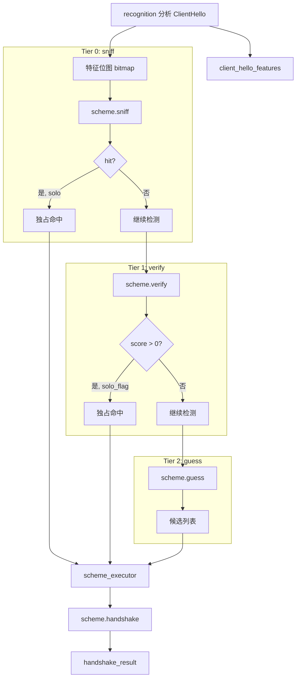

# scheme 模块

## 源码位置

`I:/code/Prism/include/prism/stealth/scheme.hpp`

## 模块职责

定义 `stealth_scheme` 抽象基类，作为所有 TLS 伪装方案的统一接口。每个方案代表一种传输层伪装方式（如 Reality、ShadowTLS、Native TLS）。通过 `handshake()` 接口完成握手和协议检测，获得最终传输层和检测到的协议类型。

## 主要组件

### sniff_result 结构体

Tier 0 快速检测结果，零成本字节比较。

| 成员 | 类型 | 说明 |
|------|------|------|
| `hit` | `bool` | 是否命中此方案 |
| `solo` | `bool` | 是否独占命中（命中后不再检测其他方案） |
| `hint` | `std::uint16_t` | 评分提示（供 Tier 2 参考，范围 0-1000） |
| `note` | `memory::string` | 检测原因（用于日志和调试） |

### verify_result 结构体

Tier 1/2 详细检测结果，评分制支持优先级排序。

| 成员 | 类型 | 说明 |
|------|------|------|
| `score` | `std::uint16_t` | 评分（0-1000，越高越确定） |
| `solo_flag` | `std::uint16_t` | 独占标记（非零表示独占，跳过其他方案） |
| `note` | `memory::string` | 检测原因（用于日志和调试） |

### handshake_result 结构体

伪装方案执行结果，包含执行后的传输层、检测到的内层协议和预读数据。

| 成员 | 类型 | 说明 |
|------|------|------|
| `transport` | `shared_transmission` | 最终传输层 |
| `detected` | `protocol::protocol_type` | 检测到的内层协议 |
| `preread` | `memory::vector<std::byte>` | 内层预读数据 |
| `error` | `fault::code` | 错误码 |
| `scheme` | `memory::string` | 成功执行的方案名 |

### handshake_context 结构体

伪装方案执行上下文，封装 `handshake()` 所需的所有参数。

| 成员 | 类型 | 说明 |
|------|------|------|
| `inbound` | `shared_transmission` | 当前传输层（应包含预读数据） |
| `cfg` | `const psm::config*` | 服务器配置 |
| `router` | `resolve::router*` | 路由器（fallback 用） |
| `session` | `agent::session_context*` | 会话上下文 |
| `preread` | `memory::vector<std::byte>` | 来自 identify 的 preread 数据（完整 ClientHello） |

### stealth_scheme 抽象基类

传输层伪装方案抽象基类，支持分层检测。

#### 基本信息方法

| 方法 | 返回类型 | 说明 |
|------|----------|------|
| `name()` | `std::string_view` | 方案名称（用于日志） |
| `tier()` | `std::uint8_t` | 检测层级（0-2），默认 Tier 2 |
| `unique()` | `bool` | 是否有独占特征，默认 false |

#### 配置方法

| 方法 | 返回类型 | 说明 |
|------|----------|------|
| `active(cfg)` | `bool` | 判断此方案是否在当前配置下启用 |
| `snis(cfg)` | `memory::vector<memory::string>` | 获取 SNI 白名单，默认空 |

#### Tier 0: 快速检测

```cpp
[[nodiscard]] virtual auto sniff(
    std::uint32_t bitmap,
    const protocol::tls::client_hello_features &features) const
    -> sniff_result;
```

零成本字节比较，不涉及 HMAC 或解密。例如 Reality 检查 `session_id[0:3] == [0x01, 0x08, 0x02]`。默认返回 `{.hit = false, .solo = false, .hint = 0, .note = "no sniff"}`。

#### Tier 1: 详细检测

```cpp
[[nodiscard]] virtual auto verify(
    const protocol::tls::client_hello_features &features,
    std::span<const std::byte> raw,
    const psm::config &cfg) const
    -> verify_result;
```

涉及 HMAC 验证或解密，延迟执行。例如 ShadowTLS HMAC 验证、AnyTLS ECH 解密。默认返回 `{.score = 0, .solo_flag = 0, .note = "no verify"}`。

#### Tier 2: 模糊检测

```cpp
[[nodiscard]] virtual auto guess(const psm::config &cfg) const
    -> verify_result;
```

无 ClientHello 独占特征，依赖 SNI 匹配。例如 Restls、TrustTunnel、Native。默认返回 `{.score = weight(), .solo_flag = 0, .note = "guess"}`。

#### 执行方法

```cpp
[[nodiscard]] virtual auto handshake(handshake_context ctx)
    -> net::awaitable<handshake_result> = 0;
```

执行握手，返回处理结果。纯虚函数，子类必须实现。

#### 保护方法

| 方法 | 返回类型 | 说明 |
|------|----------|------|
| `weight()` | `std::uint16_t` | 权重分（Tier 2 使用），默认 100 |

### 类型别名

```cpp
using shared_scheme = std::shared_ptr<stealth_scheme>;
```

方案共享指针类型。

## 分层检测策略

| Tier | 方法 | 成本 | 独占性 | 典型方案 |
|------|------|------|--------|----------|
| 0 | `sniff()` | 零成本字节比较 | 可独占跳过其他 | Reality |
| 1 | `verify()` | HMAC/解密 | 可独占跳过其他 | ShadowTLS, AnyTLS |
| 2 | `guess()` | SNI 路由 | 通常不独占 | Restls, TrustTunnel, Native |

## 调用链



## 相关文档

- [[overview|Stealth 模块总览]]
- [[executor|执行器详解]]
- [[registry|注册表详解]]
- [[../protocol/tls/types|TLS 类型定义]]
- [[../recognition/recognition|Recognition 模块]]