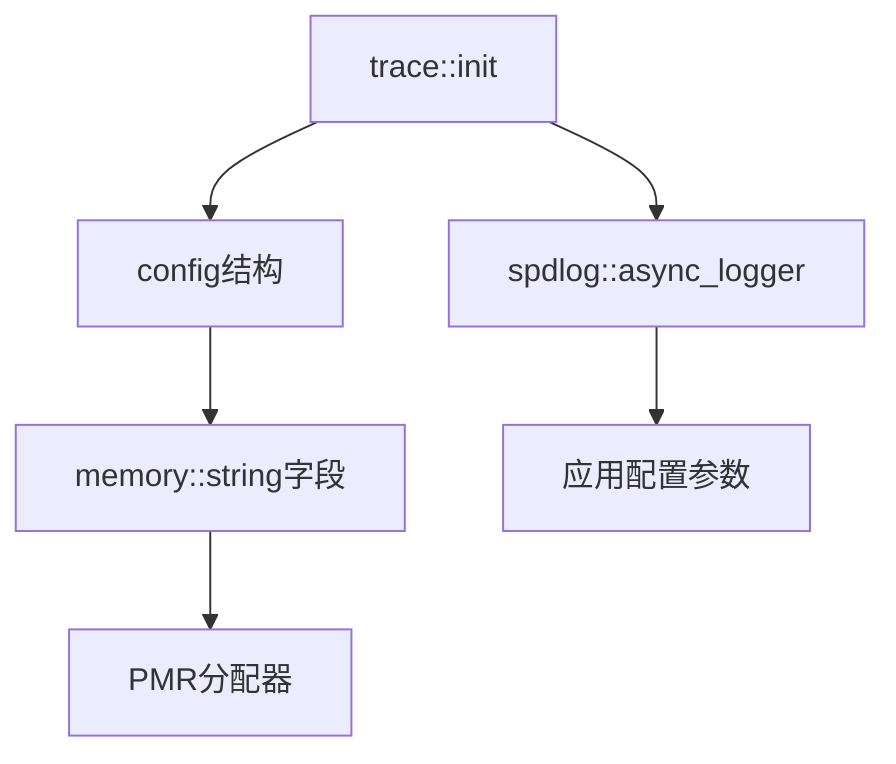

# Trace Config

日志系统配置参数定义。

## 源码位置

`I:/code/Prism/include/prism/trace/config.hpp`

## 配置结构

```cpp
namespace psm::trace {
    struct config {
        memory::string file_name = "prism.log";
        memory::string path_name = "logs";
        std::uint64_t max_size = 64ULL * 1024ULL * 1024ULL;  // 64MB
        std::uint32_t max_files = 8U;
        std::uint32_t queue_size = 8192U;
        std::uint32_t thread_count = 1U;
        bool enable_console = true;
        bool enable_file = true;
        memory::string log_level = "info";
        memory::string pattern = "[%Y-%m-%d %H:%M:%S.%e][%l] %v";
        memory::string trace_name = "prism";
    };
}
```

## 参数说明

### 文件输出

| 参数 | 默认值 | 说明 |
|------|--------|------|
| `file_name` | `"prism.log"` | 日志文件名 |
| `path_name` | `"logs"` | 日志文件存储路径 |
| `max_size` | 64MB | 单文件最大大小 |
| `max_files` | 8 | 最大保留文件数 |
| `enable_file` | true | 是否启用文件输出 |

### 异步配置

| 参数 | 默认值 | 说明 |
|------|--------|------|
| `queue_size` | 8192 | 异步队列大小 |
| `thread_count` | 1 | 后台刷盘线程数 |

队列满时采用 `overrun_oldest` 策略，丢弃最旧日志。

### 控制台输出

| 参数 | 默认值 | 说明 |
|------|--------|------|
| `enable_console` | true | 是否启用控制台输出 |

### 日志格式

| 参数 | 默认值 | 说明 |
|------|--------|------|
| `log_level` | `"info"` | 日志级别 |
| `pattern` | `[%Y-%m-%d %H:%M:%S.%e][%l] %v` | 输出格式 |
| `trace_name` | `"prism"` | 日志器名称 |

## PMR 集成

所有字符串字段使用 `memory::string`，支持自定义内存资源：

```cpp
trace::config cfg(memory::system::global_pool());
cfg.file_name = "custom.log";
cfg.log_level = "debug";
```

## 默认格式解析

```
[%Y-%m-%d %H:%M:%S.%e][%l] %v
│          │      │   │  │
│          │      │   │  └─ 消息内容
│          │      │   └──── 日志级别
│          │      └──────── 毫秒
│          └──────────────── 时间
└─────────────────────────── 日期
```

输出示例：
```
[2024-01-15 10:30:45.123][info] Server started on port 8080
```

## 调用链



## 相关页面

- [[core/trace/overview]] - Trace模块总览
- [[core/trace/spdlog]] - spdlog集成实现
- [[core/memory/container]] - PMR字符串定义