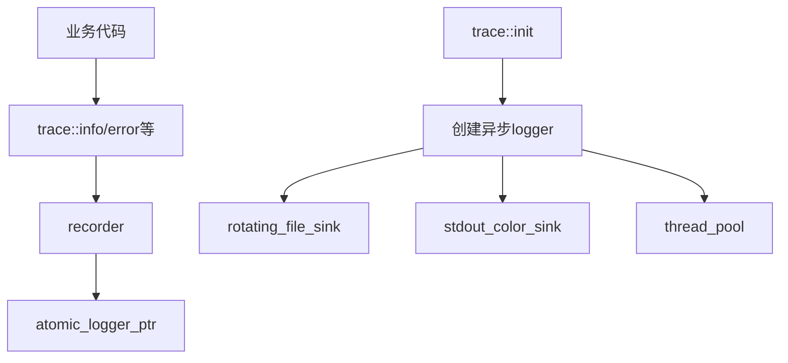

# Trace 模块

Trace 模块提供基于 spdlog 的日志系统，支持异步日志记录、日志轮转和多目标输出。

## 设计决策

### 为什么用异步日志？

spdlog 的异步模式将日志格式化和 I/O 操作卸载到独立线程池，业务线程只做"将消息推入队列"（纳秒级）。同步日志在突发大量日志时（如 DDoS 攻击场景）会阻塞 I/O 线程，导致请求延迟飙升。

**后果**: `queue_size` 满时可能丢弃日志。默认 8192 条缓冲，极端场景需调大。

### 为什么 recorder() 返回 shared_ptr 而非全局引用？

spdlog logger 不是线程安全的（格式化操作有内部状态），但 `shared_ptr` 的原子引用计数保证多线程安全获取 logger 指针。每个线程获取后独立使用，不冲突。

**后果**: 热路径频繁调用 `recorder()` 有原子操作开销，但相比 I/O 延迟可忽略。

## 模块组成

| 组件 | 说明 | 源码 |
|------|------|------|
| [[core/trace/config]] | 日志配置参数 | `prism/trace/config.hpp` |
| [[core/trace/spdlog]] | spdlog集成实现 | `prism/trace/spdlog.cpp` |

## 配置参数

| 参数 | 默认值 | 说明 |
|------|--------|------|
| `file_name` | `"prism.log"` | 日志文件名 |
| `path_name` | `"logs"` | 存储路径 |
| `max_size` | 64MB | 单文件最大大小 |
| `max_files` | 8 | 最大轮转文件数 |
| `queue_size` | 8192 | 异步队列大小 |
| `thread_count` | 1 | 后台刷盘线程数 |
| `enable_console` | true | 控制台输出 |
| `enable_file` | true | 文件输出 |
| `log_level` | `"info"` | 日志级别 |
| `pattern` | `[%Y-%m-%d %H:%M:%S.%e][%l] %v` | 日志格式 |
| `trace_name` | `"prism"` | 日志器名称 |

## 约束

### 异步队列满时行为

**类型**: 资源上限

**规则**: 当异步队列（`queue_size`）满时，新日志消息会被阻塞或丢弃（取决于 spdlog 策略）。

**违反后果**: 突发大量日志时可能丢失部分记录。

**源码依据**: `config.hpp:8`

### init() 必须在使用前调用

**类型**: 调用顺序

**规则**: `trace::init(cfg)` 必须在首次调用 `trace::info/error/...` 之前执行（`main.cpp` 启动流程保证）。

**违反后果**: 日志器未初始化，消息被静默丢弃。

## 日志级别

| 级别 | spdlog对应 |
|------|------------|
| trace | `spdlog::level::trace` |
| debug | `spdlog::level::debug` |
| info | `spdlog::level::info` |
| warn/warning | `spdlog::level::warn` |
| error/err | `spdlog::level::err` |
| critical/fatal | `spdlog::level::critical` |
| off | `spdlog::level::off` |

## 调用链

## 相关模块

- [[core/memory/overview]] - PMR字符串用于配置
- [[core/loader/overview]] - 配置加载器使用日志