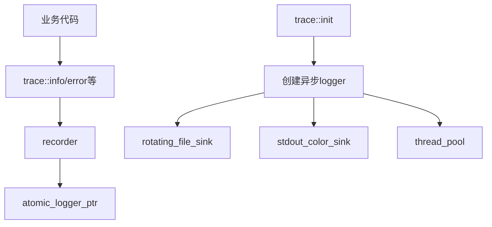

# Trace 模块

Trace 模块提供基于 spdlog 的日志系统，支持异步日志记录、日志轮转和多目标输出。

## 设计特点

- **异步日志**: 使用独立线程池，避免阻塞业务线程
- **日志轮转**: 按大小和数量自动轮转日志文件
- **PMR集成**: 配置字符串使用PMR分配器
- **原子访问**: 热路径使用原子指针，减少锁开销

## 模块组成

| 组件 | 说明 | 源码 |
|------|------|------|
| [[core/trace/config]] | 日志配置参数 | `prism/trace/config.hpp` |
| [[core/trace/spdlog]] | spdlog集成实现 | `prism/trace/spdlog.cpp` |

## 配置参数

```cpp
struct config {
    memory::string file_name = "prism.log";          // 日志文件名
    memory::string path_name = "logs";               // 存储路径
    std::uint64_t max_size = 64 * 1024 * 1024;       // 文件最大64MB
    std::uint32_t max_files = 8;                     // 最大8个文件
    std::uint32_t queue_size = 8192;                 // 异步队列大小
    std::uint32_t thread_count = 1;                  // 后台刷盘线程数
    bool enable_console = true;                      // 控制台输出
    bool enable_file = true;                         // 文件输出
    memory::string log_level = "info";               // 日志级别
    memory::string pattern = "[%Y-%m-%d %H:%M:%S.%e][%l] %v"; // 格式
    memory::string trace_name = "prism";             // 日志器名称
};
```

## 核心接口

```cpp
namespace psm::trace {
    // 获取日志器
    std::shared_ptr<spdlog::logger> recorder() noexcept;
    
    // 初始化日志系统
    void init(const config &cfg);
    
    // 关闭日志系统
    void shutdown();
}
```

## 日志级别

| 级别 | spdlog对应 |
|------|------------|
| trace | `spdlog::level::trace` |
| debug | `spdlog::level::debug` |
| info | `spdlog::level::info` |
| warn/warning | `spdlog::level::warn` |
| error/err | `spdlog::level::err` |
| critical/fatal | `spdlog::level::critical` |
| off | `spdlog::level::off` |

## 调用链



## 相关模块

- [[core/memory]] - PMR字符串用于配置
- [[core/loader]] - 配置加载器使用日志