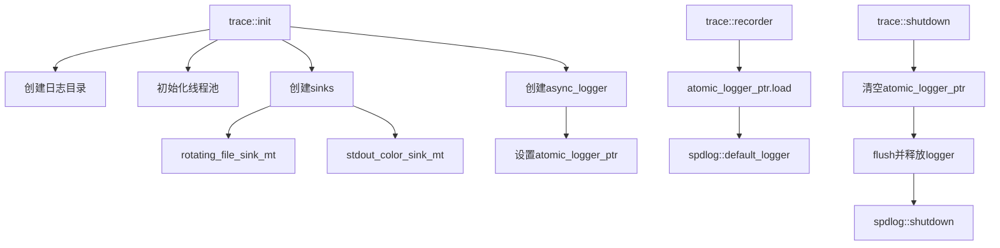

# Trace Spdlog

spdlog 日志系统的集成实现。

## 源码位置

`I:/code/Prism/src/prism/trace/spdlog.cpp`

## 实现细节

### 全局状态

```cpp
namespace {
    std::shared_mutex trace_mutex;              // 保护init/shutdown
    config last_config{};                       // 缓存最后配置
    std::shared_ptr<spdlog::logger> shared_system_logger;
    std::atomic<spdlog::logger *> atomic_logger_ptr{nullptr};
}
```

### recorder - 获取日志器

```cpp
auto recorder() noexcept -> std::shared_ptr<spdlog::logger>;
```

热路径使用原子指针，减少锁开销：

```cpp
auto *ptr = atomic_logger_ptr.load(std::memory_order_acquire);
if (!ptr) return nullptr;
return spdlog::default_logger();
```

### init - 初始化

```cpp
void init(const config &cfg);
```

执行流程：
1. 创建日志目录
2. 初始化线程池
3. 创建sink列表
4. 配置异步logger
5. 设置默认logger

### shutdown - 关闭

```cpp
void shutdown();
```

执行流程：
1. 清空原子指针
2. flush日志
3. 释放logger
4. 调用 `spdlog::shutdown()`

## 日志级别解析

```cpp
spdlog::level::level_enum parse_spdlog_level(std::string_view level_str);
```

| 输入 | 输出 |
|------|------|
| `trace` | `trace` |
| `debug` | `debug` |
| `info` | `info` |
| `warn`, `warning` | `warn` |
| `error`, `err` | `err` |
| `critical`, `fatal` | `critical` |
| `off` | `off` |

大小写不敏感，默认返回 `info`。

## Sink 创建

### rotating_file_sink

```cpp
sinks.emplace_back(std::make_shared<spdlog::sinks::rotating_file_sink_mt>(
    log_path.string(),
    max_size,
    max_files,
    true  // 自动轮转
));
```

### stdout_color_sink

```cpp
sinks.emplace_back(std::make_shared<spdlog::sinks::stdout_color_sink_mt>());
```

## 异步策略

```cpp
auto logger = std::make_shared<spdlog::async_logger>(
    logger_name,
    sinks,
    spdlog::thread_pool(),
    spdlog::async_overflow_policy::overrun_oldest  // 队列满时丢弃最旧
);
```

## 使用示例

```cpp
// 初始化
trace::config cfg;
cfg.file_name = "server.log";
cfg.log_level = "debug";
trace::init(cfg);

// 日志记录
trace::info("服务器启动，端口: {}", port);
trace::error("连接失败: {}", fault::describe(err));

// 关闭
trace::shutdown();
```

## 调用链



## 相关页面

- [[core/trace/overview]] - Trace模块总览
- [[core/trace/config]] - 日志配置参数