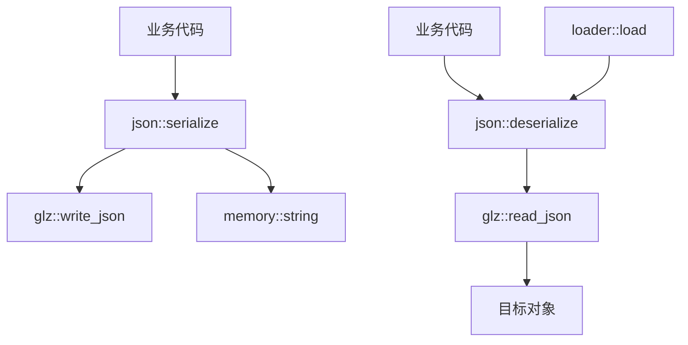

# Transformer 模块

Transformer 模块提供数据序列化与反序列化功能，当前基于 glaze 库实现 JSON 格式支持。

## 设计特点

- **类型安全**: 模板化接口，编译时类型检查
- **内存高效**: 集成PMR内存系统
- **零拷贝**: 反序列化支持移动语义优化

## 模块组成

| 组件 | 说明 | 源码 |
|------|------|------|
| [[core/transformer/json]] | JSON序列化 | `prism/transformer/json.hpp` |

## 核心接口

```cpp
namespace psm::transformer::json {
    // 序列化
    template <typename T>
    bool serialize(const T &value, memory::string &out);
    
    template <typename T>
    memory::string serialize(const T &value, memory::resource_pointer mr);
    
    // 反序列化
    template <typename T>
    bool deserialize(std::string_view json_data, T &value);
    
    template <typename T>
    bool deserialize(std::string_view json_data, T &value, memory::resource_pointer mr);
}
```

## 调用链



## 相关模块

- [[core/memory]] - PMR字符串
- [[core/loader]] - 配置加载器使用JSON反序列化