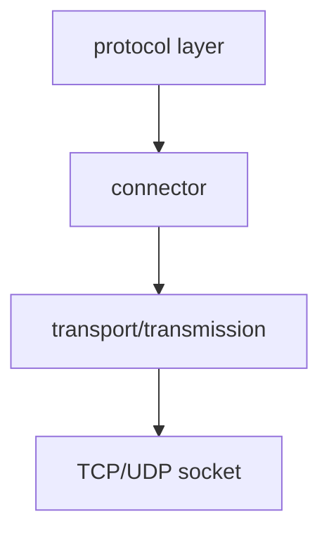

# connector

Socket 异步 IO 适配器，统一 TCP 和 UDP 的异步读写接口。

## 概述

`connector` 将 `transmission` 接口适配为 Boost.Asio 的 `AsyncReadStream`/`AsyncWriteStream` 概念。核心功能：

- **接口适配**：将 transmission 适配为 Asio 流概念
- **预读数据注入**：避免协议检测时丢失数据
- **所有权管理**：使用 `shared_ptr` 持有 transmission

## 类定义

```cpp
class connector
{
public:
    using executor_type = net::any_io_executor;
    using transmission_ptr = transport::shared_transmission;

    explicit connector(transmission_ptr trans, std::span<const std::byte> preread = {});

    connector(connector &&other) noexcept;
    connector &operator=(connector &&other) noexcept;

    // 禁止拷贝
    connector(const connector &) = delete;
    connector &operator=(const connector &) = delete;

    // AsyncStream 接口
    executor_type get_executor();
    executor_type executor();

    template <typename MutableBufferSequence, typename CompletionToken>
    auto async_read_some(const MutableBufferSequence &buffers, CompletionToken &&token);

    template <typename ConstBufferSequence, typename CompletionToken>
    auto async_write_some(const ConstBufferSequence &buffers, CompletionToken &&token);

    // 完整读写
    auto async_write(std::span<const std::byte> buffer, std::error_code &ec)
        -> net::awaitable<std::size_t>;
    auto async_read(std::span<std::byte> buffer, std::error_code &ec)
        -> net::awaitable<std::size_t>;

    // 最低层访问
    using lowest_layer_type = connector;
    lowest_layer_type &lowest_layer();
    const lowest_layer_type &lowest_layer() const;

    // 传输层访问
    auto &transmission() const;
    transmission_ptr release();

private:
    transmission_ptr trans_;                   // 传输层对象的共享指针
    memory::vector<std::byte> preread_buffer_;  // 预读数据缓冲区
    std::size_t preread_offset_ = 0;           // 预读数据当前消费偏移量
};
```

## 核心功能

### 预读数据注入

在协议检测阶段，可能已经读取了部分数据。`connector` 支持注入预读数据，在首次 `async_read_some` 时优先返回，避免数据丢失。

**构造时注入：**

```cpp
// 协议检测阶段已读取的数据
std::vector<std::byte> detected_data = ...;

// 构造 connector 时注入预读数据
connector conn(transmission, std::span{detected_data});

// 首次读取会先返回预读数据
auto n = co_await net::async_read_some(conn, buffer, net::use_awaitable);
```

### async_read_some 详解

```cpp
template <typename MutableBufferSequence, typename CompletionToken>
auto async_read_some(const MutableBufferSequence &buffers, CompletionToken &&token);
```

**执行流程：**

```
async_read_some 调用
        │
        ▼
┌───────────────────┐
│ 预读缓冲区有数据？ │
└────────┬──────────┘
         │
    ┌────┴────┐
    │         │
   Yes       No
    │         │
    ▼         ▼
┌────────┐ ┌────────────────┐
│从预读  │ │委托给传输层    │
│缓冲区  │ │async_read_some │
│拷贝数据│ └────────────────┘
└────────┘
    │
    ▼
更新偏移量
同步返回
```

**逐行解析：**

```cpp
if (preread_offset_ < preread_buffer_.size())
{
    // 计算预读缓冲区剩余字节数
    std::size_t bytes_available = preread_buffer_.size() - preread_offset_;
    std::size_t bytes_to_copy = 0;

    // 遍历用户提供的缓冲区序列
    auto buf_it = net::buffer_sequence_begin(buffers);
    auto buf_end = net::buffer_sequence_end(buffers);
    for (; buf_it != buf_end && bytes_to_copy < bytes_available; ++buf_it)
    {
        auto buf = *buf_it;
        std::size_t buf_size = buf.size();
        // 计算当前缓冲区可拷贝的字节数
        std::size_t copy_size = std::min(buf_size, bytes_available - bytes_to_copy);
        // 执行内存拷贝
        std::memcpy(buf.data(), preread_buffer_.data() + preread_offset_ + bytes_to_copy, copy_size);
        bytes_to_copy += copy_size;
    }
    // 更新偏移量
    preread_offset_ += bytes_to_copy;

    // 同步返回结果（不发起异步操作）
    auto handler = [bytes_to_copy]<typename Callback>(Callback &&handler)
    {
        boost::system::error_code ec;
        std::forward<Callback>(handler)(ec, bytes_to_copy);
    };
    return net::async_initiate<CompletionToken, void(boost::system::error_code, std::size_t)>(handler, token);
}

// 预读数据消费完毕，委托给传输层
return transport::async_read_some(trans_, buffers, std::forward<CompletionToken>(token));
```

### async_write_some

```cpp
template <typename ConstBufferSequence, typename CompletionToken>
auto async_write_some(const ConstBufferSequence &buffers, CompletionToken &&token);
```

直接委托给传输层的 `async_write_some`，无预读逻辑。

### 完整读写操作

```cpp
// 完整写入
auto async_write(std::span<const std::byte> buffer, std::error_code &ec)
    -> net::awaitable<std::size_t>;

// 完整读取
auto async_read(std::span<std::byte> buffer, std::error_code &ec)
    -> net::awaitable<std::size_t>;
```

委托给 `transmission` 的虚函数，允许子类（如 UDP）自定义完整读写行为。

## 调用链



被协议层使用，作为传输层的统一接口：

```
protocol → connector → transmission → socket
```

## 使用示例

### 基本用法

```cpp
// 获取传输层
auto trans = co_await establish_connection(...);

// 创建适配器
connector conn(std::move(trans));

// 使用 Asio 异步操作
std::array<char, 1024> buffer;
auto n = co_await net::async_read_some(conn, net::buffer(buffer), net::use_awaitable);
```

### 协议检测场景

```cpp
// 步骤 1: 读取前几个字节检测协议
std::array<std::byte, 256> peek_buffer;
auto n = co_await trans->async_read_some(net::buffer(peek_buffer), net::use_awaitable);

// 步骤 2: 根据数据判断协议
auto protocol = detect_protocol(std::span{peek_buffer.data(), n});

// 步骤 3: 创建 connector，注入预读数据
connector conn(std::move(trans), std::span{peek_buffer.data(), n});

// 步骤 4: 协议握手（首次读取会先返回预读数据）
auto handler = create_protocol_handler(protocol);
co_await handler->handshake(conn);
```

## 与 Asio 概念的对应

| Asio 概念 | connector 实现 |
|-----------|----------------|
| `AsyncReadStream` | `async_read_some()` |
| `AsyncWriteStream` | `async_write_some()` |
| `get_executor()` | 委托给 transmission |
| `lowest_layer_type` | 自身 |

## 注意事项

1. **预读时机**：预读数据注入必须在协议握手之前完成
2. **数据丢失**：预读数据注入时机不当可能导致协议解析失败
3. **内存管理**：内部使用 `shared_ptr` 持有 transmission，确保异步操作期间传输对象不会被提前释放
4. **线程安全**：遵循 transmission 的线程安全保证

## 相关类型

- [[core/transport/transmission]] - 底层传输抽象
- [[core/transport/overview]] - 通道层